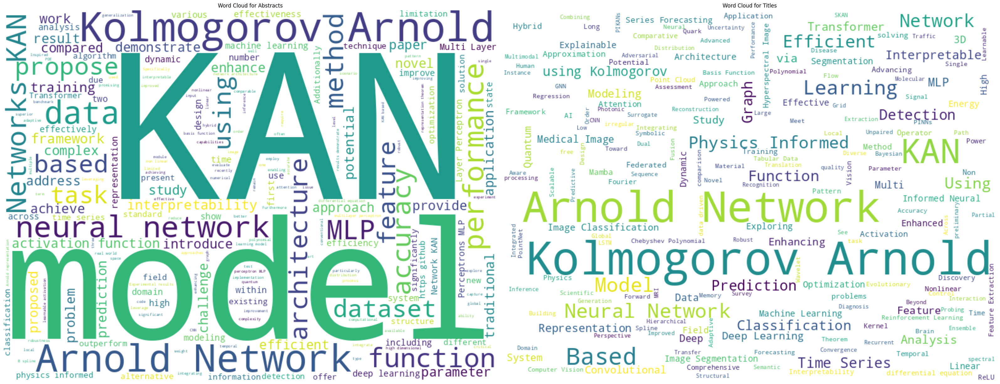

# Kolmogorov-Arnold Network Papers
A complete list of papers on KANs. Papers with submission dates before the original KAN papers are excluded. You might find [this awesome list](https://github.com/mintisan/awesome-kan) useful as well. You can find the papers and their titles, abstracts, authors, links, and dates stored in [this csv file](https://github.com/RamtinMoslemi/KAN-Papers/blob/main/kan_papers.csv).

## Papers by Month
Number of papers submitted to arXiv by month.

## Word Clouds
Word clouds of KAN paper titles and abstracts.

## Notebook
You can play with the notebook:

 

# 2024
## April
### [KAN: Kolmogorov-Arnold Networks](https://arxiv.org/abs/2404.19756)

**Authors:**
Ziming Liu, Yixuan Wang, Sachin Vaidya, Fabian Ruehle, James Halverson, Marin Soljačić, Thomas Y. Hou, Max Tegmark

**Abstract:**
Inspired by the Kolmogorov-Arnold representation theorem, we propose Kolmogorov-Arnold Networks (KANs) as promising alternatives to Multi-Layer Perceptrons (MLPs). While MLPs have fixed activation functions on nodes ("neurons"), KANs have learnable activation functions on edges ("weights"). KANs have no linear weights at all -- every weight parameter is replaced by a univariate function parametrized as a spline. We show that this seemingly simple change makes KANs outperform MLPs in terms of accuracy and interpretability. For accuracy, much smaller KANs can achieve comparable or better accuracy than much larger MLPs in data fitting and PDE solving. Theoretically and empirically, KANs possess faster neural scaling laws than MLPs. For interpretability, KANs can be intuitively visualized and can easily interact with human users. Through two examples in mathematics and physics, KANs are shown to be useful collaborators helping scientists (re)discover mathematical and physical laws. In summary, KANs are promising alternatives for MLPs, opening opportunities for further improving today's deep learning models which rely heavily on MLPs.
       

## May
### [Biology-inspired joint distribution neurons based on Hierarchical Correlation Reconstruction allowing for multidirectional neural networks](https://arxiv.org/abs/2405.05097)

**Author:**
Jarek Duda

**Abstract:**
Biological neural networks seem qualitatively superior (e.g. in learning, flexibility, robustness) to current artificial like Multi-Layer Perceptron (MLP) or Kolmogorov-Arnold Network (KAN). Simultaneously, in contrast to them: biological have fundamentally multidirectional signal propagation \cite{axon}, also of probability distributions e.g. for uncertainty estimation, and are believed not being able to use standard backpropagation training \cite{backprop}. There are proposed novel artificial neurons based on HCR (Hierarchical Correlation Reconstruction) allowing to remove the above low level differences: with neurons containing local joint distribution model (of its connections), representing joint density on normalized variables as just linear combination of $(f_\mathbf{j})$ orthonormal polynomials: $ρ(\mathbf{x})=\sum_{\mathbf{j}\in B} a_\mathbf{j} f_\mathbf{j}(\mathbf{x})$ for $\mathbf{x} \in [0,1]^d$ and $B\subset \mathbb{N}^d$ some chosen basis. By various index summations of such $(a_\mathbf{j})_{\mathbf{j}\in B}$ tensor as neuron parameters, we get simple formulas for e.g. conditional expected values for propagation in any direction, like $E[x|y,z]$, $E[y|x]$, which degenerate to KAN-like parametrization if restricting to pairwise dependencies. Such HCR network can also propagate probability distributions (also joint) like $ρ(y,z|x)$. It also allows for additional training approaches, like direct $(a_\mathbf{j})$ estimation, through tensor decomposition, or more biologically plausible information bottleneck training: layers directly influencing only neighbors, optimizing content to maximize information about the next layer, and minimizing about the previous to remove noise, extract crucial information.
       

### [Kolmogorov-Arnold Networks are Radial Basis Function Networks](https://arxiv.org/abs/2405.06721)

**Author:**
Ziyao Li

**Abstract:**
This short paper is a fast proof-of-concept that the 3-order B-splines used in Kolmogorov-Arnold Networks (KANs) can be well approximated by Gaussian radial basis functions. Doing so leads to FastKAN, a much faster implementation of KAN which is also a radial basis function (RBF) network.
       

### [Chebyshev Polynomial-Based Kolmogorov-Arnold Networks: An Efficient Architecture for Nonlinear Function Approximation](https://arxiv.org/abs/2405.07200)

**Authors:**
Sidharth SS, Keerthana AR, Gokul R, Anas KP

**Abstract:**
Accurate approximation of complex nonlinear functions is a fundamental challenge across many scientific and engineering domains. Traditional neural network architectures, such as Multi-Layer Perceptrons (MLPs), often struggle to efficiently capture intricate patterns and irregularities present in high-dimensional functions. This paper presents the Chebyshev Kolmogorov-Arnold Network (Chebyshev KAN), a new neural network architecture inspired by the Kolmogorov-Arnold representation theorem, incorporating the powerful approximation capabilities of Chebyshev polynomials. By utilizing learnable functions parametrized by Chebyshev polynomials on the network's edges, Chebyshev KANs enhance flexibility, efficiency, and interpretability in function approximation tasks. We demonstrate the efficacy of Chebyshev KANs through experiments on digit classification, synthetic function approximation, and fractal function generation, highlighting their superiority over traditional MLPs in terms of parameter efficiency and interpretability. Our comprehensive evaluation, including ablation studies, confirms the potential of Chebyshev KANs to address longstanding challenges in nonlinear function approximation, paving the way for further advancements in various scientific and engineering applications.
       

### [TKAN: Temporal Kolmogorov-Arnold Networks](https://arxiv.org/abs/2405.07344)

**Authors:**
Remi Genet, Hugo Inzirillo

**Abstract:**
Recurrent Neural Networks (RNNs) have revolutionized many areas of machine learning, particularly in natural language and data sequence processing. Long Short-Term Memory (LSTM) has demonstrated its ability to capture long-term dependencies in sequential data. Inspired by the Kolmogorov-Arnold Networks (KANs) a promising alternatives to Multi-Layer Perceptrons (MLPs), we proposed a new neural networks architecture inspired by KAN and the LSTM, the Temporal Kolomogorov-Arnold Networks (TKANs). TKANs combined the strenght of both networks, it is composed of Recurring Kolmogorov-Arnold Networks (RKANs) Layers embedding memory management. This innovation enables us to perform multi-step time series forecasting with enhanced accuracy and efficiency. By addressing the limitations of traditional models in handling complex sequential patterns, the TKAN architecture offers significant potential for advancements in fields requiring more than one step ahead forecasting.
       

### [Predictive Modeling of Flexible EHD Pumps using Kolmogorov-Arnold Networks](https://arxiv.org/abs/2405.07488)

**Authors:**
Yanhong Peng, Yuxin Wang, Fangchao Hu, Miao He, Zebing Mao, Xia Huang, Jun Ding

**Abstract:**
We present a novel approach to predicting the pressure and flow rate of flexible electrohydrodynamic pumps using the Kolmogorov-Arnold Network. Inspired by the Kolmogorov-Arnold representation theorem, KAN replaces fixed activation functions with learnable spline-based activation functions, enabling it to approximate complex nonlinear functions more effectively than traditional models like Multi-Layer Perceptron and Random Forest. We evaluated KAN on a dataset of flexible EHD pump parameters and compared its performance against RF, and MLP models. KAN achieved superior predictive accuracy, with Mean Squared Errors of 12.186 and 0.001 for pressure and flow rate predictions, respectively. The symbolic formulas extracted from KAN provided insights into the nonlinear relationships between input parameters and pump performance. These findings demonstrate that KAN offers exceptional accuracy and interpretability, making it a promising alternative for predictive modeling in electrohydrodynamic pumping.
       

### [Kolmogorov-Arnold Networks (KANs) for Time Series Analysis](https://arxiv.org/abs/2405.08790)

**Authors:**
Cristian J. Vaca-Rubio, Luis Blanco, Roberto Pereira, Màrius Caus

**Abstract:**
This paper introduces a novel application of Kolmogorov-Arnold Networks (KANs) to time series forecasting, leveraging their adaptive activation functions for enhanced predictive modeling. Inspired by the Kolmogorov-Arnold representation theorem, KANs replace traditional linear weights with spline-parametrized univariate functions, allowing them to learn activation patterns dynamically. We demonstrate that KANs outperforms conventional Multi-Layer Perceptrons (MLPs) in a real-world satellite traffic forecasting task, providing more accurate results with considerably fewer number of learnable parameters. We also provide an ablation study of KAN-specific parameters impact on performance. The proposed approach opens new avenues for adaptive forecasting models, emphasizing the potential of KANs as a powerful tool in predictive analytics.
       

### [Smooth Kolmogorov Arnold networks enabling structural knowledge representation](https://arxiv.org/abs/2405.11318)

**Authors:**
Moein E. Samadi, Younes Müller, Andreas Schuppert

**Abstract:**
Kolmogorov-Arnold Networks (KANs) offer an efficient and interpretable alternative to traditional multi-layer perceptron (MLP) architectures due to their finite network topology. However, according to the results of Kolmogorov and Vitushkin, the representation of generic smooth functions by KAN implementations using analytic functions constrained to a finite number of cutoff points cannot be exact. Hence, the convergence of KAN throughout the training process may be limited. This paper explores the relevance of smoothness in KANs, proposing that smooth, structurally informed KANs can achieve equivalence to MLPs in specific function classes. By leveraging inherent structural knowledge, KANs may reduce the data required for training and mitigate the risk of generating hallucinated predictions, thereby enhancing model reliability and performance in computational biomedicine.
       

### [Wav-KAN: Wavelet Kolmogorov-Arnold Networks](https://arxiv.org/abs/2405.12832)

**Authors:**
Zavareh Bozorgasl, Hao Chen

**Abstract:**
In this paper, we introduce Wav-KAN, an innovative neural network architecture that leverages the Wavelet Kolmogorov-Arnold Networks (Wav-KAN) framework to enhance interpretability and performance. Traditional multilayer perceptrons (MLPs) and even recent advancements like Spl-KAN face challenges related to interpretability, training speed, robustness, computational efficiency, and performance. Wav-KAN addresses these limitations by incorporating wavelet functions into the Kolmogorov-Arnold network structure, enabling the network to capture both high-frequency and low-frequency components of the input data efficiently. Wavelet-based approximations employ orthogonal or semi-orthogonal basis and maintain a balance between accurately representing the underlying data structure and avoiding overfitting to the noise. While continuous wavelet transform (CWT) has a lot of potentials, we also employed discrete wavelet transform (DWT) for multiresolution analysis, which obviated the need for recalculation of the previous steps in finding the details. Analogous to how water conforms to the shape of its container, Wav-KAN adapts to the data structure, resulting in enhanced accuracy, faster training speeds, and increased robustness compared to Spl-KAN and MLPs. Our results highlight the potential of Wav-KAN as a powerful tool for developing interpretable and high-performance neural networks, with applications spanning various fields. This work sets the stage for further exploration and implementation of Wav-KAN in frameworks such as PyTorch and TensorFlow, aiming to make wavelets in KAN as widespread as activation functions like ReLU and sigmoid in universal approximation theory (UAT). The codes to replicate the simulations are available at https://github.com/zavareh1/Wav-KAN.
       

### [Endowing Interpretability for Neural Cognitive Diagnosis by Efficient Kolmogorov-Arnold Networks](https://arxiv.org/abs/2405.14399)

**Authors:**
Shangshang Yang, Linrui Qin, Xiaoshan Yu

**Abstract:**
In the realm of intelligent education, cognitive diagnosis plays a crucial role in subsequent recommendation tasks attributed to the revealed students' proficiency in knowledge concepts. Although neural network-based neural cognitive diagnosis models (CDMs) have exhibited significantly better performance than traditional models, neural cognitive diagnosis is criticized for the poor model interpretability due to the multi-layer perception (MLP) employed, even with the monotonicity assumption. Therefore, this paper proposes to empower the interpretability of neural cognitive diagnosis models through efficient kolmogorov-arnold networks (KANs), named KAN2CD, where KANs are designed to enhance interpretability in two manners. Specifically, in the first manner, KANs are directly used to replace the used MLPs in existing neural CDMs; while in the second manner, the student embedding, exercise embedding, and concept embedding are directly processed by several KANs, and then their outputs are further combined and learned in a unified KAN to get final predictions. To overcome the problem of training KANs slowly, we modify the implementation of original KANs to accelerate the training. Experiments on four real-world datasets show that the proposed KA2NCD exhibits better performance than traditional CDMs, and the proposed KA2NCD still has a bit of performance leading even over the existing neural CDMs. More importantly, the learned structures of KANs enable the proposed KA2NCD to hold as good interpretability as traditional CDMs, which is superior to existing neural CDMs. Besides, the training cost of the proposed KA2NCD is competitive to existing models.
       

### [A First Look at Kolmogorov-Arnold Networks in Surrogate-assisted Evolutionary Algorithms](https://arxiv.org/abs/2405.16494)

**Authors:**
Hao Hao, Xiaoqun Zhang, Bingdong Li, Aimin Zhou

**Abstract:**
Surrogate-assisted Evolutionary Algorithm (SAEA) is an essential method for solving expensive expensive problems. Utilizing surrogate models to substitute the optimization function can significantly reduce reliance on the function evaluations during the search process, thereby lowering the optimization costs. The construction of surrogate models is a critical component in SAEAs, with numerous machine learning algorithms playing a pivotal role in the model-building phase. This paper introduces Kolmogorov-Arnold Networks (KANs) as surrogate models within SAEAs, examining their application and effectiveness. We employ KANs for regression and classification tasks, focusing on the selection of promising solutions during the search process, which consequently reduces the number of expensive function evaluations. Experimental results indicate that KANs demonstrate commendable performance within SAEAs, effectively decreasing the number of function calls and enhancing the optimization efficiency. The relevant code is publicly accessible and can be found in the GitHub repository.
       

### [An Innovative Networks in Federated Learning](https://arxiv.org/abs/2405.17836)

**Authors:**
Zavareh Bozorgasl, Hao Chen

**Abstract:**
This paper presents the development and application of Wavelet Kolmogorov-Arnold Networks (Wav-KAN) in federated learning. We implemented Wav-KAN \cite{wav-kan} in the clients. Indeed, we have considered both continuous wavelet transform (CWT) and also discrete wavelet transform (DWT) to enable multiresolution capabaility which helps in heteregeneous data distribution across clients. Extensive experiments were conducted on different datasets, demonstrating Wav-KAN's superior performance in terms of interpretability, computational speed, training and test accuracy. Our federated learning algorithm integrates wavelet-based activation functions, parameterized by weight, scale, and translation, to enhance local and global model performance. Results show significant improvements in computational efficiency, robustness, and accuracy, highlighting the effectiveness of wavelet selection in scalable neural network design.
       

### [DeepOKAN: Deep Operator Network Based on Kolmogorov Arnold Networks for Mechanics Problems](https://arxiv.org/abs/2405.19143)

**Authors:**
Diab W. Abueidda, Panos Pantidis, Mostafa E. Mobasher

**Abstract:**
The modern digital engineering design often requires costly repeated simulations for different scenarios. The prediction capability of neural networks (NNs) makes them suitable surrogates for providing design insights. However, only a few NNs can efficiently handle complex engineering scenario predictions. We introduce a new version of the neural operators called DeepOKAN, which utilizes Kolmogorov Arnold networks (KANs) rather than the conventional neural network architectures. Our DeepOKAN uses Gaussian radial basis functions (RBFs) rather than the B-splines. RBFs offer good approximation properties and are typically computationally fast. The KAN architecture, combined with RBFs, allows DeepOKANs to represent better intricate relationships between input parameters and output fields, resulting in more accurate predictions across various mechanics problems. Specifically, we evaluate DeepOKAN's performance on several mechanics problems, including 1D sinusoidal waves, 2D orthotropic elasticity, and transient Poisson's problem, consistently achieving lower training losses and more accurate predictions compared to traditional DeepONets. This approach should pave the way for further improving the performance of neural operators.
       

## June
### [Kolmogorov-Arnold Network for Satellite Image Classification in Remote Sensing](https://arxiv.org/abs/2406.00600)

**Author:**
Minjong Cheon

**Abstract:**
In this research, we propose the first approach for integrating the Kolmogorov-Arnold Network (KAN) with various pre-trained Convolutional Neural Network (CNN) models for remote sensing (RS) scene classification tasks using the EuroSAT dataset. Our novel methodology, named KCN, aims to replace traditional Multi-Layer Perceptrons (MLPs) with KAN to enhance classification performance. We employed multiple CNN-based models, including VGG16, MobileNetV2, EfficientNet, ConvNeXt, ResNet101, and Vision Transformer (ViT), and evaluated their performance when paired with KAN. Our experiments demonstrated that KAN achieved high accuracy with fewer training epochs and parameters. Specifically, ConvNeXt paired with KAN showed the best performance, achieving 94% accuracy in the first epoch, which increased to 96% and remained consistent across subsequent epochs. The results indicated that KAN and MLP both achieved similar accuracy, with KAN performing slightly better in later epochs. By utilizing the EuroSAT dataset, we provided a robust testbed to investigate whether KAN is suitable for remote sensing classification tasks. Given that KAN is a novel algorithm, there is substantial capacity for further development and optimization, suggesting that KCN offers a promising alternative for efficient image analysis in the RS field.
       

### [FourierKAN-GCF: Fourier Kolmogorov-Arnold Network -- An Effective and Efficient Feature Transformation for Graph Collaborative Filtering](https://arxiv.org/abs/2406.01034)

**Authors:**
Jinfeng Xu, Zheyu Chen, Jinze Li, Shuo Yang, Wei Wang, Xiping Hu, Edith C. -H. Ngai

**Abstract:**
Graph Collaborative Filtering (GCF) has achieved state-of-the-art performance for recommendation tasks. However, most GCF structures simplify the feature transformation and nonlinear operation during message passing in the graph convolution network (GCN). We revisit these two components and discover that a part of feature transformation and nonlinear operation during message passing in GCN can improve the representation of GCF, but increase the difficulty of training.
  In this work, we propose a simple and effective graph-based recommendation model called FourierKAN-GCF. Specifically, it utilizes a novel Fourier Kolmogorov-Arnold Network (KAN) to replace the multilayer perceptron (MLP) as a part of the feature transformation during message passing in GCN, which improves the representation power of GCF and is easy to train. We further employ message dropout and node dropout strategies to improve the representation power and robustness of the model. Extensive experiments on two public datasets demonstrate the superiority of FourierKAN-GCF over most state-of-the-art methods. The implementation code is available at https://github.com/Jinfeng-Xu/FKAN-GCF.
       

### [iKAN: Global Incremental Learning with KAN for Human Activity Recognition Across Heterogeneous Datasets](https://arxiv.org/abs/2406.01646)

**Authors:**
Mengxi Liu, Sizhen Bian, Bo Zhou, Paul Lukowicz

**Abstract:**
This work proposes an incremental learning (IL) framework for wearable sensor human activity recognition (HAR) that tackles two challenges simultaneously: catastrophic forgetting and non-uniform inputs. The scalable framework, iKAN, pioneers IL with Kolmogorov-Arnold Networks (KAN) to replace multi-layer perceptrons as the classifier that leverages the local plasticity and global stability of splines. To adapt KAN for HAR, iKAN uses task-specific feature branches and a feature redistribution layer. Unlike existing IL methods that primarily adjust the output dimension or the number of classifier nodes to adapt to new tasks, iKAN focuses on expanding the feature extraction branches to accommodate new inputs from different sensor modalities while maintaining consistent dimensions and the number of classifier outputs. Continual learning across six public HAR datasets demonstrated the iKAN framework's incremental learning performance, with a last performance of 84.9\% (weighted F1 score) and an average incremental performance of 81.34\%, which significantly outperforms the two existing incremental learning methods, such as EWC (51.42\%) and experience replay (59.92\%).
       

### [ReLU-KAN: New Kolmogorov-Arnold Networks that Only Need Matrix Addition, Dot Multiplication, and ReLU](https://arxiv.org/abs/2406.02075)

**Authors:**
Qi Qiu, Tao Zhu, Helin Gong, Liming Chen, Huansheng Ning

**Abstract:**
Limited by the complexity of basis function (B-spline) calculations, Kolmogorov-Arnold Networks (KAN) suffer from restricted parallel computing capability on GPUs. This paper proposes a novel ReLU-KAN implementation that inherits the core idea of KAN. By adopting ReLU (Rectified Linear Unit) and point-wise multiplication, we simplify the design of KAN's basis function and optimize the computation process for efficient CUDA computing. The proposed ReLU-KAN architecture can be readily implemented on existing deep learning frameworks (e.g., PyTorch) for both inference and training. Experimental results demonstrate that ReLU-KAN achieves a 20x speedup compared to traditional KAN with 4-layer networks. Furthermore, ReLU-KAN exhibits a more stable training process with superior fitting ability while preserving the "catastrophic forgetting avoidance" property of KAN. You can get the code in https://github.com/quiqi/relu_kan
       

### [A Temporal Kolmogorov-Arnold Transformer for Time Series Forecasting](https://arxiv.org/abs/2406.02486)

**Authors:**
Remi Genet, Hugo Inzirillo

**Abstract:**
Capturing complex temporal patterns and relationships within multivariate data streams is a difficult task. We propose the Temporal Kolmogorov-Arnold Transformer (TKAT), a novel attention-based architecture designed to address this task using Temporal Kolmogorov-Arnold Networks (TKANs). Inspired by the Temporal Fusion Transformer (TFT), TKAT emerges as a powerful encoder-decoder model tailored to handle tasks in which the observed part of the features is more important than the a priori known part. This new architecture combined the theoretical foundation of the Kolmogorov-Arnold representation with the power of transformers. TKAT aims to simplify the complex dependencies inherent in time series, making them more "interpretable". The use of transformer architecture in this framework allows us to capture long-range dependencies through self-attention mechanisms.
       

### [Kolmogorov-Arnold Networks for Time Series: Bridging Predictive Power and Interpretability](https://arxiv.org/abs/2406.02496)

**Authors:**
Kunpeng Xu, Lifei Chen, Shengrui Wang

**Abstract:**
Kolmogorov-Arnold Networks (KAN) is a groundbreaking model recently proposed by the MIT team, representing a revolutionary approach with the potential to be a game-changer in the field. This innovative concept has rapidly garnered worldwide interest within the AI community. Inspired by the Kolmogorov-Arnold representation theorem, KAN utilizes spline-parametrized univariate functions in place of traditional linear weights, enabling them to dynamically learn activation patterns and significantly enhancing interpretability. In this paper, we explore the application of KAN to time series forecasting and propose two variants: T-KAN and MT-KAN. T-KAN is designed to detect concept drift within time series and can explain the nonlinear relationships between predictions and previous time steps through symbolic regression, making it highly interpretable in dynamically changing environments. MT-KAN, on the other hand, improves predictive performance by effectively uncovering and leveraging the complex relationships among variables in multivariate time series. Experiments validate the effectiveness of these approaches, demonstrating that T-KAN and MT-KAN significantly outperform traditional methods in time series forecasting tasks, not only enhancing predictive accuracy but also improving model interpretability. This research opens new avenues for adaptive forecasting models, highlighting the potential of KAN as a powerful and interpretable tool in predictive analytics.
       

### [Exploring the Potential of Polynomial Basis Functions in Kolmogorov-Arnold Networks: A Comparative Study of Different Groups of Polynomials](https://arxiv.org/abs/2406.02583)

**Author:**
Seyd Teymoor Seydi

**Abstract:**
This paper presents a comprehensive survey of 18 distinct polynomials and their potential applications in Kolmogorov-Arnold Network (KAN) models as an alternative to traditional spline-based methods. The polynomials are classified into various groups based on their mathematical properties, such as orthogonal polynomials, hypergeometric polynomials, q-polynomials, Fibonacci-related polynomials, combinatorial polynomials, and number-theoretic polynomials. The study aims to investigate the suitability of these polynomials as basis functions in KAN models for complex tasks like handwritten digit classification on the MNIST dataset. The performance metrics of the KAN models, including overall accuracy, Kappa, and F1 score, are evaluated and compared. The Gottlieb-KAN model achieves the highest performance across all metrics, suggesting its potential as a suitable choice for the given task. However, further analysis and tuning of these polynomials on more complex datasets are necessary to fully understand their capabilities in KAN models. The source code for the implementation of these KAN models is available at https://github.com/seydi1370/Basis_Functions .
       

### [Leveraging KANs For Enhanced Deep Koopman Operator Discovery](https://arxiv.org/abs/2406.02875)

**Authors:**
George Nehma, Madhur Tiwari

**Abstract:**
Multi-layer perceptrons (MLP's) have been extensively utilized in discovering Deep Koopman operators for linearizing nonlinear dynamics. With the emergence of Kolmogorov-Arnold Networks (KANs) as a more efficient and accurate alternative to the MLP Neural Network, we propose a comparison of the performance of each network type in the context of learning Koopman operators with control. In this work, we propose a KANs-based deep Koopman framework with applications to an orbital Two-Body Problem (2BP) and the pendulum for data-driven discovery of linear system dynamics. KANs were found to be superior in nearly all aspects of training; learning 31 times faster, being 15 times more parameter efficiency, and predicting 1.25 times more accurately as compared to the MLP Deep Neural Networks (DNNs) in the case of the 2BP. Thus, KANs shows potential for being an efficient tool in the development of Deep Koopman Theory.
       

### [A comprehensive and FAIR comparison between MLP and KAN representations for differential equations and operator networks](https://arxiv.org/abs/2406.02917)

**Authors:**
Khemraj Shukla, Juan Diego Toscano, Zhicheng Wang, Zongren Zou, George Em Karniadakis

**Abstract:**
Kolmogorov-Arnold Networks (KANs) were recently introduced as an alternative representation model to MLP. Herein, we employ KANs to construct physics-informed machine learning models (PIKANs) and deep operator models (DeepOKANs) for solving differential equations for forward and inverse problems. In particular, we compare them with physics-informed neural networks (PINNs) and deep operator networks (DeepONets), which are based on the standard MLP representation. We find that although the original KANs based on the B-splines parameterization lack accuracy and efficiency, modified versions based on low-order orthogonal polynomials have comparable performance to PINNs and DeepONet although they still lack robustness as they may diverge for different random seeds or higher order orthogonal polynomials. We visualize their corresponding loss landscapes and analyze their learning dynamics using information bottleneck theory. Our study follows the FAIR principles so that other researchers can use our benchmarks to further advance this emerging topic.
       

### [U-KAN Makes Strong Backbone for Medical Image Segmentation and Generation](https://arxiv.org/abs/2406.02918)

**Authors:**
Chenxin Li, Xinyu Liu, Wuyang Li, Cheng Wang, Hengyu Liu, Yifan Liu, Zhen Chen, Yixuan Yuan

**Abstract:**
U-Net has become a cornerstone in various visual applications such as image segmentation and diffusion probability models. While numerous innovative designs and improvements have been introduced by incorporating transformers or MLPs, the networks are still limited to linearly modeling patterns as well as the deficient interpretability. To address these challenges, our intuition is inspired by the impressive results of the Kolmogorov-Arnold Networks (KANs) in terms of accuracy and interpretability, which reshape the neural network learning via the stack of non-linear learnable activation functions derived from the Kolmogorov-Anold representation theorem. Specifically, in this paper, we explore the untapped potential of KANs in improving backbones for vision tasks. We investigate, modify and re-design the established U-Net pipeline by integrating the dedicated KAN layers on the tokenized intermediate representation, termed U-KAN. Rigorous medical image segmentation benchmarks verify the superiority of U-KAN by higher accuracy even with less computation cost. We further delved into the potential of U-KAN as an alternative U-Net noise predictor in diffusion models, demonstrating its applicability in generating task-oriented model architectures. These endeavours unveil valuable insights and sheds light on the prospect that with U-KAN, you can make strong backbone for medical image segmentation and generation. Project page:\url{https://yes-u-kan.github.io/}.
       

### [GKAN: Graph Kolmogorov-Arnold Networks](https://arxiv.org/abs/2406.06470)

**Authors:**
Mehrdad Kiamari, Mohammad Kiamari, Bhaskar Krishnamachari

**Abstract:**
We introduce Graph Kolmogorov-Arnold Networks (GKAN), an innovative neural network architecture that extends the principles of the recently proposed Kolmogorov-Arnold Networks (KAN) to graph-structured data. By adopting the unique characteristics of KANs, notably the use of learnable univariate functions instead of fixed linear weights, we develop a powerful model for graph-based learning tasks. Unlike traditional Graph Convolutional Networks (GCNs) that rely on a fixed convolutional architecture, GKANs implement learnable spline-based functions between layers, transforming the way information is processed across the graph structure. We present two different ways to incorporate KAN layers into GKAN: architecture 1 -- where the learnable functions are applied to input features after aggregation and architecture 2 -- where the learnable functions are applied to input features before aggregation. We evaluate GKAN empirically using a semi-supervised graph learning task on a real-world dataset (Cora). We find that architecture generally performs better. We find that GKANs achieve higher accuracy in semi-supervised learning tasks on graphs compared to the traditional GCN model. For example, when considering 100 features, GCN provides an accuracy of 53.5 while a GKAN with a comparable number of parameters gives an accuracy of 61.76; with 200 features, GCN provides an accuracy of 61.24 while a GKAN with a comparable number of parameters gives an accuracy of 67.66. We also present results on the impact of various parameters such as the number of hidden nodes, grid-size, and the polynomial-degree of the spline on the performance of GKAN.
       

### [fKAN: Fractional Kolmogorov-Arnold Networks with trainable Jacobi basis functions](https://arxiv.org/abs/2406.07456)

**Author:**
Alireza Afzal Aghaei

**Abstract:**
Recent advancements in neural network design have given rise to the development of Kolmogorov-Arnold Networks (KANs), which enhance speed, interpretability, and precision. This paper presents the Fractional Kolmogorov-Arnold Network (fKAN), a novel neural network architecture that incorporates the distinctive attributes of KANs with a trainable adaptive fractional-orthogonal Jacobi function as its basis function. By leveraging the unique mathematical properties of fractional Jacobi functions, including simple derivative formulas, non-polynomial behavior, and activity for both positive and negative input values, this approach ensures efficient learning and enhanced accuracy. The proposed architecture is evaluated across a range of tasks in deep learning and physics-informed deep learning. Precision is tested on synthetic regression data, image classification, image denoising, and sentiment analysis. Additionally, the performance is measured on various differential equations, including ordinary, partial, and fractional delay differential equations. The results demonstrate that integrating fractional Jacobi functions into KANs significantly improves training speed and performance across diverse fields and applications.
       

### [Unveiling the Power of Wavelets: A Wavelet-based Kolmogorov-Arnold Network for Hyperspectral Image Classification](https://arxiv.org/abs/2406.07869)

**Authors:**
Seyd Teymoor Seydi, Zavareh Bozorgasl, Hao Chen

**Abstract:**
Hyperspectral image classification is a crucial but challenging task due to the high dimensionality and complex spatial-spectral correlations inherent in hyperspectral data. This paper employs Wavelet-based Kolmogorov-Arnold Network (wav-kan) architecture tailored for efficient modeling of these intricate dependencies. Inspired by the Kolmogorov-Arnold representation theorem, Wav-KAN incorporates wavelet functions as learnable activation functions, enabling non-linear mapping of the input spectral signatures. The wavelet-based activation allows Wav-KAN to effectively capture multi-scale spatial and spectral patterns through dilations and translations. Experimental evaluation on three benchmark hyperspectral datasets (Salinas, Pavia, Indian Pines) demonstrates the superior performance of Wav-KAN compared to traditional multilayer perceptrons (MLPs) and the recently proposed Spline-based KAN (Spline-KAN) model. In this work we are: (1) conducting more experiments on additional hyperspectral datasets (Pavia University, WHU-Hi, and Urban Hyperspectral Image) to further validate the generalizability of Wav-KAN; (2) developing a multiresolution Wav-KAN architecture to capture scale-invariant features; (3) analyzing the effect of dimensional reduction techniques on classification performance; (4) exploring optimization methods for tuning the hyperparameters of KAN models; and (5) comparing Wav-KAN with other state-of-the-art models in hyperspectral image classification.
       

### [Suitability of KANs for Computer Vision: A preliminary investigation](https://arxiv.org/abs/2406.09087)

**Authors:**
Basim Azam, Naveed Akhtar

**Abstract:**
Kolmogorov-Arnold Networks (KANs) introduce a paradigm of neural modeling that implements learnable functions on the edges of the networks, diverging from the traditional node-centric activations in neural networks. This work assesses the applicability and efficacy of KANs in visual modeling, focusing on fundamental recognition and segmentation tasks. We mainly analyze the performance and efficiency of different network architectures built using KAN concepts along with conventional building blocks of convolutional and linear layers, enabling a comparative analysis with the conventional models. Our findings are aimed at contributing to understanding the potential of KANs in computer vision, highlighting both their strengths and areas for further research. Our evaluation point toward the fact that while KAN-based architectures perform in line with the original claims, it may often be important to employ more complex functions on the network edges to retain the performance advantage of KANs on more complex visual data.
       

### [Kolmogorov Arnold Informed neural network: A physics-informed deep learning framework for solving forward and inverse problems based on Kolmogorov Arnold Networks](https://arxiv.org/abs/2406.11045)

**Authors:**
Yizheng Wang, Jia Sun, Jinshuai Bai, Cosmin Anitescu, Mohammad Sadegh Eshaghi, Xiaoying Zhuang, Timon Rabczuk, Yinghua Liu

**Abstract:**
AI for partial differential equations (PDEs) has garnered significant attention, particularly with the emergence of Physics-informed neural networks (PINNs). The recent advent of Kolmogorov-Arnold Network (KAN) indicates that there is potential to revisit and enhance the previously MLP-based PINNs. Compared to MLPs, KANs offer interpretability and require fewer parameters. PDEs can be described in various forms, such as strong form, energy form, and inverse form. While mathematically equivalent, these forms are not computationally equivalent, making the exploration of different PDE formulations significant in computational physics. Thus, we propose different PDE forms based on KAN instead of MLP, termed Kolmogorov-Arnold-Informed Neural Network (KINN) for solving forward and inverse problems. We systematically compare MLP and KAN in various numerical examples of PDEs, including multi-scale, singularity, stress concentration, nonlinear hyperelasticity, heterogeneous, and complex geometry problems. Our results demonstrate that KINN significantly outperforms MLP regarding accuracy and convergence speed for numerous PDEs in computational solid mechanics, except for the complex geometry problem. This highlights KINN's potential for more efficient and accurate PDE solutions in AI for PDEs.
       

### [BSRBF-KAN: A combination of B-splines and Radial Basis Functions in Kolmogorov-Arnold Networks](https://arxiv.org/abs/2406.11173)

**Author:**
Hoang-Thang Ta

**Abstract:**
In this paper, we introduce BSRBF-KAN, a Kolmogorov Arnold Network (KAN) that combines B-splines and radial basis functions (RBFs) to fit input vectors during data training. We perform experiments with BSRBF-KAN, multi-layer perception (MLP), and other popular KANs, including EfficientKAN, FastKAN, FasterKAN, and GottliebKAN over the MNIST and Fashion-MNIST datasets. BSRBF-KAN shows stability in 5 training runs with a competitive average accuracy of 97.55% on MNIST and 89.33% on Fashion-MNIST and obtains convergence better than other networks. We expect BSRBF-KAN to open many combinations of mathematical functions to design KANs. Our repo is publicly available at: https://github.com/hoangthangta/BSRBF_KAN.
       

### [Initial Investigation of Kolmogorov-Arnold Networks (KANs) as Feature Extractors for IMU Based Human Activity Recognition](https://arxiv.org/abs/2406.11914)

**Authors:**
Mengxi Liu, Daniel Geißler, Dominique Nshimyimana, Sizhen Bian, Bo Zhou, Paul Lukowicz

**Abstract:**
In this work, we explore the use of a novel neural network architecture, the Kolmogorov-Arnold Networks (KANs) as feature extractors for sensor-based (specifically IMU) Human Activity Recognition (HAR). Where conventional networks perform a parameterized weighted sum of the inputs at each node and then feed the result into a statically defined nonlinearity, KANs perform non-linear computations represented by B-SPLINES on the edges leading to each node and then just sum up the inputs at the node. Instead of learning weights, the system learns the spline parameters. In the original work, such networks have been shown to be able to more efficiently and exactly learn sophisticated real valued functions e.g. in regression or PDE solution. We hypothesize that such an ability is also advantageous for computing low-level features for IMU-based HAR. To this end, we have implemented KAN as the feature extraction architecture for IMU-based human activity recognition tasks, including four architecture variations. We present an initial performance investigation of the KAN feature extractor on four public HAR datasets. It shows that the KAN-based feature extractor outperforms CNN-based extractors on all datasets while being more parameter efficient.
       

### [Convolutional Kolmogorov-Arnold Networks](https://arxiv.org/abs/2406.13155)

**Authors:**
Alexander Dylan Bodner, Antonio Santiago Tepsich, Jack Natan Spolski, Santiago Pourteau

**Abstract:**
In this paper, we introduce Convolutional Kolmogorov-Arnold Networks (Convolutional KANs), an innovative alternative to the standard Convolutional Neural Networks (CNNs) that have revolutionized the field of computer vision. By integrating the learneable non-linear activation functions presented in Kolmogorov-Arnold Networks (KANs) into convolutions, we propose a new layer. Throughout the paper, we empirically validate the performance of Convolutional KANs against traditional architectures across Fashion-MNIST dataset, finding that, in some cases, this new approach maintains a similar level of accuracy while using half the number of parameters. This experiments show that KAN Convolutions seem to learn more per kernel, which opens up a new horizon of possibilities in deep learning for computer vision.
       

### [GraphKAN: Enhancing Feature Extraction with Graph Kolmogorov Arnold Networks](https://arxiv.org/abs/2406.13597)

**Authors:**
Fan Zhang, Xin Zhang

**Abstract:**
Massive number of applications involve data with underlying relationships embedded in non-Euclidean space. Graph neural networks (GNNs) are utilized to extract features by capturing the dependencies within graphs. Despite groundbreaking performances, we argue that Multi-layer perceptrons (MLPs) and fixed activation functions impede the feature extraction due to information loss. Inspired by Kolmogorov Arnold Networks (KANs), we make the first attempt to GNNs with KANs. We discard MLPs and activation functions, and instead used KANs for feature extraction. Experiments demonstrate the effectiveness of GraphKAN, emphasizing the potential of KANs as a powerful tool. Code is available at https://github.com/Ryanfzhang/GraphKan.
       

### [rKAN: Rational Kolmogorov-Arnold Networks](https://arxiv.org/abs/2406.14495)

**Author:**
Alireza Afzal Aghaei

**Abstract:**
The development of Kolmogorov-Arnold networks (KANs) marks a significant shift from traditional multi-layer perceptrons in deep learning. Initially, KANs employed B-spline curves as their primary basis function, but their inherent complexity posed implementation challenges. Consequently, researchers have explored alternative basis functions such as Wavelets, Polynomials, and Fractional functions. In this research, we explore the use of rational functions as a novel basis function for KANs. We propose two different approaches based on Pade approximation and rational Jacobi functions as trainable basis functions, establishing the rational KAN (rKAN). We then evaluate rKAN's performance in various deep learning and physics-informed tasks to demonstrate its practicality and effectiveness in function approximation.
       

### [A Benchmarking Study of Kolmogorov-Arnold Networks on Tabular Data](https://arxiv.org/abs/2406.14529)

**Authors:**
Eleonora Poeta, Flavio Giobergia, Eliana Pastor, Tania Cerquitelli, Elena Baralis

**Abstract:**
Kolmogorov-Arnold Networks (KANs) have very recently been introduced into the world of machine learning, quickly capturing the attention of the entire community. However, KANs have mostly been tested for approximating complex functions or processing synthetic data, while a test on real-world tabular datasets is currently lacking. In this paper, we present a benchmarking study comparing KANs and Multi-Layer Perceptrons (MLPs) on tabular datasets. The study evaluates task performance and training times. From the results obtained on the various datasets, KANs demonstrate superior or comparable accuracy and F1 scores, excelling particularly in datasets with numerous instances, suggesting robust handling of complex data. We also highlight that this performance improvement of KANs comes with a higher computational cost when compared to MLPs of comparable sizes.
       

### [Demonstrating the Efficacy of Kolmogorov-Arnold Networks in Vision Tasks](https://arxiv.org/abs/2406.14916)

**Author:**
Minjong Cheon

**Abstract:**
In the realm of deep learning, the Kolmogorov-Arnold Network (KAN) has emerged as a potential alternative to multilayer projections (MLPs). However, its applicability to vision tasks has not been extensively validated. In our study, we demonstrated the effectiveness of KAN for vision tasks through multiple trials on the MNIST, CIFAR10, and CIFAR100 datasets, using a training batch size of 32. Our results showed that while KAN outperformed the original MLP-Mixer on CIFAR10 and CIFAR100, it performed slightly worse than the state-of-the-art ResNet-18. These findings suggest that KAN holds significant promise for vision tasks, and further modifications could enhance its performance in future evaluations.Our contributions are threefold: first, we showcase the efficiency of KAN-based algorithms for visual tasks; second, we provide extensive empirical assessments across various vision benchmarks, comparing KAN's performance with MLP-Mixer, CNNs, and Vision Transformers (ViT); and third, we pioneer the use of natural KAN layers in visual tasks, addressing a gap in previous research. This paper lays the foundation for future studies on KANs, highlighting their potential as a reliable alternative for image classification tasks.
       

### [How to Learn More? Exploring Kolmogorov-Arnold Networks for Hyperspectral Image Classification](https://arxiv.org/abs/2406.15719)

**Authors:**
Ali Jamali, Swalpa Kumar Roy, Danfeng Hong, Bing Lu, Pedram Ghamisi

**Abstract:**
Convolutional Neural Networks (CNNs) and vision transformers (ViTs) have shown excellent capability in complex hyperspectral image (HSI) classification. However, these models require a significant number of training data and are computational resources. On the other hand, modern Multi-Layer Perceptrons (MLPs) have demonstrated great classification capability. These modern MLP-based models require significantly less training data compared to CNNs and ViTs, achieving the state-of-the-art classification accuracy. Recently, Kolmogorov-Arnold Networks (KANs) were proposed as viable alternatives for MLPs. Because of their internal similarity to splines and their external similarity to MLPs, KANs are able to optimize learned features with remarkable accuracy in addition to being able to learn new features. Thus, in this study, we assess the effectiveness of KANs for complex HSI data classification. Moreover, to enhance the HSI classification accuracy obtained by the KANs, we develop and propose a Hybrid architecture utilizing 1D, 2D, and 3D KANs. To demonstrate the effectiveness of the proposed KAN architecture, we conducted extensive experiments on three newly created HSI benchmark datasets: QUH-Pingan, QUH-Tangdaowan, and QUH-Qingyun. The results underscored the competitive or better capability of the developed hybrid KAN-based model across these benchmark datasets over several other CNN- and ViT-based algorithms, including 1D-CNN, 2DCNN, 3D CNN, VGG-16, ResNet-50, EfficientNet, RNN, and ViT. The code are publicly available at (https://github.com/aj1365/HSIConvKAN)
       

### [CEST-KAN: Kolmogorov-Arnold Networks for CEST MRI Data Analysis](https://arxiv.org/abs/2406.16026)

**Authors:**
Jiawen Wang, Pei Cai, Ziyan Wang, Huabin Zhang, Jianpan Huang

**Abstract:**
Purpose: This study aims to propose and investigate the feasibility of using Kolmogorov-Arnold Network (KAN) for CEST MRI data analysis (CEST-KAN). Methods: CEST MRI data were acquired from twelve healthy volunteers at 3T. Data from ten subjects were used for training, while the remaining two were reserved for testing. The performance of multi-layer perceptron (MLP) and KAN models with the same network settings were evaluated and compared to the conventional multi-pool Lorentzian fitting (MPLF) method in generating water and multiple CEST contrasts, including amide, relayed nuclear Overhauser effect (rNOE), and magnetization transfer (MT). Results: The water and CEST maps generated by both MLP and KAN were visually comparable to the MPLF results. However, the KAN model demonstrated higher accuracy in extrapolating the CEST fitting metrics, as evidenced by the smaller validation loss during training and smaller absolute error during testing. Voxel-wise correlation analysis showed that all four CEST fitting metrics generated by KAN consistently exhibited higher Pearson coefficients than the MLP results, indicating superior performance. Moreover, the KAN models consistently outperformed the MLP models in varying hidden layer numbers despite longer training time. Conclusion: In this study, we demonstrated for the first time the feasibility of utilizing KAN for CEST MRI data analysis, highlighting its superiority over MLP in this task. The findings suggest that CEST-KAN has the potential to be a robust and reliable post-analysis tool for CEST MRI in clinical settings.
       

### [KANQAS: Kolmogorov-Arnold Network for Quantum Architecture Search](https://arxiv.org/abs/2406.17630)

**Authors:**
Akash Kundu, Aritra Sarkar, Abhishek Sadhu

**Abstract:**
Quantum architecture Search (QAS) is a promising direction for optimization and automated design of quantum circuits towards quantum advantage. Recent techniques in QAS emphasize Multi-Layer Perceptron (MLP)-based deep Q-networks. However, their interpretability remains challenging due to the large number of learnable parameters and the complexities involved in selecting appropriate activation functions. In this work, to overcome these challenges, we utilize the Kolmogorov-Arnold Network (KAN) in the QAS algorithm, analyzing their efficiency in the task of quantum state preparation and quantum chemistry. In quantum state preparation, our results show that in a noiseless scenario, the probability of success is 2 to 5 times higher than MLPs. In noisy environments, KAN outperforms MLPs in fidelity when approximating these states, showcasing its robustness against noise. In tackling quantum chemistry problems, we enhance the recently proposed QAS algorithm by integrating curriculum reinforcement learning with a KAN structure. This facilitates a more efficient design of parameterized quantum circuits by reducing the number of required 2-qubit gates and circuit depth. Further investigation reveals that KAN requires a significantly smaller number of learnable parameters compared to MLPs; however, the average time of executing each episode for KAN is higher.
       

### [SigKAN: Signature-Weighted Kolmogorov-Arnold Networks for Time Series](https://arxiv.org/abs/2406.17890)

**Authors:**
Hugo Inzirillo, Remi Genet

**Abstract:**
We propose a novel approach that enhances multivariate function approximation using learnable path signatures and Kolmogorov-Arnold networks (KANs). We enhance the learning capabilities of these networks by weighting the values obtained by KANs using learnable path signatures, which capture important geometric features of paths. This combination allows for a more comprehensive and flexible representation of sequential and temporal data. We demonstrate through studies that our SigKANs with learnable path signatures perform better than conventional methods across a range of function approximation challenges. By leveraging path signatures in neural networks, this method offers intriguing opportunities to enhance performance in time series analysis and time series forecasting, among other fields.
       

### [Kolmogorov-Arnold Graph Neural Networks](https://arxiv.org/abs/2406.18354)

**Authors:**
Gianluca De Carlo, Andrea Mastropietro, Aris Anagnostopoulos

**Abstract:**
Graph neural networks (GNNs) excel in learning from network-like data but often lack interpretability, making their application challenging in domains requiring transparent decision-making. We propose the Graph Kolmogorov-Arnold Network (GKAN), a novel GNN model leveraging spline-based activation functions on edges to enhance both accuracy and interpretability. Our experiments on five benchmark datasets demonstrate that GKAN outperforms state-of-the-art GNN models in node classification, link prediction, and graph classification tasks. In addition to the improved accuracy, GKAN's design inherently provides clear insights into the model's decision-making process, eliminating the need for post-hoc explainability techniques. This paper discusses the methodology, performance, and interpretability of GKAN, highlighting its potential for applications in domains where interpretability is crucial.
       

### [KAGNNs: Kolmogorov-Arnold Networks meet Graph Learning](https://arxiv.org/abs/2406.18380)

**Authors:**
Roman Bresson, Giannis Nikolentzos, George Panagopoulos, Michail Chatzianastasis, Jun Pang, Michalis Vazirgiannis

**Abstract:**
In recent years, Graph Neural Networks (GNNs) have become the de facto tool for learning node and graph representations. Most GNNs typically consist of a sequence of neighborhood aggregation (a.k.a., message-passing) layers, within which the representation of each node is updated based on those of its neighbors. The most expressive message-passing GNNs can be obtained through the use of the sum aggregator and of MLPs for feature transformation, thanks to their universal approximation capabilities. However, the limitations of MLPs recently motivated the introduction of another family of universal approximators, called Kolmogorov-Arnold Networks (KANs) which rely on a different representation theorem. In this work, we compare the performance of KANs against that of MLPs on graph learning tasks. We evaluate two different implementations of KANs using two distinct base families of functions, namely B-splines and radial basis functions. We perform extensive experiments on node classification, graph classification and graph regression datasets. Our results indicate that KANs are on-par with or better than MLPs on all studied tasks, making them viable alternatives, at the cost of some computational complexity. Code is available at https: //github.com/RomanBresson/KAGNN.
       

### [Finite basis Kolmogorov-Arnold networks: domain decomposition for data-driven and physics-informed problems](https://arxiv.org/abs/2406.19662)

**Authors:**
Amanda A. Howard, Bruno Jacob, Sarah H. Murphy, Alexander Heinlein, Panos Stinis

**Abstract:**
Kolmogorov-Arnold networks (KANs) have attracted attention recently as an alternative to multilayer perceptrons (MLPs) for scientific machine learning. However, KANs can be expensive to train, even for relatively small networks. Inspired by finite basis physics-informed neural networks (FBPINNs), in this work, we develop a domain decomposition method for KANs that allows for several small KANs to be trained in parallel to give accurate solutions for multiscale problems. We show that finite basis KANs (FBKANs) can provide accurate results with noisy data and for physics-informed training.
       

## July
### [SpectralKAN: Kolmogorov-Arnold Network for Hyperspectral Images Change Detection](https://arxiv.org/abs/2407.00949)

**Authors:**
Yanheng Wang, Xiaohan Yu, Yongsheng Gao, Jianjun Sha, Jian Wang, Lianru Gao, Yonggang Zhang, Xianhui Rong

**Abstract:**
It has been verified that deep learning methods, including convolutional neural networks (CNNs), graph neural networks (GNNs), and transformers, can accurately extract features from hyperspectral images (HSIs). These algorithms perform exceptionally well on HSIs change detection (HSIs-CD). However, the downside of these impressive results is the enormous number of parameters, FLOPs, GPU memory, training and test times required. In this paper, we propose an spectral Kolmogorov-Arnold Network for HSIs-CD (SpectralKAN). SpectralKAN represent a multivariate continuous function with a composition of activation functions to extract HSIs feature and classification. These activation functions are b-spline functions with different parameters that can simulate various functions. In SpectralKAN, a KAN encoder is proposed to enhance computational efficiency for HSIs. And a spatial-spectral KAN encoder is introduced, where the spatial KAN encoder extracts spatial features and compresses the spatial dimensions from patch size to one. The spectral KAN encoder then extracts spectral features and classifies them into changed and unchanged categories. We use five HSIs-CD datasets to verify the effectiveness of SpectralKAN. Experimental verification has shown that SpectralKAN maintains high HSIs-CD accuracy while requiring fewer parameters, FLOPs, GPU memory, training and testing times, thereby increasing the efficiency of HSIs-CD. The code will be available at https://github.com/yanhengwang-heu/SpectralKAN.
       

### [Kolmogorov-Arnold Convolutions: Design Principles and Empirical Studies](https://arxiv.org/abs/2407.01092)

**Author:**
Ivan Drokin

**Abstract:**
The emergence of Kolmogorov-Arnold Networks (KANs) has sparked significant interest and debate within the scientific community. This paper explores the application of KANs in the domain of computer vision (CV). We examine the convolutional version of KANs, considering various nonlinearity options beyond splines, such as Wavelet transforms and a range of polynomials. We propose a parameter-efficient design for Kolmogorov-Arnold convolutional layers and a parameter-efficient finetuning algorithm for pre-trained KAN models, as well as KAN convolutional versions of self-attention and focal modulation layers. We provide empirical evaluations conducted on MNIST, CIFAR10, CIFAR100, Tiny ImageNet, ImageNet1k, and HAM10000 datasets for image classification tasks. Additionally, we explore segmentation tasks, proposing U-Net-like architectures with KAN convolutions, and achieving state-of-the-art results on BUSI, GlaS, and CVC datasets. We summarized all of our findings in a preliminary design guide of KAN convolutional models for computer vision tasks. Furthermore, we investigate regularization techniques for KANs. All experimental code and implementations of convolutional layers and models, pre-trained on ImageNet1k weights are available on GitHub via this https://github.com/IvanDrokin/torch-conv-kan
       

### [SineKAN: Kolmogorov-Arnold Networks Using Sinusoidal Activation Functions](https://arxiv.org/abs/2407.04149)

**Authors:**
Eric A. F. Reinhardt, P. R. Dinesh, Sergei Gleyzer

**Abstract:**
Recent work has established an alternative to traditional multi-layer perceptron neural networks in the form of Kolmogorov-Arnold Networks (KAN). The general KAN framework uses learnable activation functions on the edges of the computational graph followed by summation on nodes. The learnable edge activation functions in the original implementation are basis spline functions (B-Spline). Here, we present a model in which learnable grids of B-Spline activation functions are replaced by grids of re-weighted sine functions. We show that this leads to better or comparable numerical performance to B-Spline KAN models on the MNIST benchmark, while also providing a substantial speed increase on the order of 4-8 times.
       

### [KAN-ODEs: Kolmogorov-Arnold Network Ordinary Differential Equations for Learning Dynamical Systems and Hidden Physics](https://arxiv.org/abs/2407.04192)

**Authors:**
Benjamin C. Koenig, Suyong Kim, Sili Deng

**Abstract:**
Kolmogorov-Arnold networks (KANs) as an alternative to multi-layer perceptrons (MLPs) are a recent development demonstrating strong potential for data-driven modeling. This work applies KANs as the backbone of a neural ordinary differential equation (ODE) framework, generalizing their use to the time-dependent and temporal grid-sensitive cases often seen in dynamical systems and scientific machine learning applications. The proposed KAN-ODEs retain the flexible dynamical system modeling framework of Neural ODEs while leveraging the many benefits of KANs compared to MLPs, including higher accuracy and faster neural scaling, stronger interpretability and generalizability, and lower parameter counts. First, we quantitatively demonstrated these improvements in a comprehensive study of the classical Lotka-Volterra predator-prey model. We then showcased the KAN-ODE framework's ability to learn symbolic source terms and complete solution profiles in higher-complexity and data-lean scenarios including wave propagation and shock formation, the complex Schrödinger equation, and the Allen-Cahn phase separation equation. The successful training of KAN-ODEs, and their improved performance compared to traditional Neural ODEs, implies significant potential in leveraging this novel network architecture in myriad scientific machine learning applications for discovering hidden physics and predicting dynamic evolution.
       

### [RPN: Reconciled Polynomial Network Towards Unifying PGMs, Kernel SVMs, MLP and KAN](https://arxiv.org/abs/2407.04819)

**Author:**
Jiawei Zhang

**Abstract:**
In this paper, we will introduce a novel deep model named Reconciled Polynomial Network (RPN) for deep function learning. RPN has a very general architecture and can be used to build models with various complexities, capacities, and levels of completeness, which all contribute to the correctness of these models. As indicated in the subtitle, RPN can also serve as the backbone to unify different base models into one canonical representation. This includes non-deep models, like probabilistic graphical models (PGMs) - such as Bayesian network and Markov network - and kernel support vector machines (kernel SVMs), as well as deep models like the classic multi-layer perceptron (MLP) and the recent Kolmogorov-Arnold network (KAN).
  Technically, RPN proposes to disentangle the underlying function to be inferred into the inner product of a data expansion function and a parameter reconciliation function. Together with the remainder function, RPN accurately approximates the underlying functions that governs data distributions. The data expansion functions in RPN project data vectors from the input space to a high-dimensional intermediate space, specified by the expansion functions in definition. Meanwhile, RPN also introduces the parameter reconciliation functions to fabricate a small number of parameters into a higher-order parameter matrix to address the ``curse of dimensionality'' problem caused by the data expansions. Moreover, the remainder functions provide RPN with additional complementary information to reduce potential approximation errors. We conducted extensive empirical experiments on numerous benchmark datasets across multiple modalities, including continuous function datasets, discrete vision and language datasets, and classic tabular datasets, to investigate the effectiveness of RPN.
       

### [HyperKAN: Kolmogorov-Arnold Networks make Hyperspectral Image Classificators Smarter](https://arxiv.org/abs/2407.05278)

**Authors:**
Valeriy Lobanov, Nikita Firsov, Evgeny Myasnikov, Roman Khabibullin, Artem Nikonorov

**Abstract:**
In traditional neural network architectures, a multilayer perceptron (MLP) is typically employed as a classification block following the feature extraction stage. However, the Kolmogorov-Arnold Network (KAN) presents a promising alternative to MLP, offering the potential to enhance prediction accuracy. In this paper, we propose the replacement of linear and convolutional layers of traditional networks with KAN-based counterparts. These modifications allowed us to significantly increase the per-pixel classification accuracy for hyperspectral remote-sensing images. We modified seven different neural network architectures for hyperspectral image classification and observed a substantial improvement in the classification accuracy across all the networks. The architectures considered in the paper include baseline MLP, state-of-the-art 1D (1DCNN) and 3D convolutional (two different 3DCNN, NM3DCNN), and transformer (SSFTT) architectures, as well as newly proposed M1DCNN. The greatest effect was achieved for convolutional networks working exclusively on spectral data, and the best classification quality was achieved using a KAN-based transformer architecture. All the experiments were conducted using seven openly available hyperspectral datasets. Our code is available at https://github.com/f-neumann77/HyperKAN.
       

### [TCKAN:A Novel Integrated Network Model for Predicting Mortality Risk in Sepsis Patients](https://arxiv.org/abs/2407.06560)

**Author:**
Fanglin Dong

**Abstract:**
Sepsis poses a major global health threat, accounting for millions of deaths annually and significant economic costs. Accurately predicting the risk of mortality in sepsis patients enables early identification, promotes the efficient allocation of medical resources, and facilitates timely interventions, thereby improving patient outcomes. Current methods typically utilize only one type of data--either constant, temporal, or ICD codes. This study introduces a novel approach, the Time-Constant Kolmogorov-Arnold Network (TCKAN), which uniquely integrates temporal data, constant data, and ICD codes within a single predictive model. Unlike existing methods that typically rely on one type of data, TCKAN leverages a multi-modal data integration strategy, resulting in superior predictive accuracy and robustness in identifying high-risk sepsis patients. Validated against the MIMIC-III and MIMIC-IV datasets, TCKAN surpasses existing machine learning and deep learning methods in accuracy, sensitivity, and specificity. Notably, TCKAN achieved AUCs of 87.76% and 88.07%, demonstrating superior capability in identifying high-risk patients. Additionally, TCKAN effectively combats the prevalent issue of data imbalance in clinical settings, improving the detection of patients at elevated risk of mortality and facilitating timely interventions. These results confirm the model's effectiveness and its potential to transform patient management and treatment optimization in clinical practice. Although the TCKAN model has already incorporated temporal, constant, and ICD code data, future research could include more diverse medical data types, such as imaging and laboratory test results, to achieve a more comprehensive data integration and further improve predictive accuracy.
       

### [MambaForGCN: Enhancing Long-Range Dependency with State Space Model and Kolmogorov-Arnold Networks for Aspect-Based Sentiment Analysis](https://arxiv.org/abs/2407.10347)

**Authors:**
Adamu Lawan, Juhua Pu, Haruna Yunusa, Aliyu Umar, Muhammad Lawan

**Abstract:**
Aspect-based Sentiment Analysis (ABSA) evaluates sentiments toward specific aspects of entities within the text. However, attention mechanisms and neural network models struggle with syntactic constraints. The quadratic complexity of attention mechanisms also limits their adoption for capturing long-range dependencies between aspect and opinion words in ABSA. This complexity can lead to the misinterpretation of irrelevant contextual words, restricting their effectiveness to short-range dependencies. To address the above problem, we present a novel approach to enhance long-range dependencies between aspect and opinion words in ABSA (MambaForGCN). This approach incorporates syntax-based Graph Convolutional Network (SynGCN) and MambaFormer (Mamba-Transformer) modules to encode input with dependency relations and semantic information. The Multihead Attention (MHA) and Selective State Space model (Mamba) blocks in the MambaFormer module serve as channels to enhance the model with short and long-range dependencies between aspect and opinion words. We also introduce the Kolmogorov-Arnold Networks (KANs) gated fusion, an adaptive feature representation system that integrates SynGCN and MambaFormer and captures non-linear, complex dependencies. Experimental results on three benchmark datasets demonstrate MambaForGCN's effectiveness, outperforming state-of-the-art (SOTA) baseline models.
       

### [A Comprehensive Survey on Kolmogorov Arnold Networks (KAN)](https://arxiv.org/abs/2407.11075)

**Authors:**
Tianrui Ji, Yuntian Hou, Di Zhang

**Abstract:**
Through this comprehensive survey of Kolmogorov-Arnold Networks(KAN), we have gained a thorough understanding of its theoretical foundation, architectural design, application scenarios, and current research progress. KAN, with its unique architecture and flexible activation functions, excels in handling complex data patterns and nonlinear relationships, demonstrating wide-ranging application potential. While challenges remain, KAN is poised to pave the way for innovative solutions in various fields, potentially revolutionizing how we approach complex computational problems.
       

### [DP-KAN: Differentially Private Kolmogorov-Arnold Networks](https://arxiv.org/abs/2407.12569)

**Authors:**
Nikita P. Kalinin, Simone Bombari, Hossein Zakerinia, Christoph H. Lampert

**Abstract:**
We study the Kolmogorov-Arnold Network (KAN), recently proposed as an alternative to the classical Multilayer Perceptron (MLP), in the application for differentially private model training. Using the DP-SGD algorithm, we demonstrate that KAN can be made private in a straightforward manner and evaluated its performance across several datasets. Our results indicate that the accuracy of KAN is not only comparable with MLP but also experiences similar deterioration due to privacy constraints, making it suitable for differentially private model training.
       

### [A Survey on Universal Approximation Theorems](https://arxiv.org/abs/2407.12895)

**Author:**
Midhun T Augustine

**Abstract:**
This paper discusses various theorems on the approximation capabilities of neural networks (NNs), which are known as universal approximation theorems (UATs). The paper gives a systematic overview of UATs starting from the preliminary results on function approximation, such as Taylor's theorem, Fourier's theorem, Weierstrass approximation theorem, Kolmogorov - Arnold representation theorem, etc. Theoretical and numerical aspects of UATs are covered from both arbitrary width and depth.
       

### [DropKAN: Regularizing KANs by masking post-activations](https://arxiv.org/abs/2407.13044)

**Author:**
Mohammed Ghaith Altarabichi

**Abstract:**
We propose DropKAN (Dropout Kolmogorov-Arnold Networks) a regularization method that prevents co-adaptation of activation function weights in Kolmogorov-Arnold Networks (KANs). DropKAN functions by embedding the drop mask directly within the KAN layer, randomly masking the outputs of some activations within the KANs' computation graph. We show that this simple procedure that require minimal coding effort has a regularizing effect and consistently lead to better generalization of KANs. We analyze the adaptation of the standard Dropout with KANs and demonstrate that Dropout applied to KANs' neurons can lead to unpredictable behavior in the feedforward pass. We carry an empirical study with real world Machine Learning datasets to validate our findings. Our results suggest that DropKAN is consistently a better alternative to using standard Dropout with KANs, and improves the generalization performance of KANs. Our implementation of DropKAN is available at: \url{https://github.com/Ghaith81/dropkan}.
       

### [Reduced Effectiveness of Kolmogorov-Arnold Networks on Functions with Noise](https://arxiv.org/abs/2407.14882)

**Authors:**
Haoran Shen, Chen Zeng, Jiahui Wang, Qiao Wang

**Abstract:**
It has been observed that even a small amount of noise introduced into the dataset can significantly degrade the performance of KAN. In this brief note, we aim to quantitatively evaluate the performance when noise is added to the dataset. We propose an oversampling technique combined with denoising to alleviate the impact of noise. Specifically, we employ kernel filtering based on diffusion maps for pre-filtering the noisy data for training KAN network. Our experiments show that while adding i.i.d. noise with any fixed SNR, when we increase the amount of training data by a factor of $r$, the test-loss (RMSE) of KANs will exhibit a performance trend like $\text{test-loss} \sim \mathcal{O}(r^{-\frac{1}{2}})$ as $r\to +\infty$. We conclude that applying both oversampling and filtering strategies can reduce the detrimental effects of noise. Nevertheless, determining the optimal variance for the kernel filtering process is challenging, and enhancing the volume of training data substantially increases the associated costs, because the training dataset needs to be expanded multiple times in comparison to the initial clean data. As a result, the noise present in the data ultimately diminishes the effectiveness of Kolmogorov-Arnold networks.
       

### [Deep State Space Recurrent Neural Networks for Time Series Forecasting](https://arxiv.org/abs/2407.15236)

**Author:**
Hugo Inzirillo

**Abstract:**
We explore various neural network architectures for modeling the dynamics of the cryptocurrency market. Traditional linear models often fall short in accurately capturing the unique and complex dynamics of this market. In contrast, Deep Neural Networks (DNNs) have demonstrated considerable proficiency in time series forecasting. This papers introduces novel neural network framework that blend the principles of econometric state space models with the dynamic capabilities of Recurrent Neural Networks (RNNs). We propose state space models using Long Short Term Memory (LSTM), Gated Residual Units (GRU) and Temporal Kolmogorov-Arnold Networks (TKANs). According to the results, TKANs, inspired by Kolmogorov-Arnold Networks (KANs) and LSTM, demonstrate promising outcomes.
       

### [Inferring turbulent velocity and temperature fields and their statistics from Lagrangian velocity measurements using physics-informed Kolmogorov-Arnold Networks](https://arxiv.org/abs/2407.15727)

**Authors:**
Juan Diego Toscano, Theo Käufer, Zhibo Wang, Martin Maxey, Christian Cierpka, George Em Karniadakis

**Abstract:**
We propose the Artificial Intelligence Velocimetry-Thermometry (AIVT) method to infer hidden temperature fields from experimental turbulent velocity data. This physics-informed machine learning method enables us to infer continuous temperature fields using only sparse velocity data, hence eliminating the need for direct temperature measurements. Specifically, AIVT is based on physics-informed Kolmogorov-Arnold Networks (not neural networks) and is trained by optimizing a combined loss function that minimizes the residuals of the velocity data, boundary conditions, and the governing equations. We apply AIVT to a unique set of experimental volumetric and simultaneous temperature and velocity data of Rayleigh-Bénard convection (RBC) that we acquired by combining Particle Image Thermometry and Lagrangian Particle Tracking. This allows us to compare AIVT predictions and measurements directly. We demonstrate that we can reconstruct and infer continuous and instantaneous velocity and temperature fields from sparse experimental data at a fidelity comparable to direct numerical simulations (DNS) of turbulence. This, in turn, enables us to compute important quantities for quantifying turbulence, such as fluctuations, viscous and thermal dissipation, and QR distribution. This paradigm shift in processing experimental data using AIVT to infer turbulent fields at DNS-level fidelity is a promising avenue in breaking the current deadlock of quantitative understanding of turbulence at high Reynolds numbers, where DNS is computationally infeasible.
       

### [Sparks of Quantum Advantage and Rapid Retraining in Machine Learning](https://arxiv.org/abs/2407.16020)

**Author:**
William Troy

**Abstract:**
The advent of quantum computing holds the potential to revolutionize various fields by solving complex problems more efficiently than classical computers. Despite this promise, practical quantum advantage is hindered by current hardware limitations, notably the small number of qubits and high noise levels. In this study, we leverage adiabatic quantum computers to optimize Kolmogorov-Arnold Networks, a powerful neural network architecture for representing complex functions with minimal parameters. By modifying the network to use Bezier curves as the basis functions and formulating the optimization problem into a Quadratic Unconstrained Binary Optimization problem, we create a fixed-sized solution space, independent of the number of training samples. This strategy allows for the optimization of an entire neural network in a single training iteration in which, due to order of operations, a majority of the processing is done using a collapsed version of the training dataset. This inherently creates extremely fast training speeds, which are validated experimentally, compared to classical optimizers including Adam, Stochastic Gradient Descent, Adaptive Gradient, and simulated annealing. Additionally, we introduce a novel rapid retraining capability, enabling the network to be retrained with new data without reprocessing old samples, thus enhancing learning efficiency in dynamic environments. Experiments on retraining demonstrate a hundred times speed up using adiabatic quantum computing based optimization compared to that of the gradient descent based optimizers, with theoretical models allowing this speed up to be much larger! Our findings suggest that with further advancements in quantum hardware and algorithm optimization, quantum-optimized machine learning models could have broad applications across various domains, with initial focus on rapid retraining.
       

### [Image Classification using Fuzzy Pooling in Convolutional Kolmogorov-Arnold Networks](https://arxiv.org/abs/2407.16268)

**Authors:**
Ayan Igali, Pakizar Shamoi

**Abstract:**
Nowadays, deep learning models are increasingly required to be both interpretable and highly accurate. We present an approach that integrates Kolmogorov-Arnold Network (KAN) classification heads and Fuzzy Pooling into convolutional neural networks (CNNs). By utilizing the interpretability of KAN and the uncertainty handling capabilities of fuzzy logic, the integration shows potential for improved performance in image classification tasks. Our comparative analysis demonstrates that the modified CNN architecture with KAN and Fuzzy Pooling achieves comparable or higher accuracy than traditional models. The findings highlight the effectiveness of combining fuzzy logic and KAN to develop more interpretable and efficient deep learning models. Future work will aim to expand this approach across larger datasets.
       

### [2D and 3D Deep Learning Models for MRI-based Parkinson's Disease Classification: A Comparative Analysis of Convolutional Kolmogorov-Arnold Networks, Convolutional Neural Networks, and Graph Convolutional Networks](https://arxiv.org/abs/2407.17380)

**Authors:**
Salil B Patel, Vicky Goh, James F FitzGerald, Chrystalina A Antoniades

**Abstract:**
Parkinson's Disease (PD) diagnosis remains challenging. This study applies Convolutional Kolmogorov-Arnold Networks (ConvKANs), integrating learnable spline-based activation functions into convolutional layers, for PD classification using structural MRI. The first 3D implementation of ConvKANs for medical imaging is presented, comparing their performance to Convolutional Neural Networks (CNNs) and Graph Convolutional Networks (GCNs) across three open-source datasets. Isolated analyses assessed performance within individual datasets, using cross-validation techniques. Holdout analyses evaluated cross-dataset generalizability by training models on two datasets and testing on the third, mirroring real-world clinical scenarios. In isolated analyses, 2D ConvKANs achieved the highest AUC of 0.99 (95% CI: 0.98-0.99) on the PPMI dataset, outperforming 2D CNNs (AUC: 0.97, p = 0.0092). 3D models showed promise, with 3D CNN and 3D ConvKAN reaching an AUC of 0.85 on PPMI. In holdout analyses, 3D ConvKAN demonstrated superior generalization, achieving an AUC of 0.85 on early-stage PD data. GCNs underperformed in 2D but improved in 3D implementations. These findings highlight ConvKANs' potential for PD detection, emphasize the importance of 3D analysis in capturing subtle brain changes, and underscore cross-dataset generalization challenges. This study advances AI-assisted PD diagnosis using structural MRI and emphasizes the need for larger-scale validation.
       

### [Adaptive Training of Grid-Dependent Physics-Informed Kolmogorov-Arnold Networks](https://arxiv.org/abs/2407.17611)

**Authors:**
Spyros Rigas, Michalis Papachristou, Theofilos Papadopoulos, Fotios Anagnostopoulos, Georgios Alexandridis

**Abstract:**
Physics-Informed Neural Networks (PINNs) have emerged as a robust framework for solving Partial Differential Equations (PDEs) by approximating their solutions via neural networks and imposing physics-based constraints on the loss function. Traditionally, Multilayer Perceptrons (MLPs) have been the neural network of choice, with significant progress made in optimizing their training. Recently, Kolmogorov-Arnold Networks (KANs) were introduced as a viable alternative, with the potential of offering better interpretability and efficiency while requiring fewer parameters. In this paper, we present a fast JAX-based implementation of grid-dependent Physics-Informed Kolmogorov-Arnold Networks (PIKANs) for solving PDEs, achieving up to 84 times faster training times than the original KAN implementation. We propose an adaptive training scheme for PIKANs, introducing an adaptive state transition technique to avoid loss function peaks between grid extensions, and a methodology for designing PIKANs with alternative basis functions. Through comparative experiments, we demonstrate that the adaptive features significantly enhance solution accuracy, decreasing the L^2 error relative to the reference solution by up to 43.02%. For the studied PDEs, our methodology approaches or surpasses the results obtained from architectures that utilize up to 8.5 times more parameters, highlighting the potential of adaptive, grid-dependent PIKANs as a superior alternative in scientific and engineering applications.
       

### [Kolmogorov--Arnold networks in molecular dynamics](https://arxiv.org/abs/2407.17774)

**Authors:**
Yuki Nagai, Masahiko Okumura

**Abstract:**
We explore the integration of Kolmogorov Networks (KANs) into molecular dynamics (MD) simulations to improve interatomic potentials. We propose that widely used potentials, such as the Lennard-Jones (LJ) potential, the embedded atom model (EAM), and artificial neural network (ANN) potentials, can be interpreted within the KAN framework. Specifically, we demonstrate that the descriptors for ANN potentials, typically constructed using polynomials, can be redefined using KAN's non-linear functions. By employing linear or cubic spline interpolations for these KAN functions, we show that the computational cost of evaluating ANN potentials and their derivatives is reduced.
       

### [Exploring the Limitations of Kolmogorov-Arnold Networks in Classification: Insights to Software Training and Hardware Implementation](https://arxiv.org/abs/2407.17790)

**Authors:**
Van Duy Tran, Tran Xuan Hieu Le, Thi Diem Tran, Hoai Luan Pham, Vu Trung Duong Le, Tuan Hai Vu, Van Tinh Nguyen, Yasuhiko Nakashima

**Abstract:**
Kolmogorov-Arnold Networks (KANs), a novel type of neural network, have recently gained popularity and attention due to the ability to substitute multi-layer perceptions (MLPs) in artificial intelligence (AI) with higher accuracy and interoperability. However, KAN assessment is still limited and cannot provide an in-depth analysis of a specific domain. Furthermore, no study has been conducted on the implementation of KANs in hardware design, which would directly demonstrate whether KANs are truly superior to MLPs in practical applications. As a result, in this paper, we focus on verifying KANs for classification issues, which are a common but significant topic in AI using four different types of datasets. Furthermore, the corresponding hardware implementation is considered using the Vitis high-level synthesis (HLS) tool. To the best of our knowledge, this is the first article to implement hardware for KAN. The results indicate that KANs cannot achieve more accuracy than MLPs in high complex datasets while utilizing substantially higher hardware resources. Therefore, MLP remains an effective approach for achieving accuracy and efficiency in software and hardware implementation.
       

### [Physics Informed Kolmogorov-Arnold Neural Networks for Dynamical Analysis via Efficent-KAN and WAV-KAN](https://arxiv.org/abs/2407.18373)

**Authors:**
Subhajit Patra, Sonali Panda, Bikram Keshari Parida, Mahima Arya, Kurt Jacobs, Denys I. Bondar, Abhijit Sen

**Abstract:**
Physics-informed neural networks have proven to be a powerful tool for solving differential equations, leveraging the principles of physics to inform the learning process. However, traditional deep neural networks often face challenges in achieving high accuracy without incurring significant computational costs. In this work, we implement the Physics-Informed Kolmogorov-Arnold Neural Networks (PIKAN) through efficient-KAN and WAV-KAN, which utilize the Kolmogorov-Arnold representation theorem. PIKAN demonstrates superior performance compared to conventional deep neural networks, achieving the same level of accuracy with fewer layers and reduced computational overhead. We explore both B-spline and wavelet-based implementations of PIKAN and benchmark their performance across various ordinary and partial differential equations using unsupervised (data-free) and supervised (data-driven) techniques. For certain differential equations, the data-free approach suffices to find accurate solutions, while in more complex scenarios, the data-driven method enhances the PIKAN's ability to converge to the correct solution. We validate our results against numerical solutions and achieve $99 \%$ accuracy in most scenarios.
       

### [Gaussian Process Kolmogorov-Arnold Networks](https://arxiv.org/abs/2407.18397)

**Author:**
Andrew Siyuan Chen

**Abstract:**
In this paper, we introduce a probabilistic extension to Kolmogorov Arnold Networks (KANs) by incorporating Gaussian Process (GP) as non-linear neurons, which we refer to as GP-KAN. A fully analytical approach to handling the output distribution of one GP as an input to another GP is achieved by considering the function inner product of a GP function sample with the input distribution. These GP neurons exhibit robust non-linear modelling capabilities while using few parameters and can be easily and fully integrated in a feed-forward network structure. They provide inherent uncertainty estimates to the model prediction and can be trained directly on the log-likelihood objective function, without needing variational lower bounds or approximations. In the context of MNIST classification, a model based on GP-KAN of 80 thousand parameters achieved 98.5% prediction accuracy, compared to current state-of-the-art models with 1.5 million parameters.
       

### [F-KANs: Federated Kolmogorov-Arnold Networks](https://arxiv.org/abs/2407.20100)

**Authors:**
Engin Zeydan, Cristian J. Vaca-Rubio, Luis Blanco, Roberto Pereira, Marius Caus, Abdullah Aydeger

**Abstract:**
In this paper, we present an innovative federated learning (FL) approach that utilizes Kolmogorov-Arnold Networks (KANs) for classification tasks. By utilizing the adaptive activation capabilities of KANs in a federated framework, we aim to improve classification capabilities while preserving privacy. The study evaluates the performance of federated KANs (F- KANs) compared to traditional Multi-Layer Perceptrons (MLPs) on classification task. The results show that the F-KANs model significantly outperforms the federated MLP model in terms of accuracy, precision, recall, F1 score and stability, and achieves better performance, paving the way for more efficient and privacy-preserving predictive analytics.
       

### [COEFF-KANs: A Paradigm to Address the Electrolyte Field with KANs](https://arxiv.org/abs/2407.20265)

**Authors:**
Xinhe Li, Zhuoying Feng, Yezeng Chen, Weichen Dai, Zixu He, Yi Zhou, Shuhong Jiao

**Abstract:**
To reduce the experimental validation workload for chemical researchers and accelerate the design and optimization of high-energy-density lithium metal batteries, we aim to leverage models to automatically predict Coulombic Efficiency (CE) based on the composition of liquid electrolytes. There are mainly two representative paradigms in existing methods: machine learning and deep learning. However, the former requires intelligent input feature selection and reliable computational methods, leading to error propagation from feature estimation to model prediction, while the latter (e.g. MultiModal-MoLFormer) faces challenges of poor predictive performance and overfitting due to limited diversity in augmented data. To tackle these issues, we propose a novel method COEFF (COlumbic EFficiency prediction via Fine-tuned models), which consists of two stages: pre-training a chemical general model and fine-tuning on downstream domain data. Firstly, we adopt the publicly available MoLFormer model to obtain feature vectors for each solvent and salt in the electrolyte. Then, we perform a weighted average of embeddings for each token across all molecules, with weights determined by the respective electrolyte component ratios. Finally, we input the obtained electrolyte features into a Multi-layer Perceptron or Kolmogorov-Arnold Network to predict CE. Experimental results on a real-world dataset demonstrate that our method achieves SOTA for predicting CE compared to all baselines. Data and code used in this work will be made publicly available after the paper is published.
       

### [Rethinking the Function of Neurons in KANs](https://arxiv.org/abs/2407.20667)

**Author:**
Mohammed Ghaith Altarabichi

**Abstract:**
The neurons of Kolmogorov-Arnold Networks (KANs) perform a simple summation motivated by the Kolmogorov-Arnold representation theorem, which asserts that sum is the only fundamental multivariate function. In this work, we investigate the potential for identifying an alternative multivariate function for KAN neurons that may offer increased practical utility. Our empirical research involves testing various multivariate functions in KAN neurons across a range of benchmark Machine Learning tasks.
  Our findings indicate that substituting the sum with the average function in KAN neurons results in significant performance enhancements compared to traditional KANs. Our study demonstrates that this minor modification contributes to the stability of training by confining the input to the spline within the effective range of the activation function. Our implementation and experiments are available at: \url{https://github.com/Ghaith81/dropkan}
       

### [From Complexity to Clarity: Kolmogorov-Arnold Networks in Nuclear Binding Energy Prediction](https://arxiv.org/abs/2407.20737)

**Authors:**
Hao Liu, Jin Lei, Zhongzhou Ren

**Abstract:**
This study explores the application of Kolmogorov-Arnold Networks (KANs) in predicting nuclear binding energies, leveraging their ability to decompose complex multi-parameter systems into simpler univariate functions. By utilizing data from the Atomic Mass Evaluation (AME2020) and incorporating features such as atomic number, neutron number, and shell effects, KANs demonstrated significant predictive accuracy, surpassing traditional models. The symbolic regression analysis yielded simplified analytical expressions for binding energies, aligning with classical models like the liquid drop model and the Bethe-Weizsäcker formula. These results highlight KANs' potential in enhancing the interpretability and understanding of nuclear phenomena, paving the way for future applications in nuclear physics and beyond.
       

### [DKL-KAN: Scalable Deep Kernel Learning using Kolmogorov-Arnold Networks](https://arxiv.org/abs/2407.21176)

**Authors:**
Shrenik Zinage, Sudeepta Mondal, Soumalya Sarkar

**Abstract:**
The need for scalable and expressive models in machine learning is paramount, particularly in applications requiring both structural depth and flexibility. Traditional deep learning methods, such as multilayer perceptrons (MLP), offer depth but lack ability to integrate structural characteristics of deep learning architectures with non-parametric flexibility of kernel methods. To address this, deep kernel learning (DKL) was introduced, where inputs to a base kernel are transformed using a deep learning architecture. These kernels can replace standard kernels, allowing both expressive power and scalability. The advent of Kolmogorov-Arnold Networks (KAN) has generated considerable attention and discussion among researchers in scientific domain. In this paper, we introduce a scalable deep kernel using KAN (DKL-KAN) as an effective alternative to DKL using MLP (DKL-MLP). Our approach involves simultaneously optimizing these kernel attributes using marginal likelihood within a Gaussian process framework. We analyze two variants of DKL-KAN for a fair comparison with DKL-MLP: one with same number of neurons and layers as DKL-MLP, and another with approximately same number of trainable parameters. To handle large datasets, we use kernel interpolation for scalable structured Gaussian processes (KISS-GP) for low-dimensional inputs and KISS-GP with product kernels for high-dimensional inputs. The efficacy of DKL-KAN is evaluated in terms of computational training time and test prediction accuracy across a wide range of applications. Additionally, the effectiveness of DKL-KAN is also examined in modeling discontinuities and accurately estimating prediction uncertainty. The results indicate that DKL-KAN outperforms DKL-MLP on datasets with a low number of observations. Conversely, DKL-MLP exhibits better scalability and higher test prediction accuracy on datasets with large number of observations.
       

## August
### [TASI Lectures on Physics for Machine Learning](https://arxiv.org/abs/2408.00082)

**Author:**
Jim Halverson

**Abstract:**
These notes are based on lectures I gave at TASI 2024 on Physics for Machine Learning. The focus is on neural network theory, organized according to network expressivity, statistics, and dynamics. I present classic results such as the universal approximation theorem and neural network / Gaussian process correspondence, and also more recent results such as the neural tangent kernel, feature learning with the maximal update parameterization, and Kolmogorov-Arnold networks. The exposition on neural network theory emphasizes a field theoretic perspective familiar to theoretical physicists. I elaborate on connections between the two, including a neural network approach to field theory.
       

### [3D U-KAN Implementation for Multi-modal MRI Brain Tumor Segmentation](https://arxiv.org/abs/2408.00273)

**Authors:**
Tianze Tang, Yanbing Chen, Hai Shu

**Abstract:**
We explore the application of U-KAN, a U-Net based network enhanced with Kolmogorov-Arnold Network (KAN) layers, for 3D brain tumor segmentation using multi-modal MRI data. We adapt the original 2D U-KAN model to the 3D task, and introduce a variant called UKAN-SE, which incorporates Squeeze-and-Excitation modules for global attention. We compare the performance of U-KAN and UKAN-SE against existing methods such as U-Net, Attention U-Net, and Swin UNETR, using the BraTS 2024 dataset. Our results show that U-KAN and UKAN-SE, with approximately 10.6 million parameters, achieve exceptional efficiency, requiring only about 1/4 of the training time of U-Net and Attention U-Net, and 1/6 that of Swin UNETR, while surpassing these models across most evaluation metrics. Notably, UKAN-SE slightly outperforms U-KAN.
       

### [GNN-SKAN: Harnessing the Power of SwallowKAN to Advance Molecular Representation Learning with GNNs](https://arxiv.org/abs/2408.01018)

**Authors:**
Ruifeng Li, Mingqian Li, Wei Liu, Hongyang Chen

**Abstract:**
Effective molecular representation learning is crucial for advancing molecular property prediction and drug design. Mainstream molecular representation learning approaches are based on Graph Neural Networks (GNNs). However, these approaches struggle with three significant challenges: insufficient annotations, molecular diversity, and architectural limitations such as over-squashing, which leads to the loss of critical structural details. To address these challenges, we introduce a new class of GNNs that integrates the Kolmogorov-Arnold Networks (KANs), known for their robust data-fitting capabilities and high accuracy in small-scale AI + Science tasks. By incorporating KANs into GNNs, our model enhances the representation of molecular structures. We further advance this approach with a variant called SwallowKAN (SKAN), which employs adaptive Radial Basis Functions (RBFs) as the core of the non-linear neurons. This innovation improves both computational efficiency and adaptability to diverse molecular structures. Building on the strengths of SKAN, we propose a new class of GNNs, GNN-SKAN, and its augmented variant, GNN-SKAN+, which incorporates a SKAN-based classifier to further boost performance. To our knowledge, this is the first work to integrate KANs into GNN architectures tailored for molecular representation learning. Experiments across 6 classification datasets, 6 regression datasets, and 4 few-shot learning datasets demonstrate that our approach achieves new state-of-the-art performance in terms of accuracy and computational cost.
       

### [KAN based Autoencoders for Factor Models](https://arxiv.org/abs/2408.02694)

**Authors:**
Tianqi Wang, Shubham Singh

**Abstract:**
Inspired by recent advances in Kolmogorov-Arnold Networks (KANs), we introduce a novel approach to latent factor conditional asset pricing models. While previous machine learning applications in asset pricing have predominantly used Multilayer Perceptrons with ReLU activation functions to model latent factor exposures, our method introduces a KAN-based autoencoder which surpasses MLP models in both accuracy and interpretability. Our model offers enhanced flexibility in approximating exposures as nonlinear functions of asset characteristics, while simultaneously providing users with an intuitive framework for interpreting latent factors. Empirical backtesting demonstrates our model's superior ability to explain cross-sectional risk exposures. Moreover, long-short portfolios constructed using our model's predictions achieve higher Sharpe ratios, highlighting its practical value in investment management.
       

### [Bayesian Kolmogorov Arnold Networks (Bayesian_KANs): A Probabilistic Approach to Enhance Accuracy and Interpretability](https://arxiv.org/abs/2408.02706)

**Author:**
Masoud Muhammed Hassan

**Abstract:**
Because of its strong predictive skills, deep learning has emerged as an essential tool in many industries, including healthcare. Traditional deep learning models, on the other hand, frequently lack interpretability and omit to take prediction uncertainty into account two crucial components of clinical decision making. In order to produce explainable and uncertainty aware predictions, this study presents a novel framework called Bayesian Kolmogorov Arnold Networks (BKANs), which combines the expressive capacity of Kolmogorov Arnold Networks with Bayesian inference. We employ BKANs on two medical datasets, which are widely used benchmarks for assessing machine learning models in medical diagnostics: the Pima Indians Diabetes dataset and the Cleveland Heart Disease dataset. Our method provides useful insights into prediction confidence and decision boundaries and outperforms traditional deep learning models in terms of prediction accuracy. Moreover, BKANs' capacity to represent aleatoric and epistemic uncertainty guarantees doctors receive more solid and trustworthy decision support. Our Bayesian strategy improves the interpretability of the model and considerably minimises overfitting, which is important for tiny and imbalanced medical datasets, according to experimental results. We present possible expansions to further use BKANs in more complicated multimodal datasets and address the significance of these discoveries for future research in building reliable AI systems for healthcare. This work paves the way for a new paradigm in deep learning model deployment in vital sectors where transparency and reliability are crucial.
       

### [KAN we improve on HEP classification tasks? Kolmogorov-Arnold Networks applied to an LHC physics example](https://arxiv.org/abs/2408.02743)

**Authors:**
Johannes Erdmann, Florian Mausolf, Jan Lukas Späh

**Abstract:**
Recently, Kolmogorov-Arnold Networks (KANs) have been proposed as an alternative to multilayer perceptrons, suggesting advantages in performance and interpretability. We study a typical binary event classification task in high-energy physics including high-level features and comment on the performance and interpretability of KANs in this context. We find that the learned activation functions of a one-layer KAN resemble the log-likelihood ratio of the input features. In deeper KANs, the activations in the first KAN layer differ from those in the one-layer KAN, which indicates that the deeper KANs learn more complex representations of the data. We study KANs with different depths and widths and we compare them to multilayer perceptrons in terms of performance and number of trainable parameters. For the chosen classification task, we do not find that KANs are more parameter efficient. However, small KANs may offer advantages in terms of interpretability that come at the cost of only a moderate loss in performance.
       

### [Kolmogorov-Arnold PointNet: Deep learning for prediction of fluid fields on irregular geometries](https://arxiv.org/abs/2408.02950)

**Author:**
Ali Kashefi

**Abstract:**
We present Kolmogorov-Arnold PointNet (KA-PointNet) as a novel supervised deep learning framework for the prediction of incompressible steady-state fluid flow fields in irregular domains, where the predicted fields are a function of the geometry of the domains. In KA-PointNet, we implement shared Kolmogorov-Arnold Networks (KANs) in the segmentation branch of the PointNet architecture. We utilize Jacobi polynomials to construct shared KANs. As a benchmark test case, we consider incompressible laminar steady-state flow over a cylinder, where the geometry of its cross-section varies over the data set. We investigate the performance of Jacobi polynomials with different degrees as well as special cases of Jacobi polynomials such as Legendre polynomials, Chebyshev polynomials of the first and second kinds, and Gegenbauer polynomials, in terms of the computational cost of training and accuracy of prediction of the test set. Additionally, we compare the performance of PointNet with shared KANs (i.e., KA-PointNet) and PointNet with shared Multilayer Perceptrons (MLPs). It is observed that when the number of trainable parameters is approximately equal, PointNet with shared KANs (i.e., KA-PointNet) outperforms PointNet with shared MLPs.
       

### [Path-SAM2: Transfer SAM2 for digital pathology semantic segmentation](https://arxiv.org/abs/2408.03651)

**Authors:**
Mingya Zhang, Liang Wang, Zhihao Chen, Yiyuan Ge, Xianping Tao

**Abstract:**
The semantic segmentation task in pathology plays an indispensable role in assisting physicians in determining the condition of tissue lesions. With the proposal of Segment Anything Model (SAM), more and more foundation models have seen rapid development in the field of image segmentation. Recently, SAM2 has garnered widespread attention in both natural image and medical image segmentation. Compared to SAM, it has significantly improved in terms of segmentation accuracy and generalization performance. We compared the foundational models based on SAM and found that their performance in semantic segmentation of pathological images was hardly satisfactory. In this paper, we propose Path-SAM2, which for the first time adapts the SAM2 model to cater to the task of pathological semantic segmentation. We integrate the largest pretrained vision encoder for histopathology (UNI) with the original SAM2 encoder, adding more pathology-based prior knowledge. Additionally, we introduce a learnable Kolmogorov-Arnold Networks (KAN) classification module to replace the manual prompt process. In three adenoma pathological datasets, Path-SAM2 has achieved state-of-the-art performance.This study demonstrates the great potential of adapting SAM2 to pathology image segmentation tasks. We plan to release the code and model weights for this paper at: https://github.com/simzhangbest/SAM2PATH
       

### [Neural Network Modeling of Heavy-Quark Potential from Holography](https://arxiv.org/abs/2408.03784)

**Authors:**
Ou-Yang Luo, Xun Chen, Fu-Peng Li, Xiao-Hua Li, Kai Zhou

**Abstract:**
Using Multi-Layer Perceptrons (MLP) and Kolmogorov-Arnold Networks (KAN), we construct a holographic model based on lattice QCD data for the heavy-quark potential in the 2+1 system. The deformation factor $w(r)$ in the metric is obtained using the two types of neural network. First, we numerically obtain $w(r)$ using MLP, accurately reproducing the QCD results of the lattice, and calculate the heavy quark potential at finite temperature and the chemical potential. Subsequently, we employ KAN within the Andreev-Zakharov model for validation purpose, which can analytically reconstruct $w(r)$, matching the Andreev-Zakharov model exactly and confirming the validity of MLP. Finally, we construct an analytical holographic model using KAN and study the heavy-quark potential at finite temperature and chemical potential using the KAN-based holographic model. This work demonstrates the potential of KAN to derive analytical expressions for high-energy physics applications.
       

### [From Black Box to Clarity: AI-Powered Smart Grid Optimization with Kolmogorov-Arnold Networks](https://arxiv.org/abs/2408.04063)

**Authors:**
Xiaoting Wang, Yuzhuo Li, Yunwei Li, Gregory Kish

**Abstract:**
This work is the first to adopt Kolmogorov-Arnold Networks (KAN), a recent breakthrough in artificial intelligence, for smart grid optimizations. To fully leverage KAN's interpretability, a general framework is proposed considering complex uncertainties. The stochastic optimal power flow problem in hybrid AC/DC systems is chosen as a particularly tough case study for demonstrating the effectiveness of this framework.
       

### [Kolmogorov-Arnold Network for Online Reinforcement Learning](https://arxiv.org/abs/2408.04841)

**Authors:**
Victor Augusto Kich, Jair Augusto Bottega, Raul Steinmetz, Ricardo Bedin Grando, Ayano Yorozu, Akihisa Ohya

**Abstract:**
Kolmogorov-Arnold Networks (KANs) have shown potential as an alternative to Multi-Layer Perceptrons (MLPs) in neural networks, providing universal function approximation with fewer parameters and reduced memory usage. In this paper, we explore the use of KANs as function approximators within the Proximal Policy Optimization (PPO) algorithm. We evaluate this approach by comparing its performance to the original MLP-based PPO using the DeepMind Control Proprio Robotics benchmark. Our results indicate that the KAN-based reinforcement learning algorithm can achieve comparable performance to its MLP-based counterpart, often with fewer parameters. These findings suggest that KANs may offer a more efficient option for reinforcement learning models.
       

### [Physics-Informed Kolmogorov-Arnold Networks for Power System Dynamics](https://arxiv.org/abs/2408.06650)

**Authors:**
Hang Shuai, Fangxing Li

**Abstract:**
This paper presents, for the first time, a framework for Kolmogorov-Arnold Networks (KANs) in power system applications. Inspired by the recently proposed KAN architecture, this paper proposes physics-informed Kolmogorov-Arnold Networks (PIKANs), a novel KAN-based physics-informed neural network (PINN) tailored to efficiently and accurately learn dynamics within power systems. The PIKANs present a promising alternative to conventional Multi-Layer Perceptrons (MLPs) based PINNs, achieving superior accuracy in predicting power system dynamics while employing a smaller network size. Simulation results on a single-machine infinite bus system and a 4-bus 2- generator system underscore the accuracy of the PIKANs in predicting rotor angle and frequency with fewer learnable parameters than conventional PINNs. Furthermore, the simulation results demonstrate PIKANs capability to accurately identify uncertain inertia and damping coefficients. This work opens up a range of opportunities for the application of KANs in power systems, enabling efficient determination of grid dynamics and precise parameter identification.
       

### [KAN You See It? KANs and Sentinel for Effective and Explainable Crop Field Segmentation](https://arxiv.org/abs/2408.07040)

**Authors:**
Daniele Rege Cambrin, Eleonora Poeta, Eliana Pastor, Tania Cerquitelli, Elena Baralis, Paolo Garza

**Abstract:**
Segmentation of crop fields is essential for enhancing agricultural productivity, monitoring crop health, and promoting sustainable practices. Deep learning models adopted for this task must ensure accurate and reliable predictions to avoid economic losses and environmental impact. The newly proposed Kolmogorov-Arnold networks (KANs) offer promising advancements in the performance of neural networks. This paper analyzes the integration of KAN layers into the U-Net architecture (U-KAN) to segment crop fields using Sentinel-2 and Sentinel-1 satellite images and provides an analysis of the performance and explainability of these networks. Our findings indicate a 2\% improvement in IoU compared to the traditional full-convolutional U-Net model in fewer GFLOPs. Furthermore, gradient-based explanation techniques show that U-KAN predictions are highly plausible and that the network has a very high ability to focus on the boundaries of cultivated areas rather than on the areas themselves. The per-channel relevance analysis also reveals that some channels are irrelevant to this task.
       

### [VulCatch: Enhancing Binary Vulnerability Detection through CodeT5 Decompilation and KAN Advanced Feature Extraction](https://arxiv.org/abs/2408.07181)

**Authors:**
Abdulrahman Hamman Adama Chukkol, Senlin Luo, Kashif Sharif, Yunusa Haruna, Muhammad Muhammad Abdullahi

**Abstract:**
Binary program vulnerability detection is critical for software security, yet existing deep learning approaches often rely on source code analysis, limiting their ability to detect unknown vulnerabilities. To address this, we propose VulCatch, a binary-level vulnerability detection framework. VulCatch introduces a Synergy Decompilation Module (SDM) and Kolmogorov-Arnold Networks (KAN) to transform raw binary code into pseudocode using CodeT5, preserving high-level semantics for deep analysis with tools like Ghidra and IDA. KAN further enhances feature transformation, enabling the detection of complex vulnerabilities. VulCatch employs word2vec, Inception Blocks, BiLSTM Attention, and Residual connections to achieve high detection accuracy (98.88%) and precision (97.92%), while minimizing false positives (1.56%) and false negatives (2.71%) across seven CVE datasets.
       

### [Kolmogorov-Arnold Networks (KAN) for Time Series Classification and Robust Analysis](https://arxiv.org/abs/2408.07314)

**Authors:**
Chang Dong, Liangwei Zheng, Weitong Chen

**Abstract:**
Kolmogorov-Arnold Networks (KAN) has recently attracted significant attention as a promising alternative to traditional Multi-Layer Perceptrons (MLP). Despite their theoretical appeal, KAN require validation on large-scale benchmark datasets. Time series data, which has become increasingly prevalent in recent years, especially univariate time series are naturally suited for validating KAN. Therefore, we conducted a fair comparison among KAN, MLP, and mixed structures. The results indicate that KAN can achieve performance comparable to, or even slightly better than, MLP across 128 time series datasets. We also performed an ablation study on KAN, revealing that the output is primarily determined by the base component instead of b-spline function. Furthermore, we assessed the robustness of these models and found that KAN and the hybrid structure MLP\_KAN exhibit significant robustness advantages, attributed to their lower Lipschitz constants. This suggests that KAN and KAN layers hold strong potential to be robust models or to improve the adversarial robustness of other models.
       

### [KAN versus MLP on Irregular or Noisy Functions](https://arxiv.org/abs/2408.07906)

**Authors:**
Chen Zeng, Jiahui Wang, Haoran Shen, Qiao Wang

**Abstract:**
In this paper, we compare the performance of Kolmogorov-Arnold Networks (KAN) and Multi-Layer Perceptron (MLP) networks on irregular or noisy functions. We control the number of parameters and the size of the training samples to ensure a fair comparison. For clarity, we categorize the functions into six types: regular functions, continuous functions with local non-differentiable points, functions with jump discontinuities, functions with singularities, functions with coherent oscillations, and noisy functions. Our experimental results indicate that KAN does not always perform best. For some types of functions, MLP outperforms or performs comparably to KAN. Furthermore, increasing the size of training samples can improve performance to some extent. When noise is added to functions, the irregular features are often obscured by the noise, making it challenging for both MLP and KAN to extract these features effectively. We hope these experiments provide valuable insights for future neural network research and encourage further investigations to overcome these challenges.
       

### [The Dawn of KAN in Image-to-Image (I2I) Translation: Integrating Kolmogorov-Arnold Networks with GANs for Unpaired I2I Translation](https://arxiv.org/abs/2408.08216)

**Authors:**
Arpan Mahara, Naphtali D. Rishe, Liangdong Deng

**Abstract:**
Image-to-Image translation in Generative Artificial Intelligence (Generative AI) has been a central focus of research, with applications spanning healthcare, remote sensing, physics, chemistry, photography, and more. Among the numerous methodologies, Generative Adversarial Networks (GANs) with contrastive learning have been particularly successful. This study aims to demonstrate that the Kolmogorov-Arnold Network (KAN) can effectively replace the Multi-layer Perceptron (MLP) method in generative AI, particularly in the subdomain of image-to-image translation, to achieve better generative quality. Our novel approach replaces the two-layer MLP with a two-layer KAN in the existing Contrastive Unpaired Image-to-Image Translation (CUT) model, developing the KAN-CUT model. This substitution favors the generation of more informative features in low-dimensional vector representations, which contrastive learning can utilize more effectively to produce high-quality images in the target domain. Extensive experiments, detailed in the results section, demonstrate the applicability of KAN in conjunction with contrastive learning and GANs in Generative AI, particularly for image-to-image translation. This work suggests that KAN could be a valuable component in the broader generative AI domain.
       

### [A Conflicts-free, Speed-lossless KAN-based Reinforcement Learning Decision System for Interactive Driving in Roundabouts](https://arxiv.org/abs/2408.08242)

**Authors:**
Zhihao Lin, Zhen Tian, Qi Zhang, Ziyang Ye, Hanyang Zhuang, Jianglin Lan

**Abstract:**
Safety and efficiency are crucial for autonomous driving in roundabouts, especially in the context of mixed traffic where autonomous vehicles (AVs) and human-driven vehicles coexist. This paper introduces a learning-based algorithm tailored to foster safe and efficient driving behaviors across varying levels of traffic flows in roundabouts. The proposed algorithm employs a deep Q-learning network to effectively learn safe and efficient driving strategies in complex multi-vehicle roundabouts. Additionally, a KAN (Kolmogorov-Arnold network) enhances the AVs' ability to learn their surroundings robustly and precisely. An action inspector is integrated to replace dangerous actions to avoid collisions when the AV interacts with the environment, and a route planner is proposed to enhance the driving efficiency and safety of the AVs. Moreover, a model predictive control is adopted to ensure stability and precision of the driving actions. The results show that our proposed system consistently achieves safe and efficient driving whilst maintaining a stable training process, as evidenced by the smooth convergence of the reward function and the low variance in the training curves across various traffic flows. Compared to state-of-the-art benchmarks, the proposed algorithm achieves a lower number of collisions and reduced travel time to destination.
       

### [Activation Space Selectable Kolmogorov-Arnold Networks](https://arxiv.org/abs/2408.08338)

**Authors:**
Zhuoqin Yang, Jiansong Zhang, Xiaoling Luo, Zheng Lu, Linlin Shen

**Abstract:**
The multilayer perceptron (MLP), a fundamental paradigm in current artificial intelligence, is widely applied in fields such as computer vision and natural language processing. However, the recently proposed Kolmogorov-Arnold Network (KAN), based on nonlinear additive connections, has been proven to achieve performance comparable to MLPs with significantly fewer parameters. Despite this potential, the use of a single activation function space results in reduced performance of KAN and related works across different tasks. To address this issue, we propose an activation space Selectable KAN (S-KAN). S-KAN employs an adaptive strategy to choose the possible activation mode for data at each feedforward KAN node. Our approach outperforms baseline methods in seven representative function fitting tasks and significantly surpasses MLP methods with the same level of parameters. Furthermore, we extend the structure of S-KAN and propose an activation space selectable Convolutional KAN (S-ConvKAN), which achieves leading results on four general image classification datasets. Our method mitigates the performance variability of the original KAN across different tasks and demonstrates through extensive experiments that feedforward KANs with selectable activations can achieve or even exceed the performance of MLP-based methods. This work contributes to the understanding of the data-centric design of new AI paradigms and provides a foundational reference for innovations in KAN-based network architectures.
       

### [Photonic KAN: a Kolmogorov-Arnold network inspired efficient photonic neuromorphic architecture](https://arxiv.org/abs/2408.08407)

**Authors:**
Yiwei Peng, Sean Hooten, Xinling Yu, Thomas Van Vaerenbergh, Yuan Yuan, Xian Xiao, Bassem Tossoun, Stanley Cheung, Marco Fiorentino, Raymond Beausoleil

**Abstract:**
Kolmogorov-Arnold Networks (KAN) models were recently proposed and claimed to provide improved parameter scaling and interpretability compared to conventional multilayer perceptron (MLP) models. Inspired by the KAN architecture, we propose the Photonic KAN -- an integrated all-optical neuromorphic platform leveraging highly parametric optical nonlinear transfer functions along KAN edges. In this work, we implement such nonlinearities in the form of cascaded ring-assisted Mach-Zehnder Interferometer (MZI) devices. This innovative design has the potential to address key limitations of current photonic neural networks. In our test cases, the Photonic KAN showcases enhanced parameter scaling and interpretability compared to existing photonic neural networks. The photonic KAN achieves approximately 65$\times$ reduction in energy consumption and area, alongside a 50$\times$ reduction in latency compared to previous MZI-based photonic accelerators with similar performance for function fitting task. This breakthrough presents a promising new avenue for expanding the scalability and efficiency of neuromorphic hardware platforms.
       

### [Beyond KAN: Introducing KarSein for Adaptive High-Order Feature Interaction Modeling in CTR Prediction](https://arxiv.org/abs/2408.08713)

**Authors:**
Yunxiao Shi, Wujiang Xu, Mingyu Jin, Haimin Zhang, Qiang Wu, Yongfeng Zhang, Min Xu

**Abstract:**
Modeling feature interactions is crucial for click-through rate (CTR) prediction, particularly when it comes to high-order explicit interactions. Traditional methods struggle with this task because they often predefine a maximum interaction order, which relies heavily on prior knowledge and can limit the model's effectiveness. Additionally, modeling high-order interactions typically leads to increased computational costs. Therefore, the challenge lies in adaptively modeling high-order feature interactions while maintaining efficiency. To address this issue, we introduce Kolmogorov-Arnold Represented Sparse Efficient Interaction Network (KarSein), designed to optimize both predictive accuracy and computational efficiency. We firstly identify limitations of directly applying Kolmogorov-Arnold Networks (KAN) to CTR and then introduce KarSein to overcome these issues. It features a novel architecture that reduces the computational costs of KAN and supports embedding vectors as feature inputs. Additionally, KarSein employs guided symbolic regression to address the challenge of KAN in spontaneously learning multiplicative relationships. Extensive experiments demonstrate KarSein's superior performance, achieving significant predictive accuracy with minimal computational overhead. Furthermore, KarSein maintains strong global explainability while enabling the removal of redundant features, resulting in a sparse network structure. These advantages also position KarSein as a promising method for efficient inference.
       

### [Detecting the Undetectable: Combining Kolmogorov-Arnold Networks and MLP for AI-Generated Image Detection](https://arxiv.org/abs/2408.09371)

**Authors:**
Taharim Rahman Anon, Jakaria Islam Emon

**Abstract:**
As artificial intelligence progresses, the task of distinguishing between real and AI-generated images is increasingly complicated by sophisticated generative models. This paper presents a novel detection framework adept at robustly identifying images produced by cutting-edge generative AI models, such as DALL-E 3, MidJourney, and Stable Diffusion 3. We introduce a comprehensive dataset, tailored to include images from these advanced generators, which serves as the foundation for extensive evaluation. we propose a classification system that integrates semantic image embeddings with a traditional Multilayer Perceptron (MLP). This baseline system is designed to effectively differentiate between real and AI-generated images under various challenging conditions. Enhancing this approach, we introduce a hybrid architecture that combines Kolmogorov-Arnold Networks (KAN) with the MLP. This hybrid model leverages the adaptive, high-resolution feature transformation capabilities of KAN, enabling our system to capture and analyze complex patterns in AI-generated images that are typically overlooked by conventional models. In out-of-distribution testing, our proposed model consistently outperformed the standard MLP across three out of distribution test datasets, demonstrating superior performance and robustness in classifying real images from AI-generated images with impressive F1 scores.
       

### [KAN 2.0: Kolmogorov-Arnold Networks Meet Science](https://arxiv.org/abs/2408.10205)

**Authors:**
Ziming Liu, Pingchuan Ma, Yixuan Wang, Wojciech Matusik, Max Tegmark

**Abstract:**
A major challenge of AI + Science lies in their inherent incompatibility: today's AI is primarily based on connectionism, while science depends on symbolism. To bridge the two worlds, we propose a framework to seamlessly synergize Kolmogorov-Arnold Networks (KANs) and science. The framework highlights KANs' usage for three aspects of scientific discovery: identifying relevant features, revealing modular structures, and discovering symbolic formulas. The synergy is bidirectional: science to KAN (incorporating scientific knowledge into KANs), and KAN to science (extracting scientific insights from KANs). We highlight major new functionalities in the pykan package: (1) MultKAN: KANs with multiplication nodes. (2) kanpiler: a KAN compiler that compiles symbolic formulas into KANs. (3) tree converter: convert KANs (or any neural networks) to tree graphs. Based on these tools, we demonstrate KANs' capability to discover various types of physical laws, including conserved quantities, Lagrangians, symmetries, and constitutive laws.
       

### [Kolmogorov Arnold Networks in Fraud Detection: Bridging the Gap Between Theory and Practice](https://arxiv.org/abs/2408.10263)

**Authors:**
Yang Lu, Felix Zhan

**Abstract:**
This study evaluates the applicability of Kolmogorov-Arnold Networks (KAN) in fraud detection, finding that their effectiveness is context-dependent. We propose a quick decision rule using Principal Component Analysis (PCA) to assess the suitability of KAN: if data can be effectively separated in two dimensions using splines, KAN may outperform traditional models; otherwise, other methods could be more appropriate. We also introduce a heuristic approach to hyperparameter tuning, significantly reducing computational costs. These findings suggest that while KAN has potential, its use should be guided by data-specific assessments.
       

### [Deep-MacroFin: Informed Equilibrium Neural Network for Continuous Time Economic Models](https://arxiv.org/abs/2408.10368)

**Authors:**
Yuntao Wu, Jiayuan Guo, Goutham Gopalakrishna, Zisis Poulos

**Abstract:**
In this paper, we present Deep-MacroFin, a comprehensive framework designed to solve partial differential equations, with a particular focus on models in continuous time economics. This framework leverages deep learning methodologies, including conventional Multi-Layer Perceptrons and the newly developed Kolmogorov-Arnold Networks. It is optimized using economic information encapsulated by Hamilton-Jacobi-Bellman equations and coupled algebraic equations. The application of neural networks holds the promise of accurately resolving high-dimensional problems with fewer computational demands and limitations compared to standard numerical methods. This versatile framework can be readily adapted for elementary differential equations, and systems of differential equations, even in cases where the solutions may exhibit discontinuities. Importantly, it offers a more straightforward and user-friendly implementation than existing libraries.
       

### [UKAN: Unbound Kolmogorov-Arnold Network Accompanied with Accelerated Library](https://arxiv.org/abs/2408.11200)

**Authors:**
Alireza Moradzadeh, Lukasz Wawrzyniak, Miles Macklin, Saee G. Paliwal

**Abstract:**
In this work, we present a GPU-accelerated library for the underlying components of Kolmogorov-Arnold Networks (KANs), along with an algorithm to eliminate bounded grids in KANs. The GPU-accelerated library reduces the computational complexity of Basis Spline (B-spline) evaluation by a factor of $\mathcal{O}$(grid size) compared to existing codes, enabling batch computation for large-scale learning. To overcome the limitations of traditional KANs, we introduce Unbounded KANs (UKANs), which eliminate the need for a bounded grid and a fixed number of B-spline coefficients. To do so, we replace the KAN parameters (B-spline coefficients) with a coefficient generator (CG) model. The inputs to the CG model are designed based on the idea of an infinite symmetric grid extending from negative infinity to positive infinity. The positional encoding of grid group, a sequential collection of B-spline grid indexes, is fed into the CG model, and coefficients are consumed by the efficient implementation (matrix representations) of B-spline functions to generate outputs. We perform several experiments on regression, classification, and generative tasks, which are promising. In particular, UKAN does not require data normalization or a bounded domain for evaluation. Additionally, our benchmarking results indicate the superior memory and computational efficiency of our library compared to existing codes.
       

### [KAN4TSF: Are KAN and KAN-based models Effective for Time Series Forecasting?](https://arxiv.org/abs/2408.11306)

**Authors:**
Xiao Han, Xinfeng Zhang, Yiling Wu, Zhenduo Zhang, Zhe Wu

**Abstract:**
Time series forecasting is a crucial task that predicts the future values of variables based on historical data. Time series forecasting techniques have been developing in parallel with the machine learning community, from early statistical learning methods to current deep learning methods. Although existing methods have made significant progress, they still suffer from two challenges. The mathematical theory of mainstream deep learning-based methods does not establish a clear relation between network sizes and fitting capabilities, and these methods often lack interpretability. To this end, we introduce the Kolmogorov-Arnold Network (KAN) into time series forecasting research, which has better mathematical properties and interpretability. First, we propose the Reversible Mixture of KAN experts (RMoK) model, which is a KAN-based model for time series forecasting. RMoK uses a mixture-of-experts structure to assign variables to KAN experts. Then, we compare performance, integration, and speed between RMoK and various baselines on real-world datasets, and the experimental results show that RMoK achieves the best performance in most cases. And we find the relationship between temporal feature weights and data periodicity through visualization, which roughly explains RMoK's mechanism. Thus, we conclude that KAN and KAN-based models (RMoK) are effective in time series forecasting. Code is available at KAN4TSF: https://github.com/2448845600/KAN4TSF.
       

### [KonvLiNA: Integrating Kolmogorov-Arnold Network with Linear Nyström Attention for feature fusion in Crop Field Detection](https://arxiv.org/abs/2408.13160)

**Authors:**
Haruna Yunusa, Qin Shiyin, Adamu Lawan, Abdulrahman Hamman Adama Chukkol

**Abstract:**
Crop field detection is a critical component of precision agriculture, essential for optimizing resource allocation and enhancing agricultural productivity. This study introduces KonvLiNA, a novel framework that integrates Convolutional Kolmogorov-Arnold Networks (cKAN) with Nyström attention mechanisms for effective crop field detection. Leveraging KAN adaptive activation functions and the efficiency of Nyström attention in handling largescale data, KonvLiNA significantly enhances feature extraction, enabling the model to capture intricate patterns in complex agricultural environments. Experimental results on rice crop dataset demonstrate KonvLiNA superiority over state-of-the-art methods, achieving a 0.415 AP and 0.459 AR with the Swin-L backbone, outperforming traditional YOLOv8 by significant margins. Additionally, evaluation on the COCO dataset showcases competitive performance across small, medium, and large objects, highlighting KonvLiNA efficacy in diverse agricultural settings. This work highlights the potential of hybrid KAN and attention mechanisms for advancing precision agriculture through improved crop field detection and management.
       

### [On the Robustness of Kolmogorov-Arnold Networks: An Adversarial Perspective](https://arxiv.org/abs/2408.13809)

**Authors:**
Tal Alter, Raz Lapid, Moshe Sipper

**Abstract:**
Kolmogorov-Arnold Networks (KANs) have recently emerged as a novel approach to function approximation, demonstrating remarkable potential in various domains. Despite their theoretical promise, the robustness of KANs under adversarial conditions has yet to be thoroughly examined. In this paper we explore the adversarial robustness of KANs, with a particular focus on image classification tasks. We assess the performance of KANs against standard white box and black-box adversarial attacks, comparing their resilience to that of established neural network architectures. Our experimental evaluation encompasses a variety of standard image classification benchmark datasets and investigates both fully connected and convolutional neural network architectures, of three sizes: small, medium, and large. We conclude that small- and medium-sized KANs (either fully connected or convolutional) are not consistently more robust than their standard counterparts, but that large-sized KANs are, by and large, more robust. This comprehensive evaluation of KANs in adversarial scenarios offers the first in-depth analysis of KAN security, laying the groundwork for future research in this emerging field.
       

### [GINN-KAN: Interpretability pipelining with applications in Physics Informed Neural Networks](https://arxiv.org/abs/2408.14780)

**Authors:**
Nisal Ranasinghe, Yu Xia, Sachith Seneviratne, Saman Halgamuge

**Abstract:**
Neural networks are powerful function approximators, yet their ``black-box" nature often renders them opaque and difficult to interpret. While many post-hoc explanation methods exist, they typically fail to capture the underlying reasoning processes of the networks. A truly interpretable neural network would be trained similarly to conventional models using techniques such as backpropagation, but additionally provide insights into the learned input-output relationships. In this work, we introduce the concept of interpretability pipelineing, to incorporate multiple interpretability techniques to outperform each individual technique. To this end, we first evaluate several architectures that promise such interpretability, with a particular focus on two recent models selected for their potential to incorporate interpretability into standard neural network architectures while still leveraging backpropagation: the Growing Interpretable Neural Network (GINN) and Kolmogorov Arnold Networks (KAN). We analyze the limitations and strengths of each and introduce a novel interpretable neural network GINN-KAN that synthesizes the advantages of both models. When tested on the Feynman symbolic regression benchmark datasets, GINN-KAN outperforms both GINN and KAN. To highlight the capabilities and the generalizability of this approach, we position GINN-KAN as an alternative to conventional black-box networks in Physics-Informed Neural Networks (PINNs). We expect this to have far-reaching implications in the application of deep learning pipelines in the natural sciences. Our experiments with this interpretable PINN on 15 different partial differential equations demonstrate that GINN-KAN augmented PINNs outperform PINNs with black-box networks in solving differential equations and surpass the capabilities of both GINN and KAN.
       

### [DualKanbaFormer: Kolmogorov-Arnold Networks and State Space Model Transformer for Multimodal Aspect-based Sentiment Analysis](https://arxiv.org/abs/2408.15379)

**Authors:**
Adamu Lawan, Juhua Pu, Haruna Yunusa, Muhammad Lawan, Aliyu Umar, Adamu Sani Yahya

**Abstract:**
Multimodal aspect-based sentiment analysis (MABSA) enhances sentiment detection by combining text with other data types like images. However, despite setting significant benchmarks, attention mechanisms exhibit limitations in efficiently modelling long-range dependencies between aspect and opinion targets within the text. They also face challenges in capturing global-context dependencies for visual representations. To this end, we propose Kolmogorov-Arnold Networks (KANs) and Selective State Space model (Mamba) transformer (DualKanbaFormer), a novel architecture to address the above issues. We leverage the power of Mamba to capture global context dependencies, Multi-head Attention (MHA) to capture local context dependencies, and KANs to capture non-linear modelling patterns for both textual representations (textual KanbaFormer) and visual representations (visual KanbaFormer). Furthermore, we fuse the textual KanbaFormer and visual KanbaFomer with a gated fusion layer to capture the inter-modality dynamics. According to extensive experimental results, our model outperforms some state-of-the-art (SOTA) studies on two public datasets.
       

### [Enhancing Intrusion Detection in IoT Environments: An Advanced Ensemble Approach Using Kolmogorov-Arnold Networks](https://arxiv.org/abs/2408.15886)

**Authors:**
Amar Amouri, Mohamad Mahmoud Al Rahhal, Yakoub Bazi, Ismail Butun, Imad Mahgoub

**Abstract:**
In recent years, the evolution of machine learning techniques has significantly impacted the field of intrusion detection, particularly within the context of the Internet of Things (IoT). As IoT networks expand, the need for robust security measures to counteract potential threats has become increasingly critical. This paper introduces a hybrid Intrusion Detection System (IDS) that synergistically combines Kolmogorov-Arnold Networks (KANs) with the XGBoost algorithm. Our proposed IDS leverages the unique capabilities of KANs, which utilize learnable activation functions to model complex relationships within data, alongside the powerful ensemble learning techniques of XGBoost, known for its high performance in classification tasks. This hybrid approach not only enhances the detection accuracy but also improves the interpretability of the model, making it suitable for dynamic and intricate IoT environments. Experimental evaluations demonstrate that our hybrid IDS achieves an impressive detection accuracy exceeding 99% in distinguishing between benign and malicious activities. Additionally, we were able to achieve F1 scores, precision, and recall that exceeded 98%. Furthermore, we conduct a comparative analysis against traditional Multi-Layer Perceptron (MLP) networks, assessing performance metrics such as Precision, Recall, and F1-score. The results underscore the efficacy of integrating KANs with XGBoost, highlighting the potential of this innovative approach to significantly strengthen the security framework of IoT networks.
       

### [Addressing common misinterpretations of KART and UAT in neural network literature](https://arxiv.org/abs/2408.16389)

**Author:**
Vugar Ismailov

**Abstract:**
This note addresses the Kolmogorov-Arnold Representation Theorem (KART) and the Universal Approximation Theorem (UAT), focusing on their common misinterpretations in some papers related to neural network approximation. Our remarks aim to support a more accurate understanding of KART and UAT among neural network specialists.
       

### [LAR-IQA: A Lightweight, Accurate, and Robust No-Reference Image Quality Assessment Model](https://arxiv.org/abs/2408.17057)

**Authors:**
Nasim Jamshidi Avanaki, Abhijay Ghildyal, Nabajeet Barman, Saman Zadtootaghaj

**Abstract:**
Recent advancements in the field of No-Reference Image Quality Assessment (NR-IQA) using deep learning techniques demonstrate high performance across multiple open-source datasets. However, such models are typically very large and complex making them not so suitable for real-world deployment, especially on resource- and battery-constrained mobile devices. To address this limitation, we propose a compact, lightweight NR-IQA model that achieves state-of-the-art (SOTA) performance on ECCV AIM UHD-IQA challenge validation and test datasets while being also nearly 5.7 times faster than the fastest SOTA model. Our model features a dual-branch architecture, with each branch separately trained on synthetically and authentically distorted images which enhances the model's generalizability across different distortion types. To improve robustness under diverse real-world visual conditions, we additionally incorporate multiple color spaces during the training process. We also demonstrate the higher accuracy of recently proposed Kolmogorov-Arnold Networks (KANs) for final quality regression as compared to the conventional Multi-Layer Perceptrons (MLPs). Our evaluation considering various open-source datasets highlights the practical, high-accuracy, and robust performance of our proposed lightweight model. Code: https://github.com/nasimjamshidi/LAR-IQA.
       

### [AASIST3: KAN-Enhanced AASIST Speech Deepfake Detection using SSL Features and Additional Regularization for the ASVspoof 2024 Challenge](https://arxiv.org/abs/2408.17352)

**Authors:**
Kirill Borodin, Vasiliy Kudryavtsev, Dmitrii Korzh, Alexey Efimenko, Grach Mkrtchian, Mikhail Gorodnichev, Oleg Y. Rogov

**Abstract:**
Automatic Speaker Verification (ASV) systems, which identify speakers based on their voice characteristics, have numerous applications, such as user authentication in financial transactions, exclusive access control in smart devices, and forensic fraud detection. However, the advancement of deep learning algorithms has enabled the generation of synthetic audio through Text-to-Speech (TTS) and Voice Conversion (VC) systems, exposing ASV systems to potential vulnerabilities. To counteract this, we propose a novel architecture named AASIST3. By enhancing the existing AASIST framework with Kolmogorov-Arnold networks, additional layers, encoders, and pre-emphasis techniques, AASIST3 achieves a more than twofold improvement in performance. It demonstrates minDCF results of 0.5357 in the closed condition and 0.1414 in the open condition, significantly enhancing the detection of synthetic voices and improving ASV security.
       

## September
### [GNN-Empowered Effective Partial Observation MARL Method for AoI Management in Multi-UAV Network](https://arxiv.org/abs/2409.00036)

**Authors:**
Yuhao Pan, Xiucheng Wang, Zhiyao Xu, Nan Cheng, Wenchao Xu, Jun-jie Zhang

**Abstract:**
Unmanned Aerial Vehicles (UAVs), due to their low cost and high flexibility, have been widely used in various scenarios to enhance network performance. However, the optimization of UAV trajectories in unknown areas or areas without sufficient prior information, still faces challenges related to poor planning performance and low distributed execution. These challenges arise when UAVs rely solely on their own observation information and the information from other UAVs within their communicable range, without access to global information. To address these challenges, this paper proposes the Qedgix framework, which combines graph neural networks (GNNs) and the QMIX algorithm to achieve distributed optimization of the Age of Information (AoI) for users in unknown scenarios. The framework utilizes GNNs to extract information from UAVs, users within the observable range, and other UAVs within the communicable range, thereby enabling effective UAV trajectory planning. Due to the discretization and temporal features of AoI indicators, the Qedgix framework employs QMIX to optimize distributed partially observable Markov decision processes (Dec-POMDP) based on centralized training and distributed execution (CTDE) with respect to mean AoI values of users. By modeling the UAV network optimization problem in terms of AoI and applying the Kolmogorov-Arnold representation theorem, the Qedgix framework achieves efficient neural network training through parameter sharing based on permutation invariance. Simulation results demonstrate that the proposed algorithm significantly improves convergence speed while reducing the mean AoI values of users. The code is available at https://github.com/UNIC-Lab/Qedgix.
       

### [Application of Kolmogorov-Arnold Networks in high energy physics](https://arxiv.org/abs/2409.01724)

**Authors:**
E. Abasov, P. Volkov, G. Vorotnikov, L. Dudko, A. Zaborenko, E. Iudin, A. Markina, M. Perfilov

**Abstract:**
Kolmogorov-Arnold Networks represent a recent advancement in machine learning, with the potential to outperform traditional perceptron-based neural networks across various domains as well as provide more interpretability with the use of symbolic formulas and pruning. This study explores the application of KANs to specific tasks in high-energy physics. We evaluate the performance of KANs in distinguishing multijet processes in proton-proton collisions and in reconstructing missing transverse momentum in events involving dark matter.
       

### [FC-KAN: Function Combinations in Kolmogorov-Arnold Networks](https://arxiv.org/abs/2409.01763)

**Authors:**
Hoang-Thang Ta, Duy-Quy Thai, Abu Bakar Siddiqur Rahman, Grigori Sidorov, Alexander Gelbukh

**Abstract:**
In this paper, we introduce FC-KAN, a Kolmogorov-Arnold Network (KAN) that leverages combinations of popular mathematical functions such as B-splines, wavelets, and radial basis functions on low-dimensional data through element-wise operations. We explore several methods for combining the outputs of these functions, including sum, element-wise product, the addition of sum and element-wise product, quadratic function representation, and concatenation. In our experiments, we compare FC-KAN with multi-layer perceptron network (MLP) and other existing KANs, such as BSRBF-KAN, EfficientKAN, FastKAN, and FasterKAN, on the MNIST and Fashion-MNIST datasets. A variant of FC-KAN, which uses a combination of outputs from B-splines and Difference of Gaussians (DoG) in the form of a quadratic function, outperformed all other models on the average of 5 independent training runs. We expect that FC-KAN can leverage function combinations to design future KANs. Our repository is publicly available at: https://github.com/hoangthangta/FC_KAN.
       

### [KAN See In the Dark](https://arxiv.org/abs/2409.03404)

**Authors:**
Aoxiang Ning, Minglong Xue, Jinhong He, Chengyun Song

**Abstract:**
Existing low-light image enhancement methods are difficult to fit the complex nonlinear relationship between normal and low-light images due to uneven illumination and noise effects. The recently proposed Kolmogorov-Arnold networks (KANs) feature spline-based convolutional layers and learnable activation functions, which can effectively capture nonlinear dependencies. In this paper, we design a KAN-Block based on KANs and innovatively apply it to low-light image enhancement. This method effectively alleviates the limitations of current methods constrained by linear network structures and lack of interpretability, further demonstrating the potential of KANs in low-level vision tasks. Given the poor perception of current low-light image enhancement methods and the stochastic nature of the inverse diffusion process, we further introduce frequency-domain perception for visually oriented enhancement. Extensive experiments demonstrate the competitive performance of our method on benchmark datasets. The code will be available at: https://github.com/AXNing/KSID}{https://github.com/AXNing/KSID.
       

### [Efficient prediction of potential energy surface and physical properties with Kolmogorov-Arnold Networks](https://arxiv.org/abs/2409.03430)

**Authors:**
Rui Wang, Hongyu Yu, Yang Zhong, Hongjun Xiang

**Abstract:**
The application of machine learning methodologies for predicting properties within materials science has garnered significant attention. Among recent advancements, Kolmogorov-Arnold Networks (KANs) have emerged as a promising alternative to traditional Multi-Layer Perceptrons (MLPs). This study evaluates the impact of substituting MLPs with KANs within three established machine learning frameworks: Allegro, Neural Equivariant Interatomic Potentials (NequIP), and the Edge-Based Tensor Prediction Graph Neural Network (ETGNN). Our results demonstrate that the integration of KANs generally yields enhanced prediction accuracies. Specifically, replacing MLPs with KANs in the output blocks leads to notable improvements in accuracy and, in certain scenarios, also results in reduced training times. Furthermore, employing KANs exclusively in the output block facilitates faster inference and improved computational efficiency relative to utilizing KANs throughout the entire model. The selection of an optimal basis function for KANs is found to be contingent upon the particular problem at hand. Our results demonstrate the strong potential of KANs in enhancing machine learning potentials and material property predictions.
       

### [CoxKAN: Kolmogorov-Arnold Networks for Interpretable, High-Performance Survival Analysis](https://arxiv.org/abs/2409.04290)

**Authors:**
William Knottenbelt, Zeyu Gao, Rebecca Wray, Woody Zhidong Zhang, Jiashuai Liu, Mireia Crispin-Ortuzar

**Abstract:**
Survival analysis is a branch of statistics used for modeling the time until a specific event occurs and is widely used in medicine, engineering, finance, and many other fields. When choosing survival models, there is typically a trade-off between performance and interpretability, where the highest performance is achieved by black-box models based on deep learning. This is a major problem in fields such as medicine where practitioners are reluctant to blindly trust black-box models to make important patient decisions. Kolmogorov-Arnold Networks (KANs) were recently proposed as an interpretable and accurate alternative to multi-layer perceptrons (MLPs). We introduce CoxKAN, a Cox proportional hazards Kolmogorov-Arnold Network for interpretable, high-performance survival analysis. We evaluate the proposed CoxKAN on 4 synthetic datasets and 9 real medical datasets. The synthetic experiments demonstrate that CoxKAN accurately recovers interpretable symbolic formulae for the hazard function, and effectively performs automatic feature selection. Evaluation on the 9 real datasets show that CoxKAN consistently outperforms the Cox proportional hazards model and achieves performance that is superior or comparable to that of tuned MLPs. Furthermore, we find that CoxKAN identifies complex interactions between predictor variables that would be extremely difficult to recognise using existing survival methods, and automatically finds symbolic formulae which uncover the precise effect of important biomarkers on patient risk.
       

### [CF-KAN: Kolmogorov-Arnold Network-based Collaborative Filtering to Mitigate Catastrophic Forgetting in Recommender Systems](https://arxiv.org/abs/2409.05878)

**Authors:**
Jin-Duk Park, Kyung-Min Kim, Won-Yong Shin

**Abstract:**
Collaborative filtering (CF) remains essential in recommender systems, leveraging user--item interactions to provide personalized recommendations. Meanwhile, a number of CF techniques have evolved into sophisticated model architectures based on multi-layer perceptrons (MLPs). However, MLPs often suffer from catastrophic forgetting, and thus lose previously acquired knowledge when new information is learned, particularly in dynamic environments requiring continual learning. To tackle this problem, we propose CF-KAN, a new CF method utilizing Kolmogorov-Arnold networks (KANs). By learning nonlinear functions on the edge level, KANs are more robust to the catastrophic forgetting problem than MLPs. Built upon a KAN-based autoencoder, CF-KAN is designed in the sense of effectively capturing the intricacies of sparse user--item interactions and retaining information from previous data instances. Despite its simplicity, our extensive experiments demonstrate 1) CF-KAN's superiority over state-of-the-art methods in recommendation accuracy, 2) CF-KAN's resilience to catastrophic forgetting, underscoring its effectiveness in both static and dynamic recommendation scenarios, and 3) CF-KAN's edge-level interpretation facilitating the explainability of recommendations.
       

### [Self-Supervised State Space Model for Real-Time Traffic Accident Prediction Using eKAN Networks](https://arxiv.org/abs/2409.05933)

**Authors:**
Xin Tan, Meng Zhao

**Abstract:**
Accurate prediction of traffic accidents across different times and regions is vital for public safety. However, existing methods face two key challenges: 1) Generalization: Current models rely heavily on manually constructed multi-view structures, like POI distributions and road network densities, which are labor-intensive and difficult to scale across cities. 2) Real-Time Performance: While some methods improve accuracy with complex architectures, they often incur high computational costs, limiting their real-time applicability. To address these challenges, we propose SSL-eKamba, an efficient self-supervised framework for traffic accident prediction. To enhance generalization, we design two self-supervised auxiliary tasks that adaptively improve traffic pattern representation through spatiotemporal discrepancy awareness. For real-time performance, we introduce eKamba, an efficient model that redesigns the Kolmogorov-Arnold Network (KAN) architecture. This involves using learnable univariate functions for input activation and applying a selective mechanism (Selective SSM) to capture multi-variate correlations, thereby improving computational efficiency. Extensive experiments on two real-world datasets demonstrate that SSL-eKamba consistently outperforms state-of-the-art baselines. This framework may also offer new insights for other spatiotemporal tasks. Our source code is publicly available at http://github.com/KevinT618/SSL-eKamba.
       

### [A Comprehensive Comparison Between ANNs and KANs For Classifying EEG Alzheimer's Data](https://arxiv.org/abs/2409.05989)

**Authors:**
Akshay Sunkara, Sriram Sattiraju, Aakarshan Kumar, Zaryab Kanjiani, Himesh Anumala

**Abstract:**
Alzheimer's Disease is an incurable cognitive condition that affects thousands of people globally. While some diagnostic methods exist for Alzheimer's Disease, many of these methods cannot detect Alzheimer's in its earlier stages. Recently, researchers have explored the use of Electroencephalogram (EEG) technology for diagnosing Alzheimer's. EEG is a noninvasive method of recording the brain's electrical signals, and EEG data has shown distinct differences between patients with and without Alzheimer's. In the past, Artificial Neural Networks (ANNs) have been used to predict Alzheimer's from EEG data, but these models sometimes produce false positive diagnoses. This study aims to compare losses between ANNs and Kolmogorov-Arnold Networks (KANs) across multiple types of epochs, learning rates, and nodes. The results show that across these different parameters, ANNs are more accurate in predicting Alzheimer's Disease from EEG signals.
       

### [KANtrol: A Physics-Informed Kolmogorov-Arnold Network Framework for Solving Multi-Dimensional and Fractional Optimal Control Problems](https://arxiv.org/abs/2409.06649)

**Author:**
Alireza Afzal Aghaei

**Abstract:**
In this paper, we introduce the KANtrol framework, which utilizes Kolmogorov-Arnold Networks (KANs) to solve optimal control problems involving continuous time variables. We explain how Gaussian quadrature can be employed to approximate the integral parts within the problem, particularly for integro-differential state equations. We also demonstrate how automatic differentiation is utilized to compute exact derivatives for integer-order dynamics, while for fractional derivatives of non-integer order, we employ matrix-vector product discretization within the KAN framework. We tackle multi-dimensional problems, including the optimal control of a 2D heat partial differential equation. The results of our simulations, which cover both forward and parameter identification problems, show that the KANtrol framework outperforms classical MLPs in terms of accuracy and efficiency.
       

### [HSR-KAN: Efficient Hyperspectral Image Super-Resolution via Kolmogorov-Arnold Networks](https://arxiv.org/abs/2409.06705)

**Authors:**
Baisong Li, Xingwang Wang, Haixiao Xu

**Abstract:**
Hyperspectral images (HSIs) have great potential in various visual tasks due to their rich spectral information. However, obtaining high-resolution hyperspectral images remains challenging due to limitations of physical imaging. Inspired by Kolmogorov-Arnold Networks (KANs), we propose an efficient HSI super-resolution (HSI-SR) model to fuse a low-resolution HSI (LR-HSI) and a high-resolution multispectral image (HR-MSI), yielding a high-resolution HSI (HR-HSI). To achieve the effective integration of spatial information from HR-MSI, we design a fusion module based on KANs, called KAN-Fusion. Further inspired by the channel attention mechanism, we design a spectral channel attention module called KAN Channel Attention Block (KAN-CAB) for post-fusion feature extraction. As a channel attention module integrated with KANs, KAN-CAB not only enhances the fine-grained adjustment ability of deep networks, enabling networks to accurately simulate details of spectral sequences and spatial textures, but also effectively avoid Curse of Dimensionality (COD). Extensive experiments show that, compared to current state-of-the-art (SOTA) HSI-SR methods, proposed HSR-KAN achieves the best performance in terms of both qualitative and quantitative assessments. Our code is available at: https://github.com/Baisonm-Li/HSR-KAN.
       

### [MLP, XGBoost, KAN, TDNN, and LSTM-GRU Hybrid RNN with Attention for SPX and NDX European Call Option Pricing](https://arxiv.org/abs/2409.06724)

**Authors:**
Boris Ter-Avanesov, Homayoon Beigi

**Abstract:**
We explore the performance of various artificial neural network architectures, including a multilayer perceptron (MLP), Kolmogorov-Arnold network (KAN), LSTM-GRU hybrid recursive neural network (RNN) models, and a time-delay neural network (TDNN) for pricing European call options. In this study, we attempt to leverage the ability of supervised learning methods, such as ANNs, KANs, and gradient-boosted decision trees, to approximate complex multivariate functions in order to calibrate option prices based on past market data. The motivation for using ANNs and KANs is the Universal Approximation Theorem and Kolmogorov-Arnold Representation Theorem, respectively. Specifically, we use S\&P 500 (SPX) and NASDAQ 100 (NDX) index options traded during 2015-2023 with times to maturity ranging from 15 days to over 4 years (OptionMetrics IvyDB US dataset). Black \& Scholes's (BS) PDE \cite{Black1973} model's performance in pricing the same options compared to real data is used as a benchmark. This model relies on strong assumptions, and it has been observed and discussed in the literature that real data does not match its predictions. Supervised learning methods are widely used as an alternative for calibrating option prices due to some of the limitations of this model. In our experiments, the BS model underperforms compared to all of the others. Also, the best TDNN model outperforms the best MLP model on all error metrics. We implement a simple self-attention mechanism to enhance the RNN models, significantly improving their performance. The best-performing model overall is the LSTM-GRU hybrid RNN model with attention. Also, the KAN model outperforms the TDNN and MLP models. We analyze the performance of all models by ticker, moneyness category, and over/under/correctly-priced percentage.
       

### [Efficient Privacy-Preserving KAN Inference Using Homomorphic Encryption](https://arxiv.org/abs/2409.07751)

**Authors:**
Zhizheng Lai, Yufei Zhou, Peijia Zheng, Lin Chen

**Abstract:**
The recently proposed Kolmogorov-Arnold Networks (KANs) offer enhanced interpretability and greater model expressiveness. However, KANs also present challenges related to privacy leakage during inference. Homomorphic encryption (HE) facilitates privacy-preserving inference for deep learning models, enabling resource-limited users to benefit from deep learning services while ensuring data security. Yet, the complex structure of KANs, incorporating nonlinear elements like the SiLU activation function and B-spline functions, renders existing privacy-preserving inference techniques inadequate. To address this issue, we propose an accurate and efficient privacy-preserving inference scheme tailored for KANs. Our approach introduces a task-specific polynomial approximation for the SiLU activation function, dynamically adjusting the approximation range to ensure high accuracy on real-world datasets. Additionally, we develop an efficient method for computing B-spline functions within the HE domain, leveraging techniques such as repeat packing, lazy combination, and comparison functions. We evaluate the effectiveness of our privacy-preserving KAN inference scheme on both symbolic formula evaluation and image classification. The experimental results show that our model achieves accuracy comparable to plaintext KANs across various datasets and outperforms plaintext MLPs. Additionally, on the CIFAR-10 dataset, our inference latency achieves over 7 times speedup compared to the naive method.
       

### [Exploring Kolmogorov-Arnold networks for realistic image sharpness assessment](https://arxiv.org/abs/2409.07762)

**Authors:**
Shaode Yu, Ze Chen, Zhimu Yang, Jiacheng Gu, Bizu Feng

**Abstract:**
Score prediction is crucial in evaluating realistic image sharpness based on collected informative features. Recently, Kolmogorov-Arnold networks (KANs) have been developed and witnessed remarkable success in data fitting. This study introduces the Taylor series-based KAN (TaylorKAN). Then, different KANs are explored in four realistic image databases (BID2011, CID2013, CLIVE, and KonIQ-10k) to predict the scores by using 15 mid-level features and 2048 high-level features. Compared to support vector regression, results show that KANs are generally competitive or superior, and TaylorKAN is the best one when mid-level features are used. This is the first study to investigate KANs on image quality assessment that sheds some light on how to select and further improve KANs in related tasks.
       

### [Reimagining Linear Probing: Kolmogorov-Arnold Networks in Transfer Learning](https://arxiv.org/abs/2409.07763)

**Authors:**
Sheng Shen, Rabih Younes

**Abstract:**
This paper introduces Kolmogorov-Arnold Networks (KAN) as an enhancement to the traditional linear probing method in transfer learning. Linear probing, often applied to the final layer of pre-trained models, is limited by its inability to model complex relationships in data. To address this, we propose substituting the linear probing layer with KAN, which leverages spline-based representations to approximate intricate functions. In this study, we integrate KAN with a ResNet-50 model pre-trained on ImageNet and evaluate its performance on the CIFAR-10 dataset. We perform a systematic hyperparameter search, focusing on grid size and spline degree (k), to optimize KAN's flexibility and accuracy. Our results demonstrate that KAN consistently outperforms traditional linear probing, achieving significant improvements in accuracy and generalization across a range of configurations. These findings indicate that KAN offers a more powerful and adaptable alternative to conventional linear probing techniques in transfer learning.
       

### [A White-Box Deep-Learning Method for Electrical Energy System Modeling Based on Kolmogorov-Arnold Network](https://arxiv.org/abs/2409.08044)

**Authors:**
Zhenghao Zhou, Yiyan Li, Zelin Guo, Zheng Yan, Mo-Yuen Chow

**Abstract:**
Deep learning methods have been widely used as an end-to-end modeling strategy of electrical energy systems because of their conveniency and powerful pattern recognition capability. However, due to the "black-box" nature, deep learning methods have long been blamed for their poor interpretability when modeling a physical system. In this paper, we introduce a novel neural network structure, Kolmogorov-Arnold Network (KAN), to achieve "white-box" modeling for electrical energy systems to enhance the interpretability. The most distinct feature of KAN lies in the learnable activation function together with the sparse training and symbolification process. Consequently, KAN can express the physical process with concise and explicit mathematical formulas while remaining the nonlinear-fitting capability of deep neural networks. Simulation results based on three electrical energy systems demonstrate the effectiveness of KAN in the aspects of interpretability, accuracy, robustness and generalization ability.
       

### [Effective Integration of KAN for Keyword Spotting](https://arxiv.org/abs/2409.08605)

**Authors:**
Anfeng Xu, Biqiao Zhang, Shuyu Kong, Yiteng Huang, Zhaojun Yang, Sangeeta Srivastava, Ming Sun

**Abstract:**
Keyword spotting (KWS) is an important speech processing component for smart devices with voice assistance capability. In this paper, we investigate if Kolmogorov-Arnold Networks (KAN) can be used to enhance the performance of KWS. We explore various approaches to integrate KAN for a model architecture based on 1D Convolutional Neural Networks (CNN). We find that KAN is effective at modeling high-level features in lower-dimensional spaces, resulting in improved KWS performance when integrated appropriately. The findings shed light on understanding KAN for speech processing tasks and on other modalities for future researchers.
       

### [TabKANet: Tabular Data Modeling with Kolmogorov-Arnold Network and Transformer](https://arxiv.org/abs/2409.08806)

**Authors:**
Weihao Gao, Zheng Gong, Zhuo Deng, Fuju Rong, Chucheng Chen, Lan Ma

**Abstract:**
Tabular data is the most common type of data in real-life scenarios. In this study, we propose the TabKANet model for tabular data modeling, which targets the bottlenecks in learning from numerical content. We constructed a Kolmogorov-Arnold Network (KAN) based Numerical Embedding Module and unified numerical and categorical features encoding within a Transformer architecture. TabKANet has demonstrated stable and significantly superior performance compared to Neural Networks (NNs) across multiple public datasets in binary classification, multi-class classification, and regression tasks. Its performance is comparable to or surpasses that of Gradient Boosted Decision Tree models (GBDTs). Our code is publicly available on GitHub: https://github.com/AI-thpremed/TabKANet.
       

### [Can Kans (re)discover predictive models for Direct-Drive Laser Fusion?](https://arxiv.org/abs/2409.08832)

**Authors:**
Rahman Ejaz, Varchas Gopalaswamy, Riccardo Betti, Aarne Lees, Christopher Kanan

**Abstract:**
The domain of laser fusion presents a unique and challenging predictive modeling application landscape for machine learning methods due to high problem complexity and limited training data. Data-driven approaches utilizing prescribed functional forms, inductive biases and physics-informed learning (PIL) schemes have been successful in the past for achieving desired generalization ability and model interpretation that aligns with physics expectations. In complex multi-physics application domains, however, it is not always obvious how architectural biases or discriminative penalties can be formulated. In this work, focusing on nuclear fusion energy using high powered lasers, we present the use of Kolmogorov-Arnold Networks (KANs) as an alternative to PIL for developing a new type of data-driven predictive model which is able to achieve high prediction accuracy and physics interpretability. A KAN based model, a MLP with PIL, and a baseline MLP model are compared in generalization ability and interpretation with a domain expert-derived symbolic regression model. Through empirical studies in this high physics complexity domain, we show that KANs can potentially provide benefits when developing predictive models for data-starved physics applications.
       

### [Implicit Neural Representations with Fourier Kolmogorov-Arnold Networks](https://arxiv.org/abs/2409.09323)

**Authors:**
Ali Mehrabian, Parsa Mojarad Adi, Moein Heidari, Ilker Hacihaliloglu

**Abstract:**
Implicit neural representations (INRs) use neural networks to provide continuous and resolution-independent representations of complex signals with a small number of parameters. However, existing INR models often fail to capture important frequency components specific to each task. To address this issue, in this paper, we propose a Fourier Kolmogorov Arnold network (FKAN) for INRs. The proposed FKAN utilizes learnable activation functions modeled as Fourier series in the first layer to effectively control and learn the task-specific frequency components. In addition, the activation functions with learnable Fourier coefficients improve the ability of the network to capture complex patterns and details, which is beneficial for high-resolution and high-dimensional data. Experimental results show that our proposed FKAN model outperforms three state-of-the-art baseline schemes, and improves the peak signal-to-noise ratio (PSNR) and structural similarity index measure (SSIM) for the image representation task and intersection over union (IoU) for the 3D occupancy volume representation task, respectively.
       

### [KAN-HyperpointNet for Point Cloud Sequence-Based 3D Human Action Recognition](https://arxiv.org/abs/2409.09444)

**Authors:**
Zhaoyu Chen, Xing Li, Qian Huang, Qiang Geng, Tianjin Yang, Shihao Han

**Abstract:**
Point cloud sequence-based 3D action recognition has achieved impressive performance and efficiency. However, existing point cloud sequence modeling methods cannot adequately balance the precision of limb micro-movements with the integrity of posture macro-structure, leading to the loss of crucial information cues in action inference. To overcome this limitation, we introduce D-Hyperpoint, a novel data type generated through a D-Hyperpoint Embedding module. D-Hyperpoint encapsulates both regional-momentary motion and global-static posture, effectively summarizing the unit human action at each moment. In addition, we present a D-Hyperpoint KANsMixer module, which is recursively applied to nested groupings of D-Hyperpoints to learn the action discrimination information and creatively integrates Kolmogorov-Arnold Networks (KAN) to enhance spatio-temporal interaction within D-Hyperpoints. Finally, we propose KAN-HyperpointNet, a spatio-temporal decoupled network architecture for 3D action recognition. Extensive experiments on two public datasets: MSR Action3D and NTU-RGB+D 60, demonstrate the state-of-the-art performance of our method.
       

### [KAN v.s. MLP for Offline Reinforcement Learning](https://arxiv.org/abs/2409.09653)

**Authors:**
Haihong Guo, Fengxin Li, Jiao Li, Hongyan Liu

**Abstract:**
Kolmogorov-Arnold Networks (KAN) is an emerging neural network architecture in machine learning. It has greatly interested the research community about whether KAN can be a promising alternative of the commonly used Multi-Layer Perceptions (MLP). Experiments in various fields demonstrated that KAN-based machine learning can achieve comparable if not better performance than MLP-based methods, but with much smaller parameter scales and are more explainable. In this paper, we explore the incorporation of KAN into the actor and critic networks for offline reinforcement learning (RL). We evaluated the performance, parameter scales, and training efficiency of various KAN and MLP based conservative Q-learning (CQL) on the the classical D4RL benchmark for offline RL. Our study demonstrates that KAN can achieve performance close to the commonly used MLP with significantly fewer parameters. This provides us an option to choose the base networks according to the requirements of the offline RL tasks.
       

### [Kolmogorov-Arnold Networks in Low-Data Regimes: A Comparative Study with Multilayer Perceptrons](https://arxiv.org/abs/2409.10463)

**Author:**
Farhad Pourkamali-Anaraki

**Abstract:**
Multilayer Perceptrons (MLPs) have long been a cornerstone in deep learning, known for their capacity to model complex relationships. Recently, Kolmogorov-Arnold Networks (KANs) have emerged as a compelling alternative, utilizing highly flexible learnable activation functions directly on network edges, a departure from the neuron-centric approach of MLPs. However, KANs significantly increase the number of learnable parameters, raising concerns about their effectiveness in data-scarce environments. This paper presents a comprehensive comparative study of MLPs and KANs from both algorithmic and experimental perspectives, with a focus on low-data regimes. We introduce an effective technique for designing MLPs with unique, parameterized activation functions for each neuron, enabling a more balanced comparison with KANs. Using empirical evaluations on simulated data and two real-world data sets from medicine and engineering, we explore the trade-offs between model complexity and accuracy, with particular attention to the role of network depth. Our findings show that MLPs with individualized activation functions achieve significantly higher predictive accuracy with only a modest increase in parameters, especially when the sample size is limited to around one hundred. For example, in a three-class classification problem within additive manufacturing, MLPs achieve a median accuracy of 0.91, significantly outperforming KANs, which only reach a median accuracy of 0.53 with default hyperparameters. These results offer valuable insights into the impact of activation function selection in neural networks.
       

### [Kolmogorov-Arnold Transformer](https://arxiv.org/abs/2409.10594)

**Authors:**
Xingyi Yang, Xinchao Wang

**Abstract:**
Transformers stand as the cornerstone of mordern deep learning. Traditionally, these models rely on multi-layer perceptron (MLP) layers to mix the information between channels. In this paper, we introduce the Kolmogorov-Arnold Transformer (KAT), a novel architecture that replaces MLP layers with Kolmogorov-Arnold Network (KAN) layers to enhance the expressiveness and performance of the model. Integrating KANs into transformers, however, is no easy feat, especially when scaled up. Specifically, we identify three key challenges: (C1) Base function. The standard B-spline function used in KANs is not optimized for parallel computing on modern hardware, resulting in slower inference speeds. (C2) Parameter and Computation Inefficiency. KAN requires a unique function for each input-output pair, making the computation extremely large. (C3) Weight initialization. The initialization of weights in KANs is particularly challenging due to their learnable activation functions, which are critical for achieving convergence in deep neural networks. To overcome the aforementioned challenges, we propose three key solutions: (S1) Rational basis. We replace B-spline functions with rational functions to improve compatibility with modern GPUs. By implementing this in CUDA, we achieve faster computations. (S2) Group KAN. We share the activation weights through a group of neurons, to reduce the computational load without sacrificing performance. (S3) Variance-preserving initialization. We carefully initialize the activation weights to make sure that the activation variance is maintained across layers. With these designs, KAT scales effectively and readily outperforms traditional MLP-based transformers.
       

### [MonoKAN: Certified Monotonic Kolmogorov-Arnold Network](https://arxiv.org/abs/2409.11078)

**Authors:**
Alejandro Polo-Molina, David Alfaya, Jose Portela

**Abstract:**
Artificial Neural Networks (ANNs) have significantly advanced various fields by effectively recognizing patterns and solving complex problems. Despite these advancements, their interpretability remains a critical challenge, especially in applications where transparency and accountability are essential. To address this, explainable AI (XAI) has made progress in demystifying ANNs, yet interpretability alone is often insufficient. In certain applications, model predictions must align with expert-imposed requirements, sometimes exemplified by partial monotonicity constraints. While monotonic approaches are found in the literature for traditional Multi-layer Perceptrons (MLPs), they still face difficulties in achieving both interpretability and certified partial monotonicity. Recently, the Kolmogorov-Arnold Network (KAN) architecture, based on learnable activation functions parametrized as splines, has been proposed as a more interpretable alternative to MLPs. Building on this, we introduce a novel ANN architecture called MonoKAN, which is based on the KAN architecture and achieves certified partial monotonicity while enhancing interpretability. To achieve this, we employ cubic Hermite splines, which guarantee monotonicity through a set of straightforward conditions. Additionally, by using positive weights in the linear combinations of these splines, we ensure that the network preserves the monotonic relationships between input and output. Our experiments demonstrate that MonoKAN not only enhances interpretability but also improves predictive performance across the majority of benchmarks, outperforming state-of-the-art monotonic MLP approaches.
       

### [Hardware Acceleration of Kolmogorov-Arnold Network (KAN) for Lightweight Edge Inference](https://arxiv.org/abs/2409.11418)

**Authors:**
Wei-Hsing Huang, Jianwei Jia, Yuyao Kong, Faaiq Waqar, Tai-Hao Wen, Meng-Fan Chang, Shimeng Yu

**Abstract:**
Recently, a novel model named Kolmogorov-Arnold Networks (KAN) has been proposed with the potential to achieve the functionality of traditional deep neural networks (DNNs) using orders of magnitude fewer parameters by parameterized B-spline functions with trainable coefficients. However, the B-spline functions in KAN present new challenges for hardware acceleration. Evaluating the B-spline functions can be performed by using look-up tables (LUTs) to directly map the B-spline functions, thereby reducing computational resource requirements. However, this method still requires substantial circuit resources (LUTs, MUXs, decoders, etc.). For the first time, this paper employs an algorithm-hardware co-design methodology to accelerate KAN. The proposed algorithm-level techniques include Alignment-Symmetry and PowerGap KAN hardware aware quantization, KAN sparsity aware mapping strategy, and circuit-level techniques include N:1 Time Modulation Dynamic Voltage input generator with analog-CIM (ACIM) circuits. The impact of non-ideal effects, such as partial sum errors caused by the process variations, has been evaluated with the statistics measured from the TSMC 22nm RRAM-ACIM prototype chips. With the best searched hyperparameters of KAN and the optimized circuits implemented in 22 nm node, we can reduce hardware area by 41.78x, energy by 77.97x with 3.03% accuracy boost compared to the traditional DNN hardware.
       

### [ASPINN: An asymptotic strategy for solving singularly perturbed differential equations](https://arxiv.org/abs/2409.13185)

**Authors:**
Sen Wang, Peizhi Zhao, Tao Song

**Abstract:**
Solving Singularly Perturbed Differential Equations (SPDEs) presents challenges due to the rapid change of their solutions at the boundary layer. In this manuscript, We propose Asymptotic Physics-Informed Neural Networks (ASPINN), a generalization of Physics-Informed Neural Networks (PINN) and General-Kindred Physics-Informed Neural Networks (GKPINN) approaches. This is a decomposition method based on the idea of asymptotic analysis. Compared to PINN, the ASPINN method has a strong fitting ability for solving SPDEs due to the placement of exponential layers at the boundary layer. Unlike GKPINN, ASPINN lessens the number of fully connected layers, thereby reducing the training cost more effectively. Moreover, ASPINN theoretically approximates the solution at the boundary layer more accurately, which accuracy is also improved compared to GKPINN. We demonstrate the effect of ASPINN by solving diverse classes of SPDEs, which clearly shows that the ASPINN method is promising in boundary layer problems. Furthermore, we introduce Chebyshev Kolmogorov-Arnold Networks (Chebyshev-KAN) instead of MLP, achieving better performance in various experiments.
       

### [A preliminary study on continual learning in computer vision using Kolmogorov-Arnold Networks](https://arxiv.org/abs/2409.13550)

**Authors:**
Alessandro Cacciatore, Valerio Morelli, Federica Paganica, Emanuele Frontoni, Lucia Migliorelli, Daniele Berardini

**Abstract:**
Deep learning has long been dominated by multi-layer perceptrons (MLPs), which have demonstrated superiority over other optimizable models in various domains. Recently, a new alternative to MLPs has emerged - Kolmogorov-Arnold Networks (KAN)- which are based on a fundamentally different mathematical framework. According to their authors, KANs address several major issues in MLPs, such as catastrophic forgetting in continual learning scenarios. However, this claim has only been supported by results from a regression task on a toy 1D dataset. In this paper, we extend the investigation by evaluating the performance of KANs in continual learning tasks within computer vision, specifically using the MNIST datasets. To this end, we conduct a structured analysis of the behavior of MLPs and two KAN-based models in a class-incremental learning scenario, ensuring that the architectures involved have the same number of trainable parameters. Our results demonstrate that an efficient version of KAN outperforms both traditional MLPs and the original KAN implementation. We further analyze the influence of hyperparameters in MLPs and KANs, as well as the impact of certain trainable parameters in KANs, such as bias and scale weights. Additionally, we provide a preliminary investigation of recent KAN-based convolutional networks and compare their performance with that of traditional convolutional neural networks. Our codes can be found at https://github.com/MrPio/KAN-Continual_Learning_tests.
       

### [Higher-order-ReLU-KANs (HRKANs) for solving physics-informed neural networks (PINNs) more accurately, robustly and faster](https://arxiv.org/abs/2409.14248)

**Authors:**
Chi Chiu So, Siu Pang Yung

**Abstract:**
Finding solutions to partial differential equations (PDEs) is an important and essential component in many scientific and engineering discoveries. One of the common approaches empowered by deep learning is Physics-informed Neural Networks (PINNs). Recently, a new type of fundamental neural network model, Kolmogorov-Arnold Networks (KANs), has been proposed as a substitute of Multilayer Perceptions (MLPs), and possesses trainable activation functions. To enhance KANs in fitting accuracy, a modification of KANs, so called ReLU-KANs, using "square of ReLU" as the basis of its activation functions, has been suggested. In this work, we propose another basis of activation functions, namely, Higherorder-ReLU (HR), which is simpler than the basis of activation functions used in KANs, namely, Bsplines; allows efficient KAN matrix operations; and possesses smooth and non-zero higher-order derivatives, essential to physicsinformed neural networks. We name such KANs with Higher-order-ReLU (HR) as their activations, HRKANs. Our detailed experiments on two famous and representative PDEs, namely, the linear Poisson equation and nonlinear Burgers' equation with viscosity, reveal that our proposed Higher-order-ReLU-KANs (HRKANs) achieve the highest fitting accuracy and training robustness and lowest training time significantly among KANs, ReLU-KANs and HRKANs. The codes to replicate our experiments are available at https://github.com/kelvinhkcs/HRKAN.
       

### [A Gated Residual Kolmogorov-Arnold Networks for Mixtures of Experts](https://arxiv.org/abs/2409.15161)

**Authors:**
Hugo Inzirillo, Remi Genet

**Abstract:**
This paper introduces KAMoE, a novel Mixture of Experts (MoE) framework based on Gated Residual Kolmogorov-Arnold Networks (GRKAN). We propose GRKAN as an alternative to the traditional gating function, aiming to enhance efficiency and interpretability in MoE modeling. Through extensive experiments on digital asset markets and real estate valuation, we demonstrate that KAMoE consistently outperforms traditional MoE architectures across various tasks and model types. Our results show that GRKAN exhibits superior performance compared to standard Gating Residual Networks, particularly in LSTM-based models for sequential tasks. We also provide insights into the trade-offs between model complexity and performance gains in MoE and KAMoE architectures.
       

### [Data-driven model discovery with Kolmogorov-Arnold networks](https://arxiv.org/abs/2409.15167)

**Authors:**
Mohammadamin Moradi, Shirin Panahi, Erik M. Bollt, Ying-Cheng Lai

**Abstract:**
Data-driven model discovery of complex dynamical systems is typically done using sparse optimization, but it has a fundamental limitation: sparsity in that the underlying governing equations of the system contain only a small number of elementary mathematical terms. Examples where sparse optimization fails abound, such as the classic Ikeda or optical-cavity map in nonlinear dynamics and a large variety of ecosystems. Exploiting the recently articulated Kolmogorov-Arnold networks, we develop a general model-discovery framework for any dynamical systems including those that do not satisfy the sparsity condition. In particular, we demonstrate non-uniqueness in that a large number of approximate models of the system can be found which generate the same invariant set with the correct statistics such as the Lyapunov exponents and Kullback-Leibler divergence. An analogy to shadowing of numerical trajectories in chaotic systems is pointed out.
       

### [PPLNs: Parametric Piecewise Linear Networks for Event-Based Temporal Modeling and Beyond](https://arxiv.org/abs/2409.19772)

**Authors:**
Chen Song, Zhenxiao Liang, Bo Sun, Qixing Huang

**Abstract:**
We present Parametric Piecewise Linear Networks (PPLNs) for temporal vision inference. Motivated by the neuromorphic principles that regulate biological neural behaviors, PPLNs are ideal for processing data captured by event cameras, which are built to simulate neural activities in the human retina. We discuss how to represent the membrane potential of an artificial neuron by a parametric piecewise linear function with learnable coefficients. This design echoes the idea of building deep models from learnable parametric functions recently popularized by Kolmogorov-Arnold Networks (KANs). Experiments demonstrate the state-of-the-art performance of PPLNs in event-based and image-based vision applications, including steering prediction, human pose estimation, and motion deblurring. The source code of our implementation is available at https://github.com/chensong1995/PPLN.
       

## October
### [KANOP: A Data-Efficient Option Pricing Model using Kolmogorov-Arnold Networks](https://arxiv.org/abs/2410.00419)

**Authors:**
Rushikesh Handal, Kazuki Matoya, Yunzhuo Wang, Masanori Hirano

**Abstract:**
Inspired by the recently proposed Kolmogorov-Arnold Networks (KANs), we introduce the KAN-based Option Pricing (KANOP) model to value American-style options, building on the conventional Least Square Monte Carlo (LSMC) algorithm. KANs, which are based on Kolmogorov-Arnold representation theorem, offer a data-efficient alternative to traditional Multi-Layer Perceptrons, requiring fewer hidden layers to achieve a higher level of performance. By leveraging the flexibility of KANs, KANOP provides a learnable alternative to the conventional set of basis functions used in the LSMC model, allowing the model to adapt to the pricing task and effectively estimate the expected continuation value. Using examples of standard American and Asian-American options, we demonstrate that KANOP produces more reliable option value estimates, both for single-dimensional cases and in more complex scenarios involving multiple input variables. The delta estimated by the KANOP model is also more accurate than that obtained using conventional basis functions, which is crucial for effective option hedging. Graphical illustrations further validate KANOP's ability to accurately model the expected continuation value for American-style options.
       

### [Incorporating Arbitrary Matrix Group Equivariance into KANs](https://arxiv.org/abs/2410.00435)

**Authors:**
Lexiang Hu, Yisen Wang, Zhouchen Lin

**Abstract:**
Kolmogorov-Arnold Networks (KANs) have seen great success in scientific domains thanks to spline activation functions, becoming an alternative to Multi-Layer Perceptrons (MLPs). However, spline functions may not respect symmetry in tasks, which is crucial prior knowledge in machine learning. Previously, equivariant networks embed symmetry into their architectures, achieving better performance in specific applications. Among these, Equivariant Multi-Layer Perceptrons (EMLP) introduce arbitrary matrix group equivariance into MLPs, providing a general framework for constructing equivariant networks layer by layer. In this paper, we propose Equivariant Kolmogorov-Arnold Networks (EKAN), a method for incorporating matrix group equivariance into KANs, aiming to broaden their applicability to more fields. First, we construct gated spline basis functions, which form the EKAN layer together with equivariant linear weights. We then define a lift layer to align the input space of EKAN with the feature space of the dataset, thereby building the entire EKAN architecture. Compared with baseline models, EKAN achieves higher accuracy with smaller datasets or fewer parameters on symmetry-related tasks, such as particle scattering and the three-body problem, often reducing test MSE by several orders of magnitude. Even in non-symbolic formula scenarios, such as top quark tagging with three jet constituents, EKAN achieves comparable results with EMLP using only $26\%$ of the parameters, while KANs do not outperform MLPs as expected.
       

### [Uncertainty Quantification with Bayesian Higher Order ReLU KANs](https://arxiv.org/abs/2410.01687)

**Authors:**
James Giroux, Cristiano Fanelli

**Abstract:**
We introduce the first method of uncertainty quantification in the domain of Kolmogorov-Arnold Networks, specifically focusing on (Higher Order) ReLUKANs to enhance computational efficiency given the computational demands of Bayesian methods. The method we propose is general in nature, providing access to both epistemic and aleatoric uncertainties. It is also capable of generalization to other various basis functions. We validate our method through a series of closure tests, including simple one-dimensional functions and application to the domain of (Stochastic) Partial Differential Equations. Referring to the latter, we demonstrate the method's ability to correctly identify functional dependencies introduced through the inclusion of a stochastic term. The code supporting this work can be found at https://github.com/wmdataphys/Bayesian-HR-KAN
       

### [On the expressiveness and spectral bias of KANs](https://arxiv.org/abs/2410.01803)

**Authors:**
Yixuan Wang, Jonathan W. Siegel, Ziming Liu, Thomas Y. Hou

**Abstract:**
Kolmogorov-Arnold Networks (KAN) \cite{liu2024kan} were very recently proposed as a potential alternative to the prevalent architectural backbone of many deep learning models, the multi-layer perceptron (MLP). KANs have seen success in various tasks of AI for science, with their empirical efficiency and accuracy demostrated in function regression, PDE solving, and many more scientific problems.
  In this article, we revisit the comparison of KANs and MLPs, with emphasis on a theoretical perspective. On the one hand, we compare the representation and approximation capabilities of KANs and MLPs. We establish that MLPs can be represented using KANs of a comparable size. This shows that the approximation and representation capabilities of KANs are at least as good as MLPs. Conversely, we show that KANs can be represented using MLPs, but that in this representation the number of parameters increases by a factor of the KAN grid size. This suggests that KANs with a large grid size may be more efficient than MLPs at approximating certain functions. On the other hand, from the perspective of learning and optimization, we study the spectral bias of KANs compared with MLPs. We demonstrate that KANs are less biased toward low frequencies than MLPs. We highlight that the multi-level learning feature specific to KANs, i.e. grid extension of splines, improves the learning process for high-frequency components. Detailed comparisons with different choices of depth, width, and grid sizes of KANs are made, shedding some light on how to choose the hyperparameters in practice.
       

### [Deep Learning Alternatives of the Kolmogorov Superposition Theorem](https://arxiv.org/abs/2410.01990)

**Authors:**
Leonardo Ferreira Guilhoto, Paris Perdikaris

**Abstract:**
This paper explores alternative formulations of the Kolmogorov Superposition Theorem (KST) as a foundation for neural network design. The original KST formulation, while mathematically elegant, presents practical challenges due to its limited insight into the structure of inner and outer functions and the large number of unknown variables it introduces. Kolmogorov-Arnold Networks (KANs) leverage KST for function approximation, but they have faced scrutiny due to mixed results compared to traditional multilayer perceptrons (MLPs) and practical limitations imposed by the original KST formulation. To address these issues, we introduce ActNet, a scalable deep learning model that builds on the KST and overcomes many of the drawbacks of Kolmogorov's original formulation. We evaluate ActNet in the context of Physics-Informed Neural Networks (PINNs), a framework well-suited for leveraging KST's strengths in low-dimensional function approximation, particularly for simulating partial differential equations (PDEs). In this challenging setting, where models must learn latent functions without direct measurements, ActNet consistently outperforms KANs across multiple benchmarks and is competitive against the current best MLP-based approaches. These results present ActNet as a promising new direction for KST-based deep learning applications, particularly in scientific computing and PDE simulation tasks.
       

### [Model Comparisons: XNet Outperforms KAN](https://arxiv.org/abs/2410.02033)

**Authors:**
Xin Li, Zhihong Jeff Xia, Xiaotao Zheng

**Abstract:**
In the fields of computational mathematics and artificial intelligence, the need for precise data modeling is crucial, especially for predictive machine learning tasks. This paper explores further XNet, a novel algorithm that employs the complex-valued Cauchy integral formula, offering a superior network architecture that surpasses traditional Multi-Layer Perceptrons (MLPs) and Kolmogorov-Arnold Networks (KANs). XNet significant improves speed and accuracy across various tasks in both low and high-dimensional spaces, redefining the scope of data-driven model development and providing substantial improvements over established time series models like LSTMs.
       

### [Kolmogorov-Arnold Network Autoencoders](https://arxiv.org/abs/2410.02077)

**Authors:**
Mohammadamin Moradi, Shirin Panahi, Erik Bollt, Ying-Cheng Lai

**Abstract:**
Deep learning models have revolutionized various domains, with Multi-Layer Perceptrons (MLPs) being a cornerstone for tasks like data regression and image classification. However, a recent study has introduced Kolmogorov-Arnold Networks (KANs) as promising alternatives to MLPs, leveraging activation functions placed on edges rather than nodes. This structural shift aligns KANs closely with the Kolmogorov-Arnold representation theorem, potentially enhancing both model accuracy and interpretability. In this study, we explore the efficacy of KANs in the context of data representation via autoencoders, comparing their performance with traditional Convolutional Neural Networks (CNNs) on the MNIST, SVHN, and CIFAR-10 datasets. Our results demonstrate that KAN-based autoencoders achieve competitive performance in terms of reconstruction accuracy, thereby suggesting their viability as effective tools in data analysis tasks.
       

### [MLP-KAN: Unifying Deep Representation and Function Learning](https://arxiv.org/abs/2410.03027)

**Authors:**
Yunhong He, Yifeng Xie, Zhengqing Yuan, Lichao Sun

**Abstract:**
Recent advancements in both representation learning and function learning have demonstrated substantial promise across diverse domains of artificial intelligence. However, the effective integration of these paradigms poses a significant challenge, particularly in cases where users must manually decide whether to apply a representation learning or function learning model based on dataset characteristics. To address this issue, we introduce MLP-KAN, a unified method designed to eliminate the need for manual model selection. By integrating Multi-Layer Perceptrons (MLPs) for representation learning and Kolmogorov-Arnold Networks (KANs) for function learning within a Mixture-of-Experts (MoE) architecture, MLP-KAN dynamically adapts to the specific characteristics of the task at hand, ensuring optimal performance. Embedded within a transformer-based framework, our work achieves remarkable results on four widely-used datasets across diverse domains. Extensive experimental evaluation demonstrates its superior versatility, delivering competitive performance across both deep representation and function learning tasks. These findings highlight the potential of MLP-KAN to simplify the model selection process, offering a comprehensive, adaptable solution across various domains. Our code and weights are available at \url{https://github.com/DLYuanGod/MLP-KAN}.
       

### [P1-KAN an effective Kolmogorov Arnold Network for function approximation](https://arxiv.org/abs/2410.03801)

**Author:**
Xavier Warin

**Abstract:**
A new Kolmogorov-Arnold network (KAN) is proposed to approximate potentially irregular functions in high dimension. We show that it outperforms multilayer perceptrons in terms of accuracy and converges faster. We also compare it with several proposed KAN networks: the original spline-based KAN network appears to be more effective for smooth functions, while the P1-KAN network is more effective for irregular functions.
       

### [Sinc Kolmogorov-Arnold Network and Its Applications on Physics-informed Neural Networks](https://arxiv.org/abs/2410.04096)

**Authors:**
Tianchi Yu, Jingwei Qiu, Jiang Yang, Ivan Oseledets

**Abstract:**
In this paper, we propose to use Sinc interpolation in the context of Kolmogorov-Arnold Networks, neural networks with learnable activation functions, which recently gained attention as alternatives to multilayer perceptron. Many different function representations have already been tried, but we show that Sinc interpolation proposes a viable alternative, since it is known in numerical analysis to represent well both smooth functions and functions with singularities. This is important not only for function approximation but also for the solutions of partial differential equations with physics-informed neural networks. Through a series of experiments, we show that SincKANs provide better results in almost all of the examples we have considered.
       

### [Quantum Kolmogorov-Arnold networks by combining quantum signal processing circuits](https://arxiv.org/abs/2410.04218)

**Author:**
Ammar Daskin

**Abstract:**
In this paper, we show that an equivalent implementation of KAN can be done on quantum computers by simply combining quantum signal processing circuits in layers. This provides a powerful and robust path for the applications of KAN on quantum computers.
       

### [QKAN: Quantum Kolmogorov-Arnold Networks](https://arxiv.org/abs/2410.04435)

**Authors:**
Petr Ivashkov, Po-Wei Huang, Kelvin Koor, Lirandë Pira, Patrick Rebentrost

**Abstract:**
The potential of learning models in quantum hardware remains an open question. Yet, the field of quantum machine learning persistently explores how these models can take advantage of quantum implementations. Recently, a new neural network architecture, called Kolmogorov-Arnold Networks (KAN), has emerged, inspired by the compositional structure of the Kolmogorov-Arnold representation theorem. In this work, we design a quantum version of KAN called QKAN. Our QKAN exploits powerful quantum linear algebra tools, including quantum singular value transformation, to apply parameterized activation functions on the edges of the network. QKAN is based on block-encodings, making it inherently suitable for direct quantum input. Furthermore, we analyze its asymptotic complexity, building recursively from a single layer to an end-to-end neural architecture. The gate complexity of QKAN scales linearly with the cost of constructing block-encodings for input and weights, suggesting broad applicability in tasks with high-dimensional input. QKAN serves as a trainable quantum machine learning model by combining parameterized quantum circuits with established quantum subroutines. Lastly, we propose a multivariate state preparation strategy based on the construction of the QKAN architecture.
       

### [Art Forgery Detection using Kolmogorov Arnold and Convolutional Neural Networks](https://arxiv.org/abs/2410.04866)

**Authors:**
Sandro Boccuzzo, Deborah Desirée Meyer, Ludovica Schaerf

**Abstract:**
Art authentication has historically established itself as a task requiring profound connoisseurship of one particular artist. Nevertheless, famous art forgers such as Wolfgang Beltracchi were able to deceive dozens of art experts. In recent years Artificial Intelligence algorithms have been successfully applied to various image processing tasks. In this work, we leverage the growing improvements in AI to present an art authentication framework for the identification of the forger Wolfgang Beltracchi. Differently from existing literature on AI-aided art authentication, we focus on a specialized model of a forger, rather than an artist, flipping the approach of traditional AI methods. We use a carefully compiled dataset of known artists forged by Beltracchi and a set of known works by the forger to train a multiclass image classification model based on EfficientNet. We compare the results with Kolmogorov Arnold Networks (KAN) which, to the best of our knowledge, have never been tested in the art domain. The results show a general agreement between the different models' predictions on artworks flagged as forgeries, which are then closely studied using visual analysis.
       

### [Residual Kolmogorov-Arnold Network for Enhanced Deep Learning](https://arxiv.org/abs/2410.05500)

**Authors:**
Ray Congrui Yu, Sherry Wu, Jiang Gui

**Abstract:**
Despite the strong performance in many computer vision tasks, Convolutional Neural Networks (CNNs) can sometimes struggle to efficiently capture long-range, complex non-linear dependencies in deeper layers of the network. We address this limitation by introducing Residual KAN, which incorporates the Kolmogorov-Arnold Network (KAN) within the CNN framework as a residual component. Our approach uses Chebyshev polynomials as the basis for KAN convolutions that enables more expressive and adaptive feature representations while maintaining computational efficiency. The proposed RKAN blocks, when integrated into established architectures such as ResNet and DenseNet, offer consistent improvements over the baseline models on various well-known benchmarks. Our results demonstrate the potential of RKAN to enhance the capabilities of deep CNNs in visual data.
       

### [KACQ-DCNN: Uncertainty-Aware Interpretable Kolmogorov-Arnold Classical-Quantum Dual-Channel Neural Network for Heart Disease Detection](https://arxiv.org/abs/2410.07446)

**Authors:**
Md Abrar Jahin, Md. Akmol Masud, M. F. Mridha, Zeyar Aung, Nilanjan Dey

**Abstract:**
Heart failure remains a major global health challenge, contributing significantly to the 17.8 million annual deaths from cardiovascular disease, highlighting the need for improved diagnostic tools. Current heart disease prediction models based on classical machine learning face limitations, including poor handling of high-dimensional, imbalanced data, limited performance on small datasets, and a lack of uncertainty quantification, while also being difficult for healthcare professionals to interpret. To address these issues, we introduce KACQ-DCNN, a novel classical-quantum hybrid dual-channel neural network that replaces traditional multilayer perceptrons and convolutional layers with Kolmogorov-Arnold Networks (KANs). This approach enhances function approximation with learnable univariate activation functions, reducing model complexity and improving generalization. The KACQ-DCNN 4-qubit 1-layered model significantly outperforms 37 benchmark models across multiple metrics, achieving an accuracy of 92.03%, a macro-average precision, recall, and F1 score of 92.00%, and an ROC-AUC score of 94.77%. Ablation studies demonstrate the synergistic benefits of combining classical and quantum components with KAN. Additionally, explainability techniques like LIME and SHAP provide feature-level insights, improving model transparency, while uncertainty quantification via conformal prediction ensures robust probability estimates. These results suggest that KACQ-DCNN offers a promising path toward more accurate, interpretable, and reliable heart disease predictions, paving the way for advancements in cardiovascular healthcare.
       

### [Generalization Bounds and Model Complexity for Kolmogorov-Arnold Networks](https://arxiv.org/abs/2410.08026)

**Authors:**
Xianyang Zhang, Huijuan Zhou

**Abstract:**
Kolmogorov-Arnold Network (KAN) is a network structure recently proposed by Liu et al. (2024) that offers improved interpretability and a more parsimonious design in many science-oriented tasks compared to multi-layer perceptrons. This work provides a rigorous theoretical analysis of KAN by establishing generalization bounds for KAN equipped with activation functions that are either represented by linear combinations of basis functions or lying in a low-rank Reproducing Kernel Hilbert Space (RKHS). In the first case, the generalization bound accommodates various choices of basis functions in forming the activation functions in each layer of KAN and is adapted to different operator norms at each layer. For a particular choice of operator norms, the bound scales with the $l_1$ norm of the coefficient matrices and the Lipschitz constants for the activation functions, and it has no dependence on combinatorial parameters (e.g., number of nodes) outside of logarithmic factors. Moreover, our result does not require the boundedness assumption on the loss function and, hence, is applicable to a general class of regression-type loss functions. In the low-rank case, the generalization bound scales polynomially with the underlying ranks as well as the Lipschitz constants of the activation functions in each layer. These bounds are empirically investigated for KANs trained with stochastic gradient descent on simulated and real data sets. The numerical results demonstrate the practical relevance of these bounds.
       

### [On the Convergence of (Stochastic) Gradient Descent for Kolmogorov--Arnold Networks](https://arxiv.org/abs/2410.08041)

**Authors:**
Yihang Gao, Vincent Y. F. Tan

**Abstract:**
Kolmogorov--Arnold Networks (KANs), a recently proposed neural network architecture, have gained significant attention in the deep learning community, due to their potential as a viable alternative to multi-layer perceptrons (MLPs) and their broad applicability to various scientific tasks. Empirical investigations demonstrate that KANs optimized via stochastic gradient descent (SGD) are capable of achieving near-zero training loss in various machine learning (e.g., regression, classification, and time series forecasting, etc.) and scientific tasks (e.g., solving partial differential equations). In this paper, we provide a theoretical explanation for the empirical success by conducting a rigorous convergence analysis of gradient descent (GD) and SGD for two-layer KANs in solving both regression and physics-informed tasks. For regression problems, we establish using the neural tangent kernel perspective that GD achieves global linear convergence of the objective function when the hidden dimension of KANs is sufficiently large. We further extend these results to SGD, demonstrating a similar global convergence in expectation. Additionally, we analyze the global convergence of GD and SGD for physics-informed KANs, which unveils additional challenges due to the more complex loss structure. This is the first work establishing the global convergence guarantees for GD and SGD applied to optimize KANs and physics-informed KANs.
       

### [The Proof of Kolmogorov-Arnold May Illuminate Neural Network Learning](https://arxiv.org/abs/2410.08451)

**Author:**
Michael H. Freedman

**Abstract:**
Kolmogorov and Arnold, in answering Hilbert's 13th problem (in the context of continuous functions), laid the foundations for the modern theory of Neural Networks (NNs). Their proof divides the representation of a multivariate function into two steps: The first (non-linear) inter-layer map gives a universal embedding of the data manifold into a single hidden layer whose image is patterned in such a way that a subsequent dynamic can then be defined to solve for the second inter-layer map. I interpret this pattern as "minor concentration" of the almost everywhere defined Jacobians of the interlayer map. Minor concentration amounts to sparsity for higher exterior powers of the Jacobians. We present a conceptual argument for how such sparsity may set the stage for the emergence of successively higher order concepts in today's deep NNs and suggest two classes of experiments to test this hypothesis.
       

### [Kolmogorov-Arnold Neural Networks for High-Entropy Alloys Design](https://arxiv.org/abs/2410.08452)

**Authors:**
Yagnik Bandyopadhyay, Harshil Avlani, Houlong L. Zhuang

**Abstract:**
A wide range of deep learning-based machine learning techniques are extensively applied to the design of high-entropy alloys (HEAs), yielding numerous valuable insights. Kolmogorov-Arnold Networks (KAN) is a recently developed architecture that aims to improve both the accuracy and interpretability of input features. In this work, we explore three different datasets for HEA design and demonstrate the application of KAN for both classification and regression models. In the first example, we use a KAN classification model to predict the probability of single-phase formation in high-entropy carbide ceramics based on various properties such as mixing enthalpy and valence electron concentration. In the second example, we employ a KAN regression model to predict the yield strength and ultimate tensile strength of HEAs based on their chemical composition and process conditions including annealing time, cold rolling percentage, and homogenization temperature. The third example involves a KAN classification model to determine whether a certain composition is an HEA or non-HEA, followed by a KAN regressor model to predict the bulk modulus of the identified HEA, aiming to identify HEAs with high bulk modulus. In all three examples, KAN either outperform or match the performance in terms of accuracy such as F1 score for classification and Mean Square Error (MSE), and coefficient of determination (R2) for regression of the multilayer perceptron (MLP) by demonstrating the efficacy of KAN in handling both classification and regression tasks. We provide a promising direction for future research to explore advanced machine learning techniques, which lead to more accurate predictions and better interpretability of complex materials, ultimately accelerating the discovery and optimization of HEAs with desirable properties.
       

### [Evaluating Federated Kolmogorov-Arnold Networks on Non-IID Data](https://arxiv.org/abs/2410.08961)

**Authors:**
Arthur Mendonça Sasse, Claudio Miceli de Farias

**Abstract:**
Federated Kolmogorov-Arnold Networks (F-KANs) have already been proposed, but their assessment is at an initial stage. We present a comparison between KANs (using B-splines and Radial Basis Functions as activation functions) and Multi- Layer Perceptrons (MLPs) with a similar number of parameters for 100 rounds of federated learning in the MNIST classification task using non-IID partitions with 100 clients. After 15 trials for each model, we show that the best accuracies achieved by MLPs can be achieved by Spline-KANs in half of the time (in rounds), with just a moderate increase in computing time.
       

### [WormKAN: Are KAN Effective for Identifying and Tracking Concept Drift in Time Series?](https://arxiv.org/abs/2410.10041)

**Authors:**
Kunpeng Xu, Lifei Chen, Shengrui Wang

**Abstract:**
Dynamic concepts in time series are crucial for understanding complex systems such as financial markets, healthcare, and online activity logs. These concepts help reveal structures and behaviors in sequential data for better decision-making and forecasting. However, existing models often struggle to detect and track concept drift due to limitations in interpretability and adaptability. To address this challenge, inspired by the flexibility of the recent Kolmogorov-Arnold Network (KAN), we propose WormKAN, a concept-aware KAN-based model to address concept drift in co-evolving time series. WormKAN consists of three key components: Patch Normalization, Temporal Representation Module, and Concept Dynamics. Patch normalization processes co-evolving time series into patches, treating them as fundamental modeling units to capture local dependencies while ensuring consistent scaling. The temporal representation module learns robust latent representations by leveraging a KAN-based autoencoder, complemented by a smoothness constraint, to uncover inter-patch correlations. Concept dynamics identifies and tracks dynamic transitions, revealing structural shifts in the time series through concept identification and drift detection. These transitions, akin to passing through a \textit{wormhole}, are identified by abrupt changes in the latent space. Experiments show that KAN and KAN-based models (WormKAN) effectively segment time series into meaningful concepts, enhancing the identification and tracking of concept drift.
       

### [PointNet with KAN versus PointNet with MLP for 3D Classification and Segmentation of Point Sets](https://arxiv.org/abs/2410.10084)

**Author:**
Ali Kashefi

**Abstract:**
Kolmogorov-Arnold Networks (KANs) have recently gained attention as an alternative to traditional Multilayer Perceptrons (MLPs) in deep learning frameworks. KANs have been integrated into various deep learning architectures such as convolutional neural networks, graph neural networks, and transformers, with their performance evaluated. However, their effectiveness within point-cloud-based neural networks remains unexplored. To address this gap, we incorporate KANs into PointNet for the first time to evaluate their performance on 3D point cloud classification and segmentation tasks. Specifically, we introduce PointNet-KAN, built upon two key components. First, it employs KANs instead of traditional MLPs. Second, it retains the core principle of PointNet by using shared KAN layers and applying symmetric functions for global feature extraction, ensuring permutation invariance with respect to the input features. In traditional MLPs, the goal is to train the weights and biases with fixed activation functions; however, in KANs, the goal is to train the activation functions themselves. We use Jacobi polynomials to construct the KAN layers. We extensively and systematically evaluate PointNet-KAN across various polynomial degrees and special types such as the Lagrange, Chebyshev, and Gegenbauer polynomials. Our results show that PointNet-KAN achieves competitive performance compared to PointNet with MLPs on benchmark datasets for 3D object classification and segmentation, despite employing a shallower and simpler network architecture. We hope this work serves as a foundation and provides guidance for integrating KANs, as an alternative to MLPs, into more advanced point cloud processing architectures.
       

### [EPi-cKANs: Elasto-Plasticity Informed Kolmogorov-Arnold Networks Using Chebyshev Polynomials](https://arxiv.org/abs/2410.10897)

**Authors:**
Farinaz Mostajeran, Salah A Faroughi

**Abstract:**
Multilayer perceptron (MLP) networks are predominantly used to develop data-driven constitutive models for granular materials. They offer a compelling alternative to traditional physics-based constitutive models in predicting nonlinear responses of these materials, e.g., elasto-plasticity, under various loading conditions. To attain the necessary accuracy, MLPs often need to be sufficiently deep or wide, owing to the curse of dimensionality inherent in these problems. To overcome this limitation, we present an elasto-plasticity informed Chebyshev-based Kolmogorov-Arnold network (EPi-cKAN) in this study. This architecture leverages the benefits of KANs and augmented Chebyshev polynomials, as well as integrates physical principles within both the network structure and the loss function. The primary objective of EPi-cKAN is to provide an accurate and generalizable function approximation for non-linear stress-strain relationships, using fewer parameters compared to standard MLPs. To evaluate the efficiency, accuracy, and generalization capabilities of EPi-cKAN in modeling complex elasto-plastic behavior, we initially compare its performance with other cKAN-based models, which include purely data-driven parallel and serial architectures. Furthermore, to differentiate EPi-cKAN's distinct performance, we also compare it against purely data-driven and physics-informed MLP-based methods. Lastly, we test EPi-cKAN's ability to predict blind strain-controlled paths that extend beyond the training data distribution to gauge its generalization and predictive capabilities. Our findings indicate that, even with limited data and fewer parameters compared to other approaches, EPi-cKAN provides superior accuracy in predicting stress components and demonstrates better generalization when used to predict sand elasto-plastic behavior under blind triaxial axisymmetric strain-controlled loading paths.
       

### [KA-GNN: Kolmogorov-Arnold Graph Neural Networks for Molecular Property Prediction](https://arxiv.org/abs/2410.11323)

**Authors:**
Longlong Li, Yipeng Zhang, Guanghui Wang, Kelin Xia

**Abstract:**
As key models in geometric deep learning, graph neural networks have demonstrated enormous power in molecular data analysis. Recently, a specially-designed learning scheme, known as Kolmogorov-Arnold Network (KAN), shows unique potential for the improvement of model accuracy, efficiency, and explainability. Here we propose the first non-trivial Kolmogorov-Arnold Network-based Graph Neural Networks (KA-GNNs), including KAN-based graph convolutional networks(KA-GCN) and KAN-based graph attention network (KA-GAT). The essential idea is to utilizes KAN's unique power to optimize GNN architectures at three major levels, including node embedding, message passing, and readout. Further, with the strong approximation capability of Fourier series, we develop Fourier series-based KAN model and provide a rigorous mathematical prove of the robust approximation capability of this Fourier KAN architecture. To validate our KA-GNNs, we consider seven most-widely-used benchmark datasets for molecular property prediction and extensively compare with existing state-of-the-art models. It has been found that our KA-GNNs can outperform traditional GNN models. More importantly, our Fourier KAN module can not only increase the model accuracy but also reduce the computational time. This work not only highlights the great power of KA-GNNs in molecular property prediction but also provides a novel geometric deep learning framework for the general non-Euclidean data analysis.
       

### [Baseflow identification via explainable AI with Kolmogorov-Arnold networks](https://arxiv.org/abs/2410.11587)

**Authors:**
Chuyang Liu, Tirthankar Roy, Daniel M. Tartakovsky, Dipankar Dwivedi

**Abstract:**
Hydrological models often involve constitutive laws that may not be optimal in every application. We propose to replace such laws with the Kolmogorov-Arnold networks (KANs), a class of neural networks designed to identify symbolic expressions. We demonstrate KAN's potential on the problem of baseflow identification, a notoriously challenging task plagued by significant uncertainty. KAN-derived functional dependencies of the baseflow components on the aridity index outperform their original counterparts. On a test set, they increase the Nash-Sutcliffe Efficiency (NSE) by 67%, decrease the root mean squared error by 30%, and increase the Kling-Gupta efficiency by 24%. This superior performance is achieved while reducing the number of fitting parameters from three to two. Next, we use data from 378 catchments across the continental United States to refine the water-balance equation at the mean-annual scale. The KAN-derived equations based on the refined water balance outperform both the current aridity index model, with up to a 105% increase in NSE, and the KAN-derived equations based on the original water balance. While the performance of our model and tree-based machine learning methods is similar, KANs offer the advantage of simplicity and transparency and require no specific software or computational tools. This case study focuses on the aridity index formulation, but the approach is flexible and transferable to other hydrological processes.
       

### [From PINNs to PIKANs: Recent Advances in Physics-Informed Machine Learning](https://arxiv.org/abs/2410.13228)

**Authors:**
Juan Diego Toscano, Vivek Oommen, Alan John Varghese, Zongren Zou, Nazanin Ahmadi Daryakenari, Chenxi Wu, George Em Karniadakis

**Abstract:**
Physics-Informed Neural Networks (PINNs) have emerged as a key tool in Scientific Machine Learning since their introduction in 2017, enabling the efficient solution of ordinary and partial differential equations using sparse measurements. Over the past few years, significant advancements have been made in the training and optimization of PINNs, covering aspects such as network architectures, adaptive refinement, domain decomposition, and the use of adaptive weights and activation functions. A notable recent development is the Physics-Informed Kolmogorov-Arnold Networks (PIKANS), which leverage a representation model originally proposed by Kolmogorov in 1957, offering a promising alternative to traditional PINNs. In this review, we provide a comprehensive overview of the latest advancements in PINNs, focusing on improvements in network design, feature expansion, optimization techniques, uncertainty quantification, and theoretical insights. We also survey key applications across a range of fields, including biomedicine, fluid and solid mechanics, geophysics, dynamical systems, heat transfer, chemical engineering, and beyond. Finally, we review computational frameworks and software tools developed by both academia and industry to support PINN research and applications.
       

### [Multifidelity Kolmogorov-Arnold Networks](https://arxiv.org/abs/2410.14764)

**Authors:**
Amanda A. Howard, Bruno Jacob, Panos Stinis

**Abstract:**
We develop a method for multifidelity Kolmogorov-Arnold networks (KANs), which use a low-fidelity model along with a small amount of high-fidelity data to train a model for the high-fidelity data accurately. Multifidelity KANs (MFKANs) reduce the amount of expensive high-fidelity data needed to accurately train a KAN by exploiting the correlations between the low- and high-fidelity data to give accurate and robust predictions in the absence of a large high-fidelity dataset. In addition, we show that multifidelity KANs can be used to increase the accuracy of physics-informed KANs (PIKANs), without the use of training data.
       

### [HiPPO-KAN: Efficient KAN Model for Time Series Analysis](https://arxiv.org/abs/2410.14939)

**Authors:**
SangJong Lee, Jin-Kwang Kim, JunHo Kim, TaeHan Kim, James Lee

**Abstract:**
In this study, we introduces a parameter-efficient model that outperforms traditional models in time series forecasting, by integrating High-order Polynomial Projection (HiPPO) theory into the Kolmogorov-Arnold network (KAN) framework. This HiPPO-KAN model achieves superior performance on long sequence data without increasing parameter count. Experimental results demonstrate that HiPPO-KAN maintains a constant parameter count while varying window sizes and prediction horizons, in contrast to KAN, whose parameter count increases linearly with window size. Surprisingly, although the HiPPO-KAN model keeps a constant parameter count as increasing window size, it significantly outperforms KAN model at larger window sizes. These results indicate that HiPPO-KAN offers significant parameter efficiency and scalability advantages for time series forecasting. Additionally, we address the lagging problem commonly encountered in time series forecasting models, where predictions fail to promptly capture sudden changes in the data. We achieve this by modifying the loss function to compute the MSE directly on the coefficient vectors in the HiPPO domain. This adjustment effectively resolves the lagging problem, resulting in predictions that closely follow the actual time series data. By incorporating HiPPO theory into KAN, this study showcases an efficient approach for handling long sequences with improved predictive accuracy, offering practical contributions for applications in large-scale time series data.
       

### [LSS-SKAN: Efficient Kolmogorov-Arnold Networks based on Single-Parameterized Function](https://arxiv.org/abs/2410.14951)

**Authors:**
Zhijie Chen, Xinglin Zhang

**Abstract:**
The recently proposed Kolmogorov-Arnold Networks (KAN) networks have attracted increasing attention due to their advantage of high visualizability compared to MLP. In this paper, based on a series of small-scale experiments, we proposed the Efficient KAN Expansion Principle (EKE Principle): allocating parameters to expand network scale, rather than employing more complex basis functions, leads to more efficient performance improvements in KANs. Based on this principle, we proposed a superior KAN termed SKAN, where the basis function utilizes only a single learnable parameter. We then evaluated various single-parameterized functions for constructing SKANs, with LShifted Softplus-based SKANs (LSS-SKANs) demonstrating superior accuracy. Subsequently, extensive experiments were performed, comparing LSS-SKAN with other KAN variants on the MNIST dataset. In the final accuracy tests, LSS-SKAN exhibited superior performance on the MNIST dataset compared to all tested pure KAN variants. Regarding execution speed, LSS-SKAN outperformed all compared popular KAN variants. Our experimental codes are available at https://github.com/chikkkit/LSS-SKAN and SKAN's Python library (for quick construction of SKAN in python) codes are available at https://github.com/chikkkit/SKAN .
       

### [Kaninfradet3D:A Road-side Camera-LiDAR Fusion 3D Perception Model based on Nonlinear Feature Extraction and Intrinsic Correlation](https://arxiv.org/abs/2410.15814)

**Authors:**
Pei Liu, Nanfang Zheng, Yiqun Li, Junlan Chen, Ziyuan Pu

**Abstract:**
With the development of AI-assisted driving, numerous methods have emerged for ego-vehicle 3D perception tasks, but there has been limited research on roadside perception. With its ability to provide a global view and a broader sensing range, the roadside perspective is worth developing. LiDAR provides precise three-dimensional spatial information, while cameras offer semantic information. These two modalities are complementary in 3D detection. However, adding camera data does not increase accuracy in some studies since the information extraction and fusion procedure is not sufficiently reliable. Recently, Kolmogorov-Arnold Networks (KANs) have been proposed as replacements for MLPs, which are better suited for high-dimensional, complex data. Both the camera and the LiDAR provide high-dimensional information, and employing KANs should enhance the extraction of valuable features to produce better fusion outcomes. This paper proposes Kaninfradet3D, which optimizes the feature extraction and fusion modules. To extract features from complex high-dimensional data, the model's encoder and fuser modules were improved using KAN Layers. Cross-attention was applied to enhance feature fusion, and visual comparisons verified that camera features were more evenly integrated. This addressed the issue of camera features being abnormally concentrated, negatively impacting fusion. Compared to the benchmark, our approach shows improvements of +9.87 mAP and +10.64 mAP in the two viewpoints of the TUMTraf Intersection Dataset and an improvement of +1.40 mAP in the roadside end of the TUMTraf V2X Cooperative Perception Dataset. The results indicate that Kaninfradet3D can effectively fuse features, demonstrating the potential of applying KANs in roadside perception tasks.
       

### [KANICE: Kolmogorov-Arnold Networks with Interactive Convolutional Elements](https://arxiv.org/abs/2410.17172)

**Authors:**
Md Meftahul Ferdaus, Mahdi Abdelguerfi, Elias Ioup, David Dobson, Kendall N. Niles, Ken Pathak, Steven Sloan

**Abstract:**
We introduce KANICE (Kolmogorov-Arnold Networks with Interactive Convolutional Elements), a novel neural architecture that combines Convolutional Neural Networks (CNNs) with Kolmogorov-Arnold Network (KAN) principles. KANICE integrates Interactive Convolutional Blocks (ICBs) and KAN linear layers into a CNN framework. This leverages KANs' universal approximation capabilities and ICBs' adaptive feature learning. KANICE captures complex, non-linear data relationships while enabling dynamic, context-dependent feature extraction based on the Kolmogorov-Arnold representation theorem. We evaluated KANICE on four datasets: MNIST, Fashion-MNIST, EMNIST, and SVHN, comparing it against standard CNNs, CNN-KAN hybrids, and ICB variants. KANICE consistently outperformed baseline models, achieving 99.35% accuracy on MNIST and 90.05% on the SVHN dataset.
  Furthermore, we introduce KANICE-mini, a compact variant designed for efficiency. A comprehensive ablation study demonstrates that KANICE-mini achieves comparable performance to KANICE with significantly fewer parameters. KANICE-mini reached 90.00% accuracy on SVHN with 2,337,828 parameters, compared to KANICE's 25,432,000. This study highlights the potential of KAN-based architectures in balancing performance and computational efficiency in image classification tasks. Our work contributes to research in adaptive neural networks, integrates mathematical theorems into deep learning architectures, and explores the trade-offs between model complexity and performance, advancing computer vision and pattern recognition. The source code for this paper is publicly accessible through our GitHub repository (https://github.com/m-ferdaus/kanice).
       

### [NIDS Neural Networks Using Sliding Time Window Data Processing with Trainable Activations and its Generalization Capability](https://arxiv.org/abs/2410.18658)

**Authors:**
Anton Raskovalov, Nikita Gabdullin, Ilya Androsov

**Abstract:**
This paper presents neural networks for network intrusion detection systems (NIDS), that operate on flow data preprocessed with a time window. It requires only eleven features which do not rely on deep packet inspection and can be found in most NIDS datasets and easily obtained from conventional flow collectors. The time window aggregates information with respect to hosts facilitating the identification of flow signatures that are missed by other aggregation methods. Several network architectures are studied and the use of Kolmogorov-Arnold Network (KAN)-inspired trainable activation functions that help to achieve higher accuracy with simpler network structure is proposed. The reported training accuracy exceeds 99% for the proposed method with as little as twenty neural network input features. This work also studies the generalization capability of NIDS, a crucial aspect that has not been adequately addressed in the previous studies. The generalization experiments are conducted using CICIDS2017 dataset and a custom dataset collected as part of this study. It is shown that the performance metrics decline significantly when changing datasets, and the reduction in performance metrics can be attributed to the difference in signatures of the same type flows in different datasets, which in turn can be attributed to the differences between the underlying networks. It is shown that the generalization accuracy of some neural networks can be very unstable and sensitive to random initialization parameters, and neural networks with fewer parameters and well-tuned activations are more stable and achieve higher accuracy.
       

### [LArctan-SKAN: Simple and Efficient Single-Parameterized Kolmogorov-Arnold Networks using Learnable Trigonometric Function](https://arxiv.org/abs/2410.19360)

**Authors:**
Zhijie Chen, Xinglin Zhang

**Abstract:**
This paper proposes a novel approach for designing Single-Parameterized Kolmogorov-Arnold Networks (SKAN) by utilizing a Single-Parameterized Function (SFunc) constructed from trigonometric functions. Three new SKAN variants are developed: LSin-SKAN, LCos-SKAN, and LArctan-SKAN. Experimental validation on the MNIST dataset demonstrates that LArctan-SKAN excels in both accuracy and computational efficiency. Specifically, LArctan-SKAN significantly improves test set accuracy over existing models, outperforming all pure KAN variants compared, including FourierKAN, LSS-SKAN, and Spl-KAN. It also surpasses mixed MLP-based models such as MLP+rKAN and MLP+fKAN in accuracy. Furthermore, LArctan-SKAN exhibits remarkable computational efficiency, with a training speed increase of 535.01% and 49.55% compared to MLP+rKAN and MLP+fKAN, respectively. These results confirm the effectiveness and potential of SKANs constructed with trigonometric functions. The experiment code is available at https://github.com/chikkkit/LArctan-SKAN .
       

### [KANsformer for Scalable Beamforming](https://arxiv.org/abs/2410.20690)

**Authors:**
Xinke Xie, Yang Lu, Chong-Yung Chi, Wei Chen, Bo Ai, Dusit Niyato

**Abstract:**
This paper proposes an unsupervised deep-learning (DL) approach by integrating transformer and Kolmogorov-Arnold networks (KAN) termed KANsformer to realize scalable beamforming for mobile communication systems. Specifically, we consider a classic multi-input-single-output energy efficiency maximization problem subject to the total power budget. The proposed KANsformer first extracts hidden features via a multi-head self-attention mechanism and then reads out the desired beamforming design via KAN. Numerical results are provided to evaluate the KANsformer in terms of generalization performance, transfer learning and ablation experiment. Overall, the KANsformer outperforms existing benchmark DL approaches, and is adaptable to the change in the number of mobile users with real-time and near-optimal inference.
       

### [Using Structural Similarity and Kolmogorov-Arnold Networks for Anatomical Embedding of 3-hinge Gyrus](https://arxiv.org/abs/2410.23598)

**Authors:**
Minheng Chen, Chao Cao, Tong Chen, Yan Zhuang, Jing Zhang, Yanjun Lyu, Xiaowei Yu, Lu Zhang, Tianming Liu, Dajiang Zhu

**Abstract:**
The 3-hinge gyrus (3HG) is a newly defined folding pattern, which is the conjunction of gyri coming from three directions in cortical folding. Many studies demonstrated that 3HGs can be reliable nodes when constructing brain networks or connectome since they simultaneously possess commonality and individuality across different individual brains and populations. However, 3HGs are identified and validated within individual spaces, making it difficult to directly serve as the brain network nodes due to the absence of cross-subject correspondence. The 3HG correspondences represent the intrinsic regulation of brain organizational architecture, traditional image-based registration methods tend to fail because individual anatomical properties need to be fully respected. To address this challenge, we propose a novel self-supervised framework for anatomical feature embedding of the 3HGs to build the correspondences among different brains. The core component of this framework is to construct a structural similarity-enhanced multi-hop feature encoding strategy based on the recently developed Kolmogorov-Arnold network (KAN) for anatomical feature embedding. Extensive experiments suggest that our approach can effectively establish robust cross-subject correspondences when no one-to-one mapping exists.
       

## November
### [KAN-AD: Time Series Anomaly Detection with Kolmogorov-Arnold Networks](https://arxiv.org/abs/2411.00278)

**Authors:**
Quan Zhou, Changhua Pei, Fei Sun, Jing Han, Zhengwei Gao, Dan Pei, Haiming Zhang, Gaogang Xie, Jianhui Li

**Abstract:**
Time series anomaly detection (TSAD) has become an essential component of large-scale cloud services and web systems because it can promptly identify anomalies, providing early warnings to prevent greater losses. Deep learning-based forecasting methods have become very popular in TSAD due to their powerful learning capabilities. However, accurate predictions don't necessarily lead to better anomaly detection. Due to the common occurrence of noise, i.e., local peaks and drops in time series, existing black-box learning methods can easily learn these unintended patterns, significantly affecting anomaly detection performance. Kolmogorov-Arnold Networks (KAN) offers a potential solution by decomposing complex temporal sequences into a combination of multiple univariate functions, making the training process more controllable. However, KAN optimizes univariate functions using spline functions, which are also susceptible to the influence of local anomalies. To address this issue, we present KAN-AD, which leverages the Fourier series to emphasize global temporal patterns, thereby mitigating the influence of local peaks and drops. KAN-AD improves both effectiveness and efficiency by transforming the existing black-box learning approach into learning the weights preceding univariate functions. Experimental results show that, compared to the current state-of-the-art, we achieved an accuracy increase of 15% while boosting inference speed by 55 times.
       

### [A KAN-based Interpretable Framework for Process-Informed Prediction of Global Warming Potential](https://arxiv.org/abs/2411.00426)

**Authors:**
Jaewook Lee, Xinyang Sun, Ethan Errington, Miao Guo

**Abstract:**
Accurate prediction of Global Warming Potential (GWP) is essential for assessing the environmental impact of chemical processes and materials. Traditional GWP prediction models rely predominantly on molecular structure, overlooking critical process-related information. In this study, we present an integrative GWP prediction model that combines molecular descriptors (MACCS keys and Mordred descriptors) with process information (process title, description, and location) to improve predictive accuracy and interpretability. Using a deep neural network (DNN) model, we achieved an R-squared of 86% on test data with Mordred descriptors, process location, and description information, representing a 25% improvement over the previous benchmark of 61%; XAI analysis further highlighted the significant role of process title embeddings in enhancing model predictions. To enhance interpretability, we employed a Kolmogorov-Arnold Network (KAN) to derive a symbolic formula for GWP prediction, capturing key molecular and process features and providing a transparent, interpretable alternative to black-box models, enabling users to gain insights into the molecular and process factors influencing GWP. Error analysis showed that the model performs reliably in densely populated data ranges, with increased uncertainty for higher GWP values. This analysis allows users to manage prediction uncertainty effectively, supporting data-driven decision-making in chemical and process design. Our results suggest that integrating both molecular and process-level information in GWP prediction models yields substantial gains in accuracy and interpretability, offering a valuable tool for sustainability assessments. Future work may extend this approach to additional environmental impact categories and refine the model to further enhance its predictive reliability.
       

### [Integrating Symbolic Neural Networks with Building Physics: A Study and Proposal](https://arxiv.org/abs/2411.00800)

**Authors:**
Xia Chen, Guoquan Lv, Xinwei Zhuang, Carlos Duarte, Stefano Schiavon, Philipp Geyer

**Abstract:**
Symbolic neural networks, such as Kolmogorov-Arnold Networks (KAN), offer a promising approach for integrating prior knowledge with data-driven methods, making them valuable for addressing inverse problems in scientific and engineering domains. This study explores the application of KAN in building physics, focusing on predictive modeling, knowledge discovery, and continuous learning. Through four case studies, we demonstrate KAN's ability to rediscover fundamental equations, approximate complex formulas, and capture time-dependent dynamics in heat transfer. While there are challenges in extrapolation and interpretability, we highlight KAN's potential to combine advanced modeling methods for knowledge augmentation, which benefits energy efficiency, system optimization, and sustainability assessments beyond the personal knowledge constraints of the modelers. Additionally, we propose a model selection decision tree to guide practitioners in appropriate applications for building physics.
       

### [Fairness-Utilization Trade-off in Wireless Networks with Explainable Kolmogorov-Arnold Networks](https://arxiv.org/abs/2411.01924)

**Authors:**
Masoud Shokrnezhad, Hamidreza Mazandarani, Tarik Taleb

**Abstract:**
The effective distribution of user transmit powers is essential for the significant advancements that the emergence of 6G wireless networks brings. In recent studies, Deep Neural Networks (DNNs) have been employed to address this challenge. However, these methods frequently encounter issues regarding fairness and computational inefficiency when making decisions, rendering them unsuitable for future dynamic services that depend heavily on the participation of each individual user. To address this gap, this paper focuses on the challenge of transmit power allocation in wireless networks, aiming to optimize $α$-fairness to balance network utilization and user equity. We introduce a novel approach utilizing Kolmogorov-Arnold Networks (KANs), a class of machine learning models that offer low inference costs compared to traditional DNNs through superior explainability. The study provides a comprehensive problem formulation, establishing the NP-hardness of the power allocation problem. Then, two algorithms are proposed for dataset generation and decentralized KAN training, offering a flexible framework for achieving various fairness objectives in dynamic 6G environments. Extensive numerical simulations demonstrate the effectiveness of our approach in terms of fairness and inference cost. The results underscore the potential of KANs to overcome the limitations of existing DNN-based methods, particularly in scenarios that demand rapid adaptation and fairness.
       

### [Human-in-the-Loop Feature Selection Using Interpretable Kolmogorov-Arnold Network-based Double Deep Q-Network](https://arxiv.org/abs/2411.03740)

**Authors:**
Md Abrar Jahin, M. F. Mridha, Nilanjan Dey

**Abstract:**
Feature selection is critical for improving the performance and interpretability of machine learning models, particularly in high-dimensional spaces where complex feature interactions can reduce accuracy and increase computational demands. Existing approaches often rely on static feature subsets or manual intervention, limiting adaptability and scalability. However, dynamic, per-instance feature selection methods and model-specific interpretability in reinforcement learning remain underexplored. This study proposes a human-in-the-loop (HITL) feature selection framework integrated into a Double Deep Q-Network (DDQN) using a Kolmogorov-Arnold Network (KAN). Our novel approach leverages simulated human feedback and stochastic distribution-based sampling, specifically Beta, to iteratively refine feature subsets per data instance, improving flexibility in feature selection. The KAN-DDQN achieved notable test accuracies of 93% on MNIST and 83% on FashionMNIST, outperforming conventional MLP-DDQN models by up to 9%. The KAN-based model provided high interpretability via symbolic representation while using 4 times fewer neurons in the hidden layer than MLPs did. Comparatively, the models without feature selection achieved test accuracies of only 58% on MNIST and 64% on FashionMNIST, highlighting significant gains with our framework. Pruning and visualization further enhanced model transparency by elucidating decision pathways. These findings present a scalable, interpretable solution for feature selection that is suitable for applications requiring real-time, adaptive decision-making with minimal human oversight.
       

### [Physics-informed Kolmogorov-Arnold Network with Chebyshev Polynomials for Fluid Mechanics](https://arxiv.org/abs/2411.04516)

**Authors:**
Chunyu Guo, Lucheng Sun, Shilong Li, Zelong Yuan, Chao Wang

**Abstract:**
Solving partial differential equations (PDEs) is essential in scientific forecasting and fluid dynamics. Traditional approaches often incur expensive computational costs and trade-offs in efficiency and accuracy. Recent deep neural networks improve accuracy but require quality training data. Physics-informed neural networks (PINNs) effectively integrate physical laws, reducing data reliance in limited sample scenarios. A novel machine-learning framework, Chebyshev physics-informed Kolmogorov-Arnold network (ChebPIKAN), is proposed to integrate the robust architectures of Kolmogorov-Arnold networks (KAN) with physical constraints to enhance calculation accuracy of PDEs for fluid mechanics. We explore the fundamentals of KAN, emphasis on the advantages of using the orthogonality of Chebyshev polynomial basis functions in spline fitting, and describe the incorporation of physics-informed loss functions tailored to specific PDEs in fluid dynamics, including Allen-Cahn equation, nonlinear Burgers equation, two-dimensional Helmholtz equations, two-dimensional Kovasznay flow and two-dimensional Navier-Stokes equations. Extensive experiments demonstrate that the proposed ChebPIKAN model significantly outperforms standard KAN architecture in solving various PDEs by embedding essential physical information more effectively. These results indicate that augmenting KAN with physical constraints can not only alleviate overfitting issues of KAN but also improve extrapolation performance. Consequently, this study highlights the potential of ChebPIKAN as a powerful tool in computational fluid dynamics, proposing a path toward fast and reliable predictions in fluid mechanics and beyond.
       

### [On Training of Kolmogorov-Arnold Networks](https://arxiv.org/abs/2411.05296)

**Author:**
Shairoz Sohail

**Abstract:**
Kolmogorov-Arnold Networks have recently been introduced as a flexible alternative to multi-layer Perceptron architectures. In this paper, we examine the training dynamics of different KAN architectures and compare them with corresponding MLP formulations. We train with a variety of different initialization schemes, optimizers, and learning rates, as well as utilize back propagation free approaches like the HSIC Bottleneck. We find that (when judged by test accuracy) KANs are an effective alternative to MLP architectures on high-dimensional datasets and have somewhat better parameter efficiency, but suffer from more unstable training dynamics. Finally, we provide recommendations for improving training stability of larger KAN models.
       

### [PEP-GS: Perceptually-Enhanced Precise Structured 3D Gaussians for View-Adaptive Rendering](https://arxiv.org/abs/2411.05731)

**Authors:**
Junxi Jin, Xiulai Li, Haiping Huang, Lianjun Liu, Yujie Sun

**Abstract:**
Recent advances in structured 3D Gaussians for view-adaptive rendering, particularly through methods like Scaffold-GS, have demonstrated promising results in neural scene representation. However, existing approaches still face challenges in perceptual consistency and precise view-dependent effects. We present PEP-GS, a novel framework that enhances structured 3D Gaussians through three key innovations: (1) a Local-Enhanced Multi-head Self-Attention (LEMSA) mechanism that replaces spherical harmonics for more accurate view-dependent color decoding, and (2) Kolmogorov-Arnold Networks (KAN) that optimize Gaussian opacity and covariance functions for enhanced interpretability and splatting precision. (3) a Neural Laplacian Pyramid Decomposition (NLPD) that improves perceptual similarity across views. Our comprehensive evaluation across multiple datasets indicates that, compared to the current state-of-the-art methods, these improvements are particularly evident in challenging scenarios such as view-dependent effects, specular reflections, fine-scale details and false geometry generation.
       

### [A Survey on Kolmogorov-Arnold Network](https://arxiv.org/abs/2411.06078)

**Authors:**
Shriyank Somvanshi, Syed Aaqib Javed, Md Monzurul Islam, Diwas Pandit, Subasish Das

**Abstract:**
This systematic review explores the theoretical foundations, evolution, applications, and future potential of Kolmogorov-Arnold Networks (KAN), a neural network model inspired by the Kolmogorov-Arnold representation theorem. KANs distinguish themselves from traditional neural networks by using learnable, spline-parameterized functions instead of fixed activation functions, allowing for flexible and interpretable representations of high-dimensional functions. This review details KAN's architectural strengths, including adaptive edge-based activation functions that improve parameter efficiency and scalability in applications such as time series forecasting, computational biomedicine, and graph learning. Key advancements, including Temporal-KAN, FastKAN, and Partial Differential Equation (PDE) KAN, illustrate KAN's growing applicability in dynamic environments, enhancing interpretability, computational efficiency, and adaptability for complex function approximation tasks. Additionally, this paper discusses KAN's integration with other architectures, such as convolutional, recurrent, and transformer-based models, showcasing its versatility in complementing established neural networks for tasks requiring hybrid approaches. Despite its strengths, KAN faces computational challenges in high-dimensional and noisy data settings, motivating ongoing research into optimization strategies, regularization techniques, and hybrid models. This paper highlights KAN's role in modern neural architectures and outlines future directions to improve its computational efficiency, interpretability, and scalability in data-intensive applications.
       

### [Early Prediction of Natural Gas Pipeline Leaks Using the MKTCN Model](https://arxiv.org/abs/2411.06214)

**Authors:**
Xuguang Li, Zhonglin Zuo, Zheng Dong, Yang Yang

**Abstract:**
Natural gas pipeline leaks pose severe risks, leading to substantial economic losses and potential hazards to human safety. In this study, we develop an accurate model for the early prediction of pipeline leaks. To the best of our knowledge, unlike previous anomaly detection, this is the first application to use internal pipeline data for early prediction of leaks. The modeling process addresses two main challenges: long-term dependencies and sample imbalance. First, we introduce a dilated convolution-based prediction model to capture long-term dependencies, as dilated convolution expands the model's receptive field without added computational cost. Second, to mitigate sample imbalance, we propose the MKTCN model, which incorporates the Kolmogorov-Arnold Network as the fully connected layer in a dilated convolution model, enhancing network generalization. Finally, we validate the MKTCN model through extensive experiments on two real-world datasets. Results demonstrate that MKTCN outperforms in generalization and classification, particularly under severe data imbalance, and effectively predicts leaks up to 5000 seconds in advance. Overall, the MKTCN model represents a significant advancement in early pipeline leak prediction, providing robust generalization and improved modeling of the long-term dependencies inherent in multi-dimensional time-series data.
       

### [SPIKANs: Separable Physics-Informed Kolmogorov-Arnold Networks](https://arxiv.org/abs/2411.06286)

**Authors:**
Bruno Jacob, Amanda A. Howard, Panos Stinis

**Abstract:**
Physics-Informed Neural Networks (PINNs) have emerged as a promising method for solving partial differential equations (PDEs) in scientific computing. While PINNs typically use multilayer perceptrons (MLPs) as their underlying architecture, recent advancements have explored alternative neural network structures. One such innovation is the Kolmogorov-Arnold Network (KAN), which has demonstrated benefits over traditional MLPs, including faster neural scaling and better interpretability. The application of KANs to physics-informed learning has led to the development of Physics-Informed KANs (PIKANs), enabling the use of KANs to solve PDEs. However, despite their advantages, KANs often suffer from slower training speeds, particularly in higher-dimensional problems where the number of collocation points grows exponentially with the dimensionality of the system. To address this challenge, we introduce Separable Physics-Informed Kolmogorov-Arnold Networks (SPIKANs). This novel architecture applies the principle of separation of variables to PIKANs, decomposing the problem such that each dimension is handled by an individual KAN. This approach drastically reduces the computational complexity of training without sacrificing accuracy, facilitating their application to higher-dimensional PDEs. Through a series of benchmark problems, we demonstrate the effectiveness of SPIKANs, showcasing their superior scalability and performance compared to PIKANs and highlighting their potential for solving complex, high-dimensional PDEs in scientific computing.
       

### [Can KAN Work? Exploring the Potential of Kolmogorov-Arnold Networks in Computer Vision](https://arxiv.org/abs/2411.06727)

**Authors:**
Yueyang Cang, Yu hang liu, Li Shi

**Abstract:**
Kolmogorov-Arnold Networks(KANs), as a theoretically efficient neural network architecture, have garnered attention for their potential in capturing complex patterns. However, their application in computer vision remains relatively unexplored. This study first analyzes the potential of KAN in computer vision tasks, evaluating the performance of KAN and its convolutional variants in image classification and semantic segmentation. The focus is placed on examining their characteristics across varying data scales and noise levels. Results indicate that while KAN exhibits stronger fitting capabilities, it is highly sensitive to noise, limiting its robustness. To address this challenge, we propose a smoothness regularization method and introduce a Segment Deactivation technique. Both approaches enhance KAN's stability and generalization, demonstrating its potential in handling complex visual data tasks.
       

### [KLCBL: An Improved Police Incident Classification Model](https://arxiv.org/abs/2411.06749)

**Authors:**
Liu Zhuoxian, Shi Tuo, Hu Xiaofeng

**Abstract:**
Police incident data is crucial for public security intelligence, yet grassroots agencies struggle with efficient classification due to manual inefficiency and automated system limitations, especially in telecom and online fraud cases. This research proposes a multichannel neural network model, KLCBL, integrating Kolmogorov-Arnold Networks (KAN), a linguistically enhanced text preprocessing approach (LERT), Convolutional Neural Network (CNN), and Bidirectional Long Short-Term Memory (BiLSTM) for police incident classification. Evaluated with real data, KLCBL achieved 91.9% accuracy, outperforming baseline models. The model addresses classification challenges, enhances police informatization, improves resource allocation, and offers broad applicability to other classification tasks.
       

### [EAPCR: A Universal Feature Extractor for Scientific Data without Explicit Feature Relation Patterns](https://arxiv.org/abs/2411.08164)

**Authors:**
Zhuohang Yu, Ling An, Yansong Li, Yu Wu, Zeyu Dong, Zhangdi Liu, Le Gao, Zhenyu Zhang, Chichun Zhou

**Abstract:**
Conventional methods, including Decision Tree (DT)-based methods, have been effective in scientific tasks, such as non-image medical diagnostics, system anomaly detection, and inorganic catalysis efficiency prediction. However, most deep-learning techniques have struggled to surpass or even match this level of success as traditional machine-learning methods. The primary reason is that these applications involve multi-source, heterogeneous data where features lack explicit relationships. This contrasts with image data, where pixels exhibit spatial relationships; textual data, where words have sequential dependencies; and graph data, where nodes are connected through established associations. The absence of explicit Feature Relation Patterns (FRPs) presents a significant challenge for deep learning techniques in scientific applications that are not image, text, and graph-based. In this paper, we introduce EAPCR, a universal feature extractor designed for data without explicit FRPs. Tested across various scientific tasks, EAPCR consistently outperforms traditional methods and bridges the gap where deep learning models fall short. To further demonstrate its robustness, we synthesize a dataset without explicit FRPs. While Kolmogorov-Arnold Network (KAN) and feature extractors like Convolutional Neural Networks (CNNs), Graph Convolutional Networks (GCNs), and Transformers struggle, EAPCR excels, demonstrating its robustness and superior performance in scientific tasks without FRPs.
       

### [Hybrid deep additive neural networks](https://arxiv.org/abs/2411.09175)

**Authors:**
Gyu Min Kim, Jeong Min Jeon

**Abstract:**
Traditional neural networks (multi-layer perceptrons) have become an important tool in data science due to their success across a wide range of tasks. However, their performance is sometimes unsatisfactory, and they often require a large number of parameters, primarily due to their reliance on the linear combination structure. Meanwhile, additive regression has been a popular alternative to linear regression in statistics. In this work, we introduce novel deep neural networks that incorporate the idea of additive regression. Our neural networks share architectural similarities with Kolmogorov-Arnold networks but are based on simpler yet flexible activation and basis functions. Additionally, we introduce several hybrid neural networks that combine this architecture with that of traditional neural networks. We derive their universal approximation properties and demonstrate their effectiveness through simulation studies and a real-data application. The numerical results indicate that our neural networks generally achieve better performance than traditional neural networks while using fewer parameters.
       

### [KAT to KANs: A Review of Kolmogorov-Arnold Networks and the Neural Leap Forward](https://arxiv.org/abs/2411.10622)

**Authors:**
Divesh Basina, Joseph Raj Vishal, Aarya Choudhary, Bharatesh Chakravarthi

**Abstract:**
The curse of dimensionality poses a significant challenge to modern multilayer perceptron-based architectures, often causing performance stagnation and scalability issues. Addressing this limitation typically requires vast amounts of data. In contrast, Kolmogorov-Arnold Networks have gained attention in the machine learning community for their bold claim of being unaffected by the curse of dimensionality. This paper explores the Kolmogorov-Arnold representation theorem and the mathematical principles underlying Kolmogorov-Arnold Networks, which enable their scalability and high performance in high-dimensional spaces. We begin with an introduction to foundational concepts necessary to understand Kolmogorov-Arnold Networks, including interpolation methods and Basis-splines, which form their mathematical backbone. This is followed by an overview of perceptron architectures and the Universal approximation theorem, a key principle guiding modern machine learning. This is followed by an overview of the Kolmogorov-Arnold representation theorem, including its mathematical formulation and implications for overcoming dimensionality challenges. Next, we review the architecture and error-scaling properties of Kolmogorov-Arnold Networks, demonstrating how these networks achieve true freedom from the curse of dimensionality. Finally, we discuss the practical viability of Kolmogorov-Arnold Networks, highlighting scenarios where their unique capabilities position them to excel in real-world applications. This review aims to offer insights into Kolmogorov-Arnold Networks' potential to redefine scalability and performance in high-dimensional learning tasks.
       

### [KAN/MultKAN with Physics-Informed Spline fitting (KAN-PISF) for ordinary/partial differential equation discovery of nonlinear dynamic systems](https://arxiv.org/abs/2411.11801)

**Authors:**
Ashish Pal, Satish Nagarajaiah

**Abstract:**
Machine learning for scientific discovery is increasingly becoming popular because of its ability to extract and recognize the nonlinear characteristics from the data. The black-box nature of deep learning methods poses difficulties in interpreting the identified model. There is a dire need to interpret the machine learning models to develop a physical understanding of dynamic systems. An interpretable form of neural network called Kolmogorov-Arnold networks (KAN) or Multiplicative KAN (MultKAN) offers critical features that help recognize the nonlinearities in the governing ordinary/partial differential equations (ODE/PDE) of various dynamic systems and find their equation structures. In this study, an equation discovery framework is proposed that includes i) sequentially regularized derivatives for denoising (SRDD) algorithm to denoise the measure data to obtain accurate derivatives, ii) KAN to identify the equation structure and suggest relevant nonlinear functions that are used to create a small overcomplete library of functions, and iii) physics-informed spline fitting (PISF) algorithm to filter the excess functions from the library and converge to the correct equation. The framework was tested on the forced Duffing oscillator, Van der Pol oscillator (stiff ODE), Burger's equation, and Bouc-Wen model (coupled ODE). The proposed method converged to the true equation for the first three systems. It provided an approximate model for the Bouc-Wen model that could acceptably capture the hysteresis response. Using KAN maintains low complexity, which helps the user interpret the results throughout the process and avoid the black-box-type nature of machine learning methods.
       

### [KAN-Mamba FusionNet: Redefining Medical Image Segmentation with Non-Linear Modeling](https://arxiv.org/abs/2411.11926)

**Authors:**
Akansh Agrawal, Akshan Agrawal, Shashwat Gupta, Priyanka Bagade

**Abstract:**
Medical image segmentation is crucial in robotic surgeries, disease diagnosis, and treatment plans. This research presents an innovative methodology that combines Kolmogorov-Arnold Networks (KAN) with an adapted Mamba layer for medical image segmentation. The proposed KAN-Mamba FusionNet framework improves image segmentation by integrating attention-driven mechanisms with convolutional parallel training and autoregressive deployment, while preserving interpretability, in contrast to the state-of-the-art techniques that depend exclusively on Mamba for ailment localization and accurate diagnosis. We evaluated our proposed KAN-Mamba FusionNet model on three distinct medical image segmentation datasets, BUSI, Kvasir-Seg and GlaS. The results indicated that the KAN-Mamba FusionNet consistently yields better IoU and F1 scores in comparison to the state-of-the-art methods. Further, we offer insights into the model's behavior via ablation studies, examining the effects of various components and assessing their contributions to the overall performance of the proposed model. The findings illustrate the strength and effectiveness of this methodology for dependable medical image segmentation, providing a unique approach to address intricate visual data issues in healthcare.
       

### [Contrast Similarity-Aware Dual-Pathway Mamba for Multivariate Time Series Node Classification](https://arxiv.org/abs/2411.12222)

**Authors:**
Mingsen Du, Meng Chen, Yongjian Li, Xiuxin Zhang, Jiahui Gao, Cun Ji, Shoushui Wei

**Abstract:**
Multivariate time series (MTS) data is generated through multiple sensors across various domains such as engineering application, health monitoring, and the internet of things, characterized by its temporal changes and high dimensional characteristics. Over the past few years, many studies have explored the long-range dependencies and similarities in MTS. However, long-range dependencies are difficult to model due to their temporal changes and high dimensionality makes it difficult to obtain similarities effectively and efficiently. Thus, to address these issues, we propose contrast similarity-aware dual-pathway Mamba for MTS node classification (CS-DPMamba). Firstly, to obtain the dynamic similarity of each sample, we initially use temporal contrast learning module to acquire MTS representations. And then we construct a similarity matrix between MTS representations using Fast Dynamic Time Warping (FastDTW). Secondly, we apply the DPMamba to consider the bidirectional nature of MTS, allowing us to better capture long-range and short-range dependencies within the data. Finally, we utilize the Kolmogorov-Arnold Network enhanced Graph Isomorphism Network to complete the information interaction in the matrix and MTS node classification task. By comprehensively considering the long-range dependencies and dynamic similarity features, we achieved precise MTS node classification. We conducted experiments on multiple University of East Anglia (UEA) MTS datasets, which encompass diverse application scenarios. Our results demonstrate the superiority of our method through both supervised and semi-supervised experiments on the MTS classification task.
       

### [Dressing the Imagination: A Dataset for AI-Powered Translation of Text into Fashion Outfits and A Novel KAN Adapter for Enhanced Feature Adaptation](https://arxiv.org/abs/2411.13901)

**Authors:**
Gayatri Deshmukh, Somsubhra De, Chirag Sehgal, Jishu Sen Gupta, Sparsh Mittal

**Abstract:**
Specialized datasets that capture the fashion industry's rich language and styling elements can boost progress in AI-driven fashion design. We present FLORA (Fashion Language Outfit Representation for Apparel Generation), the first comprehensive dataset containing 4,330 curated pairs of fashion outfits and corresponding textual descriptions. Each description utilizes industry-specific terminology and jargon commonly used by professional fashion designers, providing precise and detailed insights into the outfits. Hence, the dataset captures the delicate features and subtle stylistic elements necessary to create high-fidelity fashion designs. We demonstrate that fine-tuning generative models on the FLORA dataset significantly enhances their capability to generate accurate and stylistically rich images from textual descriptions of fashion sketches. FLORA will catalyze the creation of advanced AI models capable of comprehending and producing subtle, stylistically rich fashion designs. It will also help fashion designers and end-users to bring their ideas to life.
  As a second orthogonal contribution, we introduce KAN Adapters, which leverage Kolmogorov-Arnold Networks (KAN) as adaptive modules. They serve as replacements for traditional MLP-based LoRA adapters. With learnable spline-based activations, KAN Adapters excel in modeling complex, non-linear relationships, achieving superior fidelity, faster convergence and semantic alignment. Extensive experiments and ablation studies on our proposed FLORA dataset validate the superiority of KAN Adapters over LoRA adapters. To foster further research and collaboration, we will open-source both the FLORA and our implementation code.
       

### [Machine Learning Insights into Quark-Antiquark Interactions: Probing Field Distributions and String Tension in QCD](https://arxiv.org/abs/2411.14902)

**Authors:**
Wei Kou, Xurong Chen

**Abstract:**
Understanding the interactions between quark-antiquark pairs is essential for elucidating quark confinement within the framework of quantum chromodynamics (QCD). This study investigates the field distribution patterns that arise between these pairs by employing advanced machine learning techniques, namely multilayer perceptrons (MLP) and Kolmogorov-Arnold networks (KAN), to analyze data obtained from lattice QCD simulations. The models developed through this training are then applied to calculate the string tension and width associated with chromo flux tubes, and these results are rigorously compared to those derived from lattice QCD. Moreover, we introduce a preliminary analytical expression that characterizes the field distribution as a function of quark separation, utilizing the KAN methodology. Our comprehensive quantitative analysis underscores the potential of integrating machine learning approaches into conventional QCD research.
       

### [Exploring Kolmogorov-Arnold Networks for Interpretable Time Series Classification](https://arxiv.org/abs/2411.14904)

**Authors:**
Irina Barašin, Blaž Bertalanič, Miha Mohorčič, Carolina Fortuna

**Abstract:**
Time series classification is a relevant step supporting decision-making processes in various domains, and deep neural models have shown promising performance.
  Despite significant advancements in deep learning, the theoretical understanding of how and why complex architectures function remains limited, prompting the need for more interpretable models. Recently, the Kolmogorov-Arnold Networks (KANs) have been proposed as a more interpretable alternative. While KAN-related research is significantly rising, to date, the study of KAN architectures for time series classification has been limited.
  In this paper, we aim to conduct a comprehensive and robust exploration of the KAN architecture for time series classification on the UCR benchmark. More specifically, we look at a) how reference architectures for forecasting transfer to classification, at the b) hyperparameter and implementation influence on the classification performance in view of finding the one that performs best on the selected benchmark, the c) complexity trade-offs and d) interpretability advantages. Our results show that (1) Efficient KAN outperforms MLP in performance and computational efficiency, showcasing its suitability for tasks classification tasks. (2) Efficient KAN is more stable than KAN across grid sizes, depths, and layer configurations, particularly with lower learning rates. (3) KAN maintains competitive accuracy compared to state-of-the-art models like HIVE-COTE2, with smaller architectures and faster training times, supporting its balance of performance and transparency. (4) The interpretability of the KAN model aligns with findings from SHAP analysis, reinforcing its capacity for transparent decision-making.
       

### [Learnable Activation Functions in Physics-Informed Neural Networks for Solving Partial Differential Equations](https://arxiv.org/abs/2411.15111)

**Authors:**
Afrah Fareaa, Mustafa Serdar Celebi

**Abstract:**
We investigate the use of learnable activation functions in Physics-Informed Neural Networks (PINNs) for solving Partial Differential Equations (PDEs). Specifically, we compare the efficacy of traditional Multilayer Perceptrons (MLPs) with fixed and learnable activations against Kolmogorov-Arnold Networks (KANs), which employ learnable basis functions. Physics-informed neural networks (PINNs) have emerged as an effective method for directly incorporating physical laws into the learning process, offering a data-efficient solution for both the forward and inverse problems associated with PDEs. However, challenges such as effective training and spectral bias, where low-frequency components are learned more effectively, often limit their applicability to problems characterized by rapid oscillations or sharp transitions. By employing different activation or basis functions on MLP and KAN, we assess their impact on convergence behavior and spectral bias mitigation, and the accurate approximation of PDEs. The findings offer insights into the design of neural network architectures that balance training efficiency, convergence speed, and test accuracy for PDE solvers. By evaluating the influence of activation or basis function choices, this work provides guidelines for developing more robust and accurate PINN models. The source code and pre-trained models used in this study are made publicly available to facilitate reproducibility and future exploration.
       

### [GrokFormer: Graph Fourier Kolmogorov-Arnold Transformers](https://arxiv.org/abs/2411.17296)

**Authors:**
Guoguo Ai, Guansong Pang, Hezhe Qiao, Yuan Gao, Hui Yan

**Abstract:**
Graph Transformers (GTs) have demonstrated remarkable performance in incorporating various graph structure information, e.g., long-range structural dependency, into graph representation learning. However, self-attention -- the core module of GTs -- preserves only low-frequency signals on graph features, retaining only homophilic patterns that capture similar features among the connected nodes. Consequently, it has insufficient capacity in modeling complex node label patterns, such as the opposite of homophilic patterns -- heterophilic patterns. Some improved GTs deal with the problem by learning polynomial filters or performing self-attention over the first-order graph spectrum. However, these GTs either ignore rich information contained in the whole spectrum or neglect higher-order spectrum information, resulting in limited flexibility and frequency response in their spectral filters. To tackle these challenges, we propose a novel GT network, namely Graph Fourier Kolmogorov-Arnold Transformers (GrokFormer), to go beyond the self-attention in GTs. GrokFormer leverages learnable activation functions in order-$K$ graph spectrum through Fourier series modeling to i) learn eigenvalue-targeted filter functions producing learnable base that can capture a broad range of frequency signals flexibly, and ii) extract first- and higher-order graph spectral information adaptively. In doing so, GrokFormer can effectively capture intricate patterns hidden across different orders and levels of frequency signals, learning expressive, order-and-frequency-adaptive graph representations. Comprehensive experiments conducted on 10 node classification datasets across various domains, scales, and levels of graph heterophily, as well as 5 graph classification datasets, demonstrate that GrokFormer outperforms state-of-the-art GTs and other advanced graph neural networks.
       

### [KACDP: A Highly Interpretable Credit Default Prediction Model](https://arxiv.org/abs/2411.17783)

**Authors:**
Kun Liu, Jin Zhao

**Abstract:**
In the field of finance, the prediction of individual credit default is of vital importance. However, existing methods face problems such as insufficient interpretability and transparency as well as limited performance when dealing with high-dimensional and nonlinear data. To address these issues, this paper introduces a method based on Kolmogorov-Arnold Networks (KANs). KANs is a new type of neural network architecture with learnable activation functions and no linear weights, which has potential advantages in handling complex multi-dimensional data. Specifically, this paper applies KANs to the field of individual credit risk prediction for the first time and constructs the Kolmogorov-Arnold Credit Default Predict (KACDP) model. Experiments show that the KACDP model outperforms mainstream credit default prediction models in performance metrics (ROC_AUC and F1 values). Meanwhile, through methods such as feature attribution scores and visualization of the model structure, the model's decision-making process and the importance of different features are clearly demonstrated, providing transparent and interpretable decision-making basis for financial institutions and meeting the industry's strict requirements for model interpretability. In conclusion, the KACDP model constructed in this paper exhibits excellent predictive performance and satisfactory interpretability in individual credit risk prediction, providing an effective way to address the limitations of existing methods and offering a new and practical credit risk prediction tool for financial institutions.
       

### [KAN See Your Face](https://arxiv.org/abs/2411.18165)

**Authors:**
Dong Han, Yong Li, Joachim Denzler

**Abstract:**
With the advancement of face reconstruction (FR) systems, privacy-preserving face recognition (PPFR) has gained popularity for its secure face recognition, enhanced facial privacy protection, and robustness to various attacks. Besides, specific models and algorithms are proposed for face embedding protection by mapping embeddings to a secure space. However, there is a lack of studies on investigating and evaluating the possibility of extracting face images from embeddings of those systems, especially for PPFR. In this work, we introduce the first approach to exploit Kolmogorov-Arnold Network (KAN) for conducting embedding-to-face attacks against state-of-the-art (SOTA) FR and PPFR systems. Face embedding mapping (FEM) models are proposed to learn the distribution mapping relation between the embeddings from the initial domain and target domain. In comparison with Multi-Layer Perceptrons (MLP), we provide two variants, FEM-KAN and FEM-MLP, for efficient non-linear embedding-to-embedding mapping in order to reconstruct realistic face images from the corresponding face embedding. To verify our methods, we conduct extensive experiments with various PPFR and FR models. We also measure reconstructed face images with different metrics to evaluate the image quality. Through comprehensive experiments, we demonstrate the effectiveness of FEMs in accurate embedding mapping and face reconstruction.
       

### [KANs for Computer Vision: An Experimental Study](https://arxiv.org/abs/2411.18224)

**Authors:**
Karthik Mohan, Hanxiao Wang, Xiatian Zhu

**Abstract:**
This paper presents an experimental study of Kolmogorov-Arnold Networks (KANs) applied to computer vision tasks, particularly image classification. KANs introduce learnable activation functions on edges, offering flexible non-linear transformations compared to traditional pre-fixed activation functions with specific neural work like Multi-Layer Perceptrons (MLPs) and Convolutional Neural Networks (CNNs). While KANs have shown promise mostly in simplified or small-scale datasets, their effectiveness for more complex real-world tasks such as computer vision tasks remains less explored. To fill this gap, this experimental study aims to provide extended observations and insights into the strengths and limitations of KANs. We reveal that although KANs can perform well in specific vision tasks, they face significant challenges, including increased hyperparameter sensitivity and higher computational costs. These limitations suggest that KANs require architectural adaptations, such as integration with other architectures, to be practical for large-scale vision problems. This study focuses on empirical findings rather than proposing new methods, aiming to inform future research on optimizing KANs, in particular computer vision applications or alike.
       

### [MvKeTR: Chest CT Report Generation with Multi-View Perception and Knowledge Enhancement](https://arxiv.org/abs/2411.18309)

**Authors:**
Xiwei Deng, Xianchun He, Yudan Zhou, Shuhui Cai, Congbo Cai, Zhong Chen

**Abstract:**
CT report generation (CTRG) aims to automatically generate diagnostic reports for 3D volumes, relieving clinicians' workload and improving patient care. Despite clinical value, existing works fail to effectively incorporate diagnostic information from multiple anatomical views and lack related clinical expertise essential for accurate and reliable diagnosis. To resolve these limitations, we propose a novel Multi-view perception Knowledge-enhanced Tansformer (MvKeTR) to mimic the diagnostic workflow of clinicians. Just as radiologists first examine CT scans from multiple planes, a Multi-View Perception Aggregator (MVPA) with view-aware attention effectively synthesizes diagnostic information from multiple anatomical views. Then, inspired by how radiologists further refer to relevant clinical records to guide diagnostic decision-making, a Cross-Modal Knowledge Enhancer (CMKE) retrieves the most similar reports based on the query volume to incorporate domain knowledge into the diagnosis procedure. Furthermore, instead of traditional MLPs, we employ Kolmogorov-Arnold Networks (KANs) with learnable nonlinear activation functions as the fundamental building blocks of both modules to better capture intricate diagnostic patterns in CT interpretation. Extensive experiments on the public CTRG-Chest-548K dataset demonstrate that our method outpaces prior state-of-the-art models across all metrics.
       

### [Non-linear Equalization in 112 Gb/s PONs Using Kolmogorov-Arnold Networks](https://arxiv.org/abs/2411.19631)

**Authors:**
Rodrigo Fischer, Patrick Matalla, Sebastian Randel, Laurent Schmalen

**Abstract:**
We investigate Kolmogorov-Arnold networks (KANs) for non-linear equalization of 112 Gb/s PAM4 passive optical networks (PONs). Using pruning and extensive hyperparameter search, we outperform linear equalizers and convolutional neural networks at low computational complexity.
       

## December
### [Option Pricing with Convolutional Kolmogorov-Arnold Networks](https://arxiv.org/abs/2412.01224)

**Authors:**
Zeyuan Li, Qingdao Huang

**Abstract:**
With the rapid advancement of neural networks, methods for option pricing have evolved significantly. This study employs the Black-Scholes-Merton (B-S-M) model, incorporating an additional variable to improve the accuracy of predictions compared to the traditional Black-Scholes (B-S) model. Furthermore, Convolutional Kolmogorov-Arnold Networks (Conv-KANs) and Kolmogorov-Arnold Networks (KANs) are introduced to demonstrate that networks with enhanced non-linear capabilities yield superior fitting performance. For comparative analysis, Conv-LSTM and LSTM models, which are widely used in time series forecasting, are also applied. Additionally, a novel data selection strategy is proposed to simulate a real trading environment, thereby enhancing the robustness of the model.
       

### [Explainable fault and severity classification for rolling element bearings using Kolmogorov-Arnold networks](https://arxiv.org/abs/2412.01322)

**Authors:**
Spyros Rigas, Michalis Papachristou, Ioannis Sotiropoulos, Georgios Alexandridis

**Abstract:**
Rolling element bearings are critical components of rotating machinery, with their performance directly influencing the efficiency and reliability of industrial systems. At the same time, bearing faults are a leading cause of machinery failures, often resulting in costly downtime, reduced productivity, and, in extreme cases, catastrophic damage. This study presents a methodology that utilizes Kolmogorov-Arnold Networks to address these challenges through automatic feature selection, hyperparameter tuning and interpretable fault analysis within a unified framework. By training shallow network architectures and minimizing the number of selected features, the framework produces lightweight models that deliver explainable results through feature attribution and symbolic representations of their activation functions. Validated on two widely recognized datasets for bearing fault diagnosis, the framework achieved perfect F1-Scores for fault detection and high performance in fault and severity classification tasks, including 100% F1-Scores in most cases. Notably, it demonstrated adaptability by handling diverse fault types, such as imbalance and misalignment, within the same dataset. The symbolic representations enhanced model interpretability, while feature attribution offered insights into the optimal feature types or signals for each studied task. These results highlight the framework's potential for practical applications, such as real-time machinery monitoring, and for scientific research requiring efficient and explainable models.
       

### [ECG-SleepNet: Deep Learning-Based Comprehensive Sleep Stage Classification Using ECG Signals](https://arxiv.org/abs/2412.01929)

**Authors:**
Poorya Aghaomidi, Ge Wang

**Abstract:**
Accurate sleep stage classification is essential for understanding sleep disorders and improving overall health. This study proposes a novel three-stage approach for sleep stage classification using ECG signals, offering a more accessible alternative to traditional methods that often rely on complex modalities like EEG. In Stages 1 and 2, we initialize the weights of two networks, which are then integrated in Stage 3 for comprehensive classification. In the first phase, we estimate key features using Feature Imitating Networks (FINs) to achieve higher accuracy and faster convergence. The second phase focuses on identifying the N1 sleep stage through the time-frequency representation of ECG signals. Finally, the third phase integrates models from the previous stages and employs a Kolmogorov-Arnold Network (KAN) to classify five distinct sleep stages. Additionally, data augmentation techniques, particularly SMOTE, are used in enhancing classification capabilities for underrepresented stages like N1. Our results demonstrate significant improvements in the classification performance, with an overall accuracy of 80.79% an overall kappa of 0.73. The model achieves specific accuracies of 86.70% for Wake, 60.36% for N1, 83.89% for N2, 84.85% for N3, and 87.16% for REM. This study emphasizes the importance of weight initialization and data augmentation in optimizing sleep stage classification with ECG signals.
       

### [Beyond Tree Models: A Hybrid Model of KAN and gMLP for Large-Scale Financial Tabular Data](https://arxiv.org/abs/2412.02097)

**Authors:**
Mingming Zhang, Jiahao Hu, Pengfei Shi, Ningtao Wang, Ruizhe Gao, Guandong Sun, Feng Zhao, Yulin kang, Xing Fu, Weiqiang Wang, Junbo Zhao

**Abstract:**
Tabular data plays a critical role in real-world financial scenarios. Traditionally, tree models have dominated in handling tabular data. However, financial datasets in the industry often encounter some challenges, such as data heterogeneity, the predominance of numerical features and the large scale of the data, which can range from tens of millions to hundreds of millions of records. These challenges can lead to significant memory and computational issues when using tree-based models. Consequently, there is a growing need for neural network-based solutions that can outperform these models. In this paper, we introduce TKGMLP, an hybrid network for tabular data that combines shallow Kolmogorov Arnold Networks with Gated Multilayer Perceptron. This model leverages the strengths of both architectures to improve performance and scalability. We validate TKGMLP on a real-world credit scoring dataset, where it achieves state-of-the-art results and outperforms current benchmarks. Furthermore, our findings demonstrate that the model continues to improve as the dataset size increases, making it highly scalable. Additionally, we propose a novel feature encoding method for numerical data, specifically designed to address the predominance of numerical features in financial datasets. The integration of this feature encoding method within TKGMLP significantly improves prediction accuracy. This research not only advances table prediction technology but also offers a practical and effective solution for handling large-scale numerical tabular data in various industrial applications.
       

### [Enhanced Photovoltaic Power Forecasting: An iTransformer and LSTM-Based Model Integrating Temporal and Covariate Interactions](https://arxiv.org/abs/2412.02302)

**Authors:**
Guang Wu, Yun Wang, Qian Zhou, Ziyang Zhang

**Abstract:**
Accurate photovoltaic (PV) power forecasting is critical for integrating renewable energy sources into the grid, optimizing real-time energy management, and ensuring energy reliability amidst increasing demand. However, existing models often struggle with effectively capturing the complex relationships between target variables and covariates, as well as the interactions between temporal dynamics and multivariate data, leading to suboptimal forecasting accuracy. To address these challenges, we propose a novel model architecture that leverages the iTransformer for feature extraction from target variables and employs long short-term memory (LSTM) to extract features from covariates. A cross-attention mechanism is integrated to fuse the outputs of both models, followed by a Kolmogorov-Arnold network (KAN) mapping for enhanced representation. The effectiveness of the proposed model is validated using publicly available datasets from Australia, with experiments conducted across four seasons. Results demonstrate that the proposed model effectively capture seasonal variations in PV power generation and improve forecasting accuracy.
       

### [CIKAN: Constraint Informed Kolmogorov-Arnold Networks for Autonomous Spacecraft Rendezvous using Time Shift Governor](https://arxiv.org/abs/2412.03710)

**Authors:**
Taehyeun Kim, Anouck Girard, Ilya Kolmanovsky

**Abstract:**
The paper considers a Constrained-Informed Neural Network (CINN) approximation for the Time Shift Governor (TSG), which is an add-on scheme to the nominal closed-loop system used to enforce constraints by time-shifting the reference trajectory in spacecraft rendezvous applications. We incorporate Kolmogorov-Arnold Networks (KANs), an emerging architecture in the AI community, as a fundamental component of CINN and propose a Constrained-Informed Kolmogorov-Arnold Network (CIKAN)-based approximation for TSG. We demonstrate the effectiveness of the CIKAN-based TSG through simulations of constrained spacecraft rendezvous missions on highly elliptic orbits and present comparisons between CIKANs, MLP-based CINNs, and the conventional TSG.
       

### [You KAN Do It in a Single Shot: Plug-and-Play Methods with Single-Instance Priors](https://arxiv.org/abs/2412.06204)

**Authors:**
Yanqi Cheng, Carola-Bibiane Schönlieb, Angelica I Aviles-Rivero

**Abstract:**
The use of Plug-and-Play (PnP) methods has become a central approach for solving inverse problems, with denoisers serving as regularising priors that guide optimisation towards a clean solution. In this work, we introduce KAN-PnP, an optimisation framework that incorporates Kolmogorov-Arnold Networks (KANs) as denoisers within the Plug-and-Play (PnP) paradigm. KAN-PnP is specifically designed to solve inverse problems with single-instance priors, where only a single noisy observation is available, eliminating the need for large datasets typically required by traditional denoising methods. We show that KANs, based on the Kolmogorov-Arnold representation theorem, serve effectively as priors in such settings, providing a robust approach to denoising. We prove that the KAN denoiser is Lipschitz continuous, ensuring stability and convergence in optimisation algorithms like PnP-ADMM, even in the context of single-shot learning. Additionally, we provide theoretical guarantees for KAN-PnP, demonstrating its convergence under key conditions: the convexity of the data fidelity term, Lipschitz continuity of the denoiser, and boundedness of the regularisation functional. These conditions are crucial for stable and reliable optimisation. Our experimental results show, on super-resolution and joint optimisation, that KAN-PnP outperforms exiting methods, delivering superior performance in single-shot learning with minimal data. The method exhibits strong convergence properties, achieving high accuracy with fewer iterations.
       

### [PowerMLP: An Efficient Version of KAN](https://arxiv.org/abs/2412.13571)

**Authors:**
Ruichen Qiu, Yibo Miao, Shiwen Wang, Lijia Yu, Yifan Zhu, Xiao-Shan Gao

**Abstract:**
The Kolmogorov-Arnold Network (KAN) is a new network architecture known for its high accuracy in several tasks such as function fitting and PDE solving. The superior expressive capability of KAN arises from the Kolmogorov-Arnold representation theorem and learnable spline functions. However, the computation of spline functions involves multiple iterations, which renders KAN significantly slower than MLP, thereby increasing the cost associated with model training and deployment. The authors of KAN have also noted that ``the biggest bottleneck of KANs lies in its slow training. KANs are usually 10x slower than MLPs, given the same number of parameters.'' To address this issue, we propose a novel MLP-type neural network PowerMLP that employs simpler non-iterative spline function representation, offering approximately the same training time as MLP while theoretically demonstrating stronger expressive power than KAN. Furthermore, we compare the FLOPs of KAN and PowerMLP, quantifying the faster computation speed of PowerMLP. Our comprehensive experiments demonstrate that PowerMLP generally achieves higher accuracy and a training speed about 40 times faster than KAN in various tasks.
       

